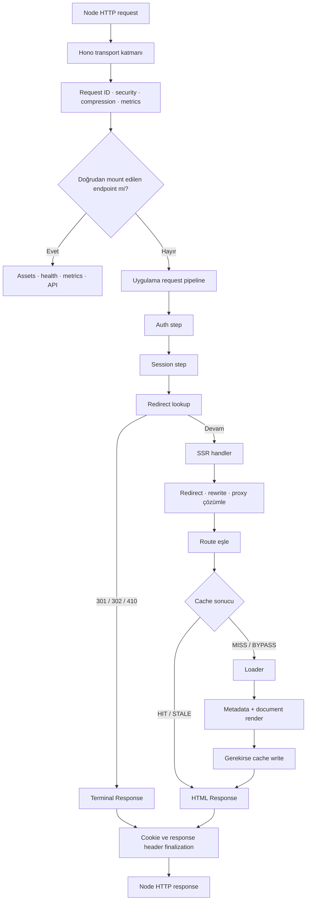
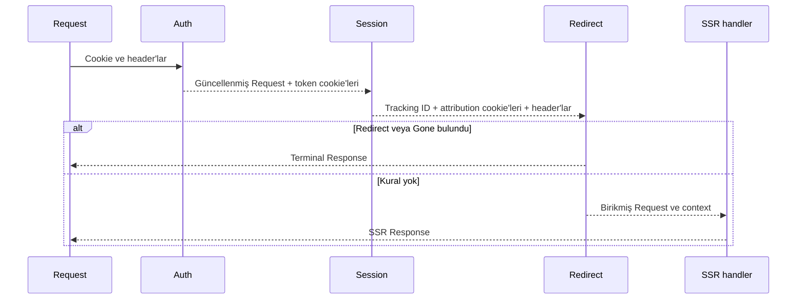

# React’i Framework Olmadan SSR Etmek: Hono Üzerinde Request Pipeline

> Next.js’in görünmez biçimde üstlendiği runtime sorumluluklarını Hono, React ve açık kontratlarla
> yeniden kurmak

Next.js’ten çıkmaya karar vermek ile Next.js’ten gerçekten çıkmak arasında büyük bir mesafe var.
Karar anında kulağa basit gelen cümle şudur: “React zaten `react-dom/server` ile HTML üretebiliyor;
önüne de hafif bir HTTP sunucusu koyarız.” Teknik olarak doğrudur. Fakat çalışan bir ürünün ihtiyacı
yalnızca bir React ağacını string’e çevirmek değildir.

Bir request’in kabul edilmesi, kimliğinin belirlenmesi, güvenlik header’larının eklenmesi, auth
credential’larının yenilenmesi, redirect ve rewrite kurallarının uygulanması, route’un bulunması,
cache kararının verilmesi, verinin yüklenmesi, metadata’nın üretilmesi, doğru asset’lerin HTML’e
yerleştirilmesi, interactive alanların hydrate edilmesi, hataların doğru status code ile dönmesi ve
sunucunun deploy sırasında devam eden işleri kaybetmeden kapanması gerekir.

Meta-framework bütün bunları tek bir ürün deneyiminin içine saklar. Framework’ten çıktığımızda eksilen
şey React değil, runtime’dır.

Bu yazı Hono ile birkaç route tanımlama rehberi değil. Next.js’in ardından inşa ettiğimiz runtime’ın
anatomisini, bir request’i başından sonuna takip ederek anlatıyor. Amacımız yeni bir genel amaçlı
framework yazmak değildi. Yalnızca ürünümüzün gerçekten ihtiyaç duyduğu davranışları, sırası görünür
ve test edilebilir bir request pipeline olarak kurmaktı.

## Önce sorumluluk envanterini çıkardık

Framework’ten ayrılırken en tehlikeli hata, yalnızca görünen API’leri değiştirmektir. `page.tsx`
yerine bir route dosyası, `middleware.ts` yerine Hono middleware’i yazar ve geçişin tamamlandığını
düşünürseniz framework’ün üretimde sessizce yerine getirdiği sorumlulukları eksik bırakırsınız.

Biz önce şu envanteri çıkardık:

| Sorumluluk                                             | Yeni sahibi                      |
| ------------------------------------------------------ | -------------------------------- |
| Node HTTP sunucusu ve Web `Request`/`Response` köprüsü | Hono + `@hono/node-server`       |
| Request ID, güvenlik, sıkıştırma, metrik               | Hono middleware katmanı          |
| Auth, session ve CMS redirect sırası                   | Uygulama pipeline’ı              |
| Redirect, rewrite ve proxy çözümleme                   | `src/routing`                    |
| Route eşleme ve loader çalıştırma                      | `server/handler.ts`              |
| Cache politikası                                       | Route kontratı + cache adapter’ı |
| Full-document HTML                                     | `server/document.tsx`            |
| Client bundle ve asset manifest                        | Vite                             |
| Seçici hydration                                       | Island bootstrap                 |
| Hata sayfası ve HTTP status                            | Server handler                   |
| Readiness ve güvenli kapanış                           | Server entry point               |

Bu tablo geçişin kapsamını dürüstçe gösteriyordu. “Framework kullanmıyoruz” dediğiniz anda bu
sorumluluklar ortadan kalkmıyor; yalnızca sahip değiştiriyor.

## Sistemin büyük resmi

Runtime’ın tamamını tek diagramda şöyle okuyabiliriz:



Diagramdaki en önemli ayrım Hono transport katmanı ile uygulama pipeline’ının farklı olmasıdır. İkisi
de request üzerinde çalışır ama aynı problemi çözmez.

Hono katmanı her HTTP response için geçerli çapraz sorumlulukları yönetir: request ID, security
header’ları, compression ve süre metriği. Uygulama pipeline’ı ise ürün kararlarını yönetir: access
token yenilenecek mi, tracking cookie’si üretilecek mi, istek bir CMS kuralıyla başka yere
yönlendirilecek mi?

Bu sınır, geçiş sırasında verdiğimiz en önemli mimari kararlardan biriydi.

## 1. Katman: Node ile Hono arasındaki ince köprü

Hono’nun projedeki görevi “yeni Next.js olmak” değil. Hono, Node HTTP sunucusu ile standart Web API
kontratları arasında ince bir taşıma katmanı.

```ts
const app = new Hono<{ Variables: AppVariables }>();

app.use("*", requestId);
app.use("*", securityMiddleware);
app.use("*", compress());

app.get("/healthz", (c) => c.text("ok"));
app.use("/assets/*", serveStatic({ root: "./dist/client" }));

app.all("*", async (c) => {
  return handle(c.req.raw, routes, assets);
});

serve({ fetch: app.fetch, port: config.port });
```

Hono’nun Node adapter’ı bir `fetch` handler’ını gerçek HTTP sunucusuna bağlıyor. Hono API’sinin Web
Standards tabanlı olması sayesinde uygulamanın iç katmanları Hono’nun `Context` nesnesini taşımak
zorunda kalmıyor. Node da güncel sürümlerde tarayıcı uyumlu `fetch`, `Request`, `Response`, `Headers`
ve ilgili Web API’lerini global olarak sağlıyor. Böylece `handle(request): Promise<Response>` kontratı
hem üretimde hem testte aynı kalıyor.

Bu küçük tercih bağımlılık yönünü değiştiriyor:

```text
Node adapter → Hono → standart Request/Response → uygulama kodu
```

Uygulama kodu Hono’ya değil, platform kontratına bağımlı. Yarın HTTP kabuğu değişse routing, loader,
cache ve document renderer’ın yeniden yazılması gerekmiyor.

[Hono’nun Node.js başlangıç rehberi](https://hono.dev/docs/getting-started/nodejs) bu adapter modelini;
[Node.js globals dokümantasyonu](https://nodejs.org/api/globals.html) ise yerleşik Web API yüzeyini
tanımlıyor.

## 2. Hono middleware’i nerede kullanılmalı?

Hono middleware zinciri registration sırasına göre çalışır ve `await next()` etrafında soğan modeli
oluşturur. Request aşağı doğru ilerler, response yukarı doğru döner. Bu model logging, timing,
compression ve security header gibi transport sorumlulukları için çok uygundur.

```ts
app.use("*", async (c, next) => {
  const started = performance.now();

  await next();

  observeRequest(c.res.status, c.res.headers.get("x-cache") ?? "NONE", performance.now() - started);
});
```

Burada metrik middleware’i handler’dan önce zamanı ölçüyor, `await next()` sonrasında oluşmuş gerçek
response’un status ve cache bilgisini okuyor. Bu, soğan modelinin doğal kullanımı.

Fakat auth refresh, session zenginleştirme ve redirect lookup’ı da aynı iç içe middleware modeline
koysaydık birkaç sorun doğacaktı:

- Bir adımın request’e eklediği header’ın sonraki adıma nasıl aktarıldığı örtükleşecekti.
- Birden fazla adımın ürettiği `Set-Cookie` header’larını korumak zorlaşacaktı.
- Redirect’in zinciri nerede durdurduğu `next()` çağrılarına bağlı hale gelecekti.
- Step’leri Hono `Context` oluşturmadan birim test etmek güçleşecekti.
- Ürün akışı ile HTTP framework’ünün lifecycle’ı birbirine bağlanacaktı.

Bu nedenle Hono middleware’i yalnızca HTTP kabuğunda tuttuk. Hono’nun resmi
[middleware rehberi](https://hono.dev/docs/guides/middleware) sıra, `next()` ve erken `Response`
dönüşünün semantiğini ayrıntılı biçimde açıklıyor. Biz bu semantiği transport katmanında kullanıyor,
domain akışı için daha açık bir accumulator modeli tercih ediyoruz.

## 3. İkinci pipeline: açık ve sıralı uygulama adımları

Uygulama pipeline’ının kontratı küçük:

```ts
type PipelineContext = {
  url: URL;
  pathname: string;
  publicPath: string;
  requestId?: string;
  clientIp: string;
};

type PipelineResult = {
  request: Request;
  cookies: CookieJar;
  responseHeaders: Headers;
  trackingId?: string;
  response?: Response;
};

type MiddlewareStep = (
  ctx: PipelineContext,
  acc: PipelineResult,
) => Promise<Partial<PipelineResult> | void>;
```

Her step iki şey görür: değişmeyen request bağlamı ve kendisinden önceki adımların biriktirdiği sonuç.
Step yalnızca değiştirdiği alanları döndürür. Runner bu patch’i accumulator ile birleştirir.

```ts
for (const step of steps) {
  const patch = await step(ctx, current);
  if (!patch) continue;

  current = mergeAcc(current, patch);

  if (current.response) break;
}
```

`response` alanı terminaldir. Bir redirect veya `410 Gone` üretildiği anda kalan step’ler ve SSR
handler çalışmaz. Bu davranış exception, özel flag veya `next()` disiplinine bırakılmadığı için hem
koddan hem testten görülebilir.

Mevcut sıra bilinçli olarak şöyledir:

```ts
const pipelineSteps = [authStep, sessionStep, redirectionStep];
```



Sırayı bir array’de görebilmek küçük ama önemli bir kazanım. Bir request’in hangi işlerden geçtiğini
anlamak için farklı klasörlerdeki nested callback’leri takip etmek gerekmiyor.

## 4. Auth step: UI sinyali değil credential otoritesi

Auth adımı access ve refresh token’ları HttpOnly cookie’lerden okur. Access token geçerliyse sonraki
server çağrılarında kullanılmak üzere request’in `Authorization` header’ına eklenir. Süresi dolmuşsa
refresh token gateway’e gönderilir; başarılı sonuç yeni token cookie’leri üretir ve request’i yeni
access token ile devam ettirir.

```ts
const outcome = await runAuthCore(acc.request, acc.cookies);

const headers = new Headers(acc.request.headers);
if (outcome.authorization) {
  headers.set("Authorization", outcome.authorization);
}

return {
  request: cloneRequestWithHeaders(acc.request, headers),
  cookies: outcome.cookies,
};
```

Buradaki kritik nokta auth adımının her sayfayı kullanıcıya özel HTML’e dönüştürmemesidir. Token,
server-to-server isteklerde yetki taşır; public sayfanın HTML’ine kullanıcı verisi koymak için otomatik
izin vermez. Route shared cache kullanıyorsa render çıktısı yine herkese ortak kalır.

`signed_in` veya `account_text` gibi JavaScript tarafından okunabilen cookie’ler ancak UI ipucudur.
Kullanıcı bunları değiştirebilir. Korumalı bir island gerçek veriyi istediğinde HttpOnly credential
devreye girer; gateway’in `200` veya `401` cevabı otoritedir. Başarılı refresh sonrasında UI ipucu
cookie’leri tekrar senkronize edilir. Böylece hızlı ilk görünüm ile gerçek yetkilendirme birbirinden
ayrılır.

Bu ayrım yalnız güvenlik için değil cache güvenliği için de gereklidir: credential’ın varlığı tek
başına cache key’i bölmez; yalnızca gerçekten render edilen HTML’i değiştiren girdiler cache
kontratına girer.

## 5. Session step: request’i zenginleştir, HTML’i kişiselleştirme

Session adımı kampanya parametrelerini normalize eder, kalıcı tracking ID üretir, bot bilgisini işler
ve gateway’in ihtiyaç duyduğu kontrollü header’ları request’e ekler.

Örneğin `utm_source`, `utm_campaign` ve `gclid` cookie’ye yazılabilir; fakat bunlar public HTML’in
içeriğini değiştirmiyorsa cache key’ine girmez. Session adımının varlığı route’u otomatik olarak
dynamic veya uncached yapmaz.

```ts
const trackingId = sanitizeUuid(cookie(acc.request, Cookie.userTrackingId)) ?? crypto.randomUUID();

const headers = new Headers(acc.request.headers);
headers.set("x-pathname", ctx.publicPath);
headers.set("x-client-ip", ctx.clientIp);

return {
  request: cloneRequestWithHeaders(acc.request, headers),
  responseHeaders,
  cookies: jar,
  trackingId,
};
```

Bu step aynı zamanda güven sınırını görünür kılıyor. Client’tan gelen rastgele `x-client-ip` veya
`x-pathname` değerine güvenmek yerine sunucunun doğruladığı IP ve public path kullanılıyor. Proxy
arkasında çalışırken `X-Forwarded-For` ancak `TRUST_PROXY` bilinçli biçimde açılmışsa ve değer geçerli
bir IP ise kabul ediliyor.

## 6. Redirection step: render’dan önce terminal karar

Redirect lookup pipeline’ın son uygulama adımı. Gateway veya içerik sistemi public path için bir
kural döndürürse iki terminal sonuçtan biri üretiliyor:

- Kalıcı/geçici yönlendirme için `3xx` ve `Location` header’ı.
- Artık var olmayan içerik için cache’lenebilir bir `410 Gone` HTML’i.

Bu kontrol route loader’dan ve React render’dan önce yapılır. Eski bir URL’nin nereye gittiğini
öğrenmek için menü, sayfa içeriği ve document shell fetch’lerini çalıştırmak gereksizdir.

Terminal response üretildiğinde daha önce auth ve session adımlarında biriken cookie’ler
kaybedilmez. Finalization aşaması bunları redirect response’una da ekler. Bu ayrıntı, middleware
geçişlerinde kolayca kaçan üretim hatalarından biridir: yeni token üretilir, ardından redirect
döner, fakat `Set-Cookie` nihai response’a taşınmadığı için tarayıcı yenilenmiş token’ı hiç alamaz.

## 7. Finalization: response’u tek yerde kapatmak

Pipeline adımları doğrudan nihai response header’larını mutasyona uğratmıyor. Cookie ve header’lar
ayrı accumulator’larda toplanıyor; response’un terminal redirect’ten mi yoksa SSR handler’dan mı
geldiğine bakılmaksızın en sonda uygulanıyor.

```ts
export function finalizeSsrResponse(ssrResponse: Response, result: PipelineResult): Response {
  let response = mergeResponseHeaders(ssrResponse, result.responseHeaders);
  response = applyCookies(response, result.cookies);
  return response;
}
```

`CookieJar`, her adımın `Set-Cookie` header’ını ezmesini engelliyor. Aynı cookie adı tekrar yazılırsa
son değer kazanıyor; farklı cookie’ler birlikte korunuyor. Response’un tamamlandığı tek bir nokta
olduğu için request ID ve ortak header’lar da kaybolmuyor.

Pipeline’ın invariant’ı artık açık:

> Her request ya terminal bir `Response` üretir ya da güncellenmiş bir `Request` ile SSR handler’a
> ulaşır. İki durumda da biriken response yan etkileri aynı finalizer’dan geçer.

## 8. SSR handler: okunabilir tek bir ana yol

Pipeline’dan sonra `handle()` fonksiyonu başlıyor. Bu fonksiyon bilinçli olarak yukarıdan aşağı
okunabilen bir orchestration katmanı:

```text
route resolution
    ↓
route match
    ↓
cache policy ve cache read
    ↓
loader
    ↓
document render
    ↓
cache write
    ↓
HTML Response
```

Her dalın bir HTTP karşılığı var. Redirect doğrudan `3xx`, proxy upstream response’u, eşleşmeyen path
`404`, beklenmeyen hata `500` döndürüyor. Başarılı loader’ın status ve header’ları da render edilen
HTML response’una taşınıyor.

Bu fonksiyon “uygulamanın request pipeline’ı nerede?” sorusuna tek bir dosyayla cevap verebiliyor.
Framework’ten çıktıktan sonra kazandığımız kontrolün değeri tam burada görülüyor: davranış plugin,
component ağacı ve convention’lar arasında dağılmıyor.

## 9. Redirect, rewrite ve proxy aynı şey değildir

Next.js daha önce redirects ve rewrites için hazır bir sözlük sunuyordu. Çıkıştan sonra bu semantiği
kendimiz tanımladık:

```ts
type RouteResolution =
  | { kind: "redirect"; url: string; status: 301 | 302 | 307 | 308 }
  | { kind: "proxy"; url: string }
  | { kind: "rewrite"; pathname: string; publicPath: string }
  | { kind: "none"; pathname: string; publicPath: string };
```

Aralarındaki fark önemlidir:

- **Redirect:** Tarayıcıya yeni URL verilir; ikinci bir request oluşur.
- **Rewrite:** Tarayıcıdaki URL değişmez; route matcher başka bir internal path görür.
- **Proxy:** Request dış bir origin’e iletilir; upstream response kullanıcıya döner.

Örneğin `/emekli-bankaciligi`, internal olarak `/retirement-banking` route’una rewrite edilebilir.
React component internal path üzerinden bulunur fakat canonical URL ve cache key tarayıcının gördüğü
`publicPath` üzerinden kurulabilir.

```ts
const internalUrl = new URL(url);
internalUrl.pathname = resolution.pathname;

const routeCtx = {
  url: internalUrl,
  publicPath: resolution.publicPath,
  // ...
};
```

`url.pathname` ile `publicPath` ayrımı yapılmazsa rewrite sonrası SEO canonical’ı yanlışlaşabilir,
analytics internal route’u kaydedebilir veya iki public URL istemeden aynı cache entry’sine
düşebilir. Bir framework’ün daha önce sessizce koruduğu URL semantiğini artık açık veri modeli
koruyor.

Kurallarda “first match wins” uygulanıyor. Bu nedenle sıra implementasyon ayrıntısı değil, route
kontratının parçası ve testlerle korunuyor. Hono routing de kayıt sırasının önceliği etkilediğini
belirtiyor; genel ilke aynı: route sırası görünür ve deterministik olmalı.
[Hono routing dokümantasyonu](https://hono.dev/docs/api/routing)

## 10. Route artık yalnız component değildir

Framework’ten çıktıktan sonra bir route’un taşıması gereken bilgiyi tek bir TypeScript kontratında
topladık:

```ts
type Route<T> = {
  path: string;
  cache?: (ctx: Ctx) => CachePolicy;
  loader: (ctx: Ctx) => Promise<LoaderResult<T>>;
  Component: (props: { data: T }) => ReactElement;
  generateMetadata?: (data: T, ctx: Ctx) => PageMetadata;
  pageMeta?: (data: T, ctx: Ctx) => PageAnalyticsMeta;
  minimalChrome?: boolean;
};
```

Bu kontratta dört farklı karar yan yana görülebiliyor:

1. **Eşleme:** Hangi path bu route’a ait?
2. **Yeniden kullanım:** Üretilen HTML cache’lenebilir mi ve hangi key ile?
3. **Veri:** Cache miss’te loader ne yükler, hangi status ve header’ı döndürür?
4. **Sunum:** Aynı loader verisinden component ve metadata ne üretir?

Loader’ın render’dan önce tamamlanması tesadüf değil. Component içinde server fetch başlatmak yerine
veri bağımlılıklarını route sınırında topluyoruz. Böylece bir cache hit olduğunda loader hiç çalışmaz;
bir miss olduğunda hangi dış isteklerin render’ı beslediği görülebilir.

Metadata için ayrı bir fetch yapılmıyor. `generateMetadata`, loader’ın zaten getirdiği veriyi kullanır.
Bu yaklaşım içerik ile `<title>`, canonical ve Open Graph alanlarının farklı anlarda farklı veri
sürümleri görmesini de önler.

## 11. Cache render motorunun dışında değil, yolun içindedir

Cache konusunu serinin sonraki yazısında ayrıntılı ele alacağız; fakat request pipeline içindeki yeri
şimdiden önemli. Cache kontrolü loader’dan önce yapılır:

```ts
const policy = route.cache?.(routeCtx) ?? { kind: "none" };
const key = cache.cacheKey(policy);

if (key && request.method === "GET") {
  const hit = await cache.read(key);
  if (hit) return html(hit.body, 200, policy, hit.state);
}

const result = await route.loader(routeCtx);
const body = await renderDocument(route, result.data, assets, { routeCtx });
```

Burada cache, React render’ın çevresine sonradan sarılmış bir performans eklentisi değil; handler’ın
birinci sınıf dalıdır. `HIT`, `STALE`, `MISS` ve `BYPASS` response header’ında ve request log’unda
görülür.

Route `cache` fonksiyonu tanımlamıyorsa varsayım `none` olur. Shared cache kullanmak bilinçli bir
opt-in’dir. Policy’nin key dizisi, HTML’i değiştiren bütün boyutların eksiksiz beyanıdır. Auth
token’ının request’te bulunması public HTML’i değiştirmiyorsa key’e girmez ve cache’i bypass etmez.

## 12. Document renderer: React ağacından tam HTML belgesine

Route component’i tek başına document değildir. Üretim HTML’inde `<html>`, `<head>`, metadata,
stylesheet, module preload, analytics bootstrap, layout shell ve client entry script’i de gerekir.

```tsx
const html = renderToString(
  <html lang="tr">
    <head>
      <MetadataHead meta={seo} />
      {assets.css.map((href) => (
        <link key={href} rel="stylesheet" href={href} />
      ))}
      <link rel="modulepreload" href={assets.js} />
    </head>
    <body>
      <div id="root">
        <RootLayout shell={shell} pageMeta={pageMeta}>
          <route.Component data={data} />
        </RootLayout>
      </div>
      <script type="module" src={assets.js} />
    </body>
  </html>,
);

return "<!DOCTYPE html>" + html;
```

`renderDocument()` önce ortak shell verisini, route metadata’sını ve analytics page meta’sını çözer.
Ardından bütün document ağacını tek seferde render eder. Sonuç status code ve cache header’larıyla bir
Web `Response` içine konur.

React’in [`renderToString` dokümantasyonu](https://react.dev/reference/react-dom/server/renderToString)
bu API’nin React ağacını HTML string’ine çevirdiğini, fakat streaming’i ve veriyi bekleyen Suspense
senaryolarını desteklemediğini açıkça belirtiyor. Bizim kullanımımızda bütün loader verisi render’dan
önce hazır olduğu için bu sınır bilinçli bir tercih.

### Neden şimdilik streaming kullanmıyoruz?

React, Node ortamı için `renderToPipeableStream` gibi streaming API’leri öneriyor. Streaming ilk
byte’ı daha erken gönderebilir ve Suspense boundary’leri hazır oldukça açabilir. Bu gerçek bir
avantajdır; `renderToString` modern React’in en gelişmiş SSR yolu değildir.

Fakat bu projede HTML cache entry’si tam belge olarak atomik biçimde yazılıyor. Streaming’e geçmek şu
soruları da çözmeyi gerektirir:

- Header’lar gönderildikten sonra loader veya render hatası çıkarsa status nasıl değişecek?
- Kısmi stream cache’e yazılmayacağından nasıl emin olunacak?
- Client disconnect olduğunda render ve upstream fetch’ler nasıl iptal edilecek?
- CDN veya Redis için tam response hangi noktada commit edilecek?
- Bot ve kullanıcı isteklerinde farklı streaming stratejisi gerekecek mi?

Hono da stream başladıktan sonra oluşan hatalarda global error handler’ın response’u artık overwrite
edemeyeceği konusunda uyarıyor.
[Hono streaming rehberi](https://hono.dev/docs/helpers/streaming)

Dolayısıyla mevcut karar “streaming gereksiz” değil; “önce tam-document SSR ve atomik shared cache
invariant’ını sade tutuyoruz” kararı. Ölçümler TTFB’nin kritik sorun olduğunu gösterirse streaming ayrı
bir tasarım çalışması olarak eklenebilir.

## 13. Client ve server build’lerini ayırmak

Next.js’ten çıktığımızda build graph’ının da sahibi olduk. Vite iki farklı çıktı üretiyor:

```text
src/entry.client.tsx ── Vite client build ──> dist/client + manifest
server/index.ts      ── Vite SSR build    ──> dist/server/index.js
```

Client build hashed JS/CSS dosyalarını ve `.vite/manifest.json` dosyasını üretir. Server başlangıçta
manifest’i okur, entry chunk ile CSS asset’lerini bulur ve document renderer’a verir. Böylece HTML’e
development dosya adı değil, build’in gerçek fingerprint’li çıktısı girer. İstenirse aynı resolver
asset URL’lerini ayrı bir CDN origin’ine taşır.

```ts
const entry = Object.values(manifest).find((chunk) => chunk.isEntry);

return {
  js: assetUrl(`/${entry.file}`),
  css: (entry.css ?? []).map((file) => assetUrl(`/${file}`)),
};
```

Vite’ın [SSR rehberi](https://vite.dev/guide/ssr.html), client ve server entry noktalarının ayrı
kurulmasını ve manifest’in module/chunk ilişkileri için kullanılmasını anlatıyor. Framework bu wiring’i
bizim yerimize yapmadığı için manifest bulunamazsa server’ın sessizce bozuk HTML üretmesine izin
vermiyoruz; başlangıç doğrudan hata veriyor.

## 14. Hydration sınırı: bütün sayfayı uyandırmak zorunda değiliz

Server HTML üretmek etkileşim için yeterli değildir. React’in `hydrateRoot` API’si mevcut server
HTML’ine event handler’ları ve client state’i bağlar. Fakat bütün document ağacını tek client root
olarak hydrate etmek, public içeriğin tamamı için JavaScript indirmek anlamına gelebilir.

Bu nedenle interactive alanları island olarak işaretliyoruz:

```tsx
<div
  data-island={name}
  data-mode={mode}
  data-eager={eager ? "" : undefined}
  data-props={JSON.stringify(props ?? {})}
>
  {mode === "hydrate" ? children : <div data-fallback="">{children}</div>}
</div>
```

Client entry `import.meta.glob("./islands/*.tsx")` ile her island’ı ayrı chunk’a dönüştürüyor.
DOM’daki `data-island` değerine göre doğru module dinamik olarak yükleniyor. Eager island’lar hemen,
diğerleri viewport’a 200 piksel kala `IntersectionObserver` ile başlatılıyor.

İki farklı çalışma modu var:

- **`hydrate`:** Server gerçek HTML’i üretir; client aynı ağacı `hydrateRoot` ile interactive yapar.
- **`defer`:** Server yalnız güvenli fallback’i üretir; client component’i `createRoot` ile mount eder
  ve kullanıcıya özel veriyi kendi API çağrısıyla alır.

`defer` kişiselleştirme sınırımızdır. Hesap özeti gibi kullanıcıya özel içerik shared SSR HTML’ine
girmez. Public shell cache’lenebilir; gerçek account verisi HttpOnly credential ile internal API’den
gelir.

React’in [`hydrateRoot` referansı](https://react.dev/reference/react-dom/client/hydrateRoot), server
ve client ilk çıktısının aynı olması gerektiğini ve mismatch’lerin bug olarak ele alınmasını özellikle
vurguluyor. Bu nedenle `hydrate` modunda render sırasında `window`, anlık tarih veya rastgele değer
gibi iki ortamda farklı sonuç üreten girdiler kullanmıyoruz. Böyle bir ihtiyaç varsa değer server’dan
prop olarak taşınmalı ya da component `defer` moduna alınmalı.

## 15. Hata sınırı React component’inden önce başlar

SSR sisteminde hata yönetimi yalnız React error boundary değildir. Route resolution, proxy, cache,
loader, metadata veya document render aşamalarının herhangi biri HTML oluşmadan hata verebilir.

Handler bütün ana yolu `try/catch` içine alır. Beklenmeyen hata yapılandırılmış log’a request ID ve
public path ile yazılır; kullanıcıya stack trace yerine bağımsız bir `500` document’i döner:

```ts
catch (error) {
  logError(error, { requestId, path: url.pathname });
  const response = errorResponse(assets);
  response.headers.set("x-request-id", requestId);
  return response;
}
```

Error response `private, no-store` taşır. Böylece geçici upstream arızası shared cache’e yazılıp uzun
süre servis edilmez. Loader bilinçli olarak `404` veya `503` döndürüyorsa kendi status’u korunur;
yalnızca beklenmeyen exception `500` olur.

Response henüz stream edilmediği için hata anında status ve document’in tamamını güvenli biçimde
değiştirebiliyoruz. Bu da mevcut non-streaming tasarımın operasyonel sadelik avantajlarından biri.

## 16. Gözlemlenebilirlik pipeline’ın sonradan eklenen süsü değildir

Kendi runtime’ımızı kurduğumuzda “bu request neden yavaş?” sorusunun cevabını da kendimiz üretmek
zorundayız. Her request’e bir ID atanıyor ve aynı değer response header’ına, hata log’una ve request
log’una taşınıyor.

Başarılı SSR log’u en az şu alanları içeriyor:

```json
{
  "path": "/ihtiyac-kredisi/istanbul",
  "status": 200,
  "cache": "HIT",
  "durationMs": 8,
  "requestId": "..."
}
```

`x-cache` değeri kullanıcıya dönen response ile metrikteki label’ın aynı kaynaktan gelmesini
sağlıyor. `HIT`, `STALE`, `MISS`, `BYPASS`, `PROXY`, `REDIRECT` ve `ERROR` durumları operasyon sırasında
ayırt edilebiliyor.

Sunucuda ayrıca üç ayrı operasyon endpoint’i var:

- `/healthz`: Process HTTP cevap verebiliyor mu?
- `/readyz`: Yeni trafik almaya hazır mı, zorunlu cache dependency’si erişilebilir mi?
- `/metrics`: Status, cache state ve süre dağılımı ne?

Liveness ile readiness’i ayırmak deploy sırasında önemlidir. Redis geçici olarak yoksa process’i
sürekli öldürmek yerine readiness politikası trafiği kontrollü biçimde kesebilir.

## 17. Graceful shutdown da request pipeline’ın parçasıdır

Bir server yalnız nasıl başladığıyla değil, nasıl kapandığıyla da production-ready olur. `SIGTERM`
geldiğinde uygulama:

1. `shuttingDown` durumuna geçer ve yeni SSR isteklerine `503` verir.
2. HTTP server’ın yeni bağlantı kabul etmesini durdurur.
3. Devam eden stale revalidation işlerini belirli timeout içinde drain eder.
4. Redis bağlantısını kapatır.
5. Toplam shutdown timeout aşılırsa process’i hata koduyla sonlandırır.

```ts
httpServer.close(async () => {
  await drainRevalidations(config.revalidationDrainTimeoutMs);
  await closeCache();
  process.exit(0);
});
```

Hono’nun Node rehberinde de `server.close()` ile güvenli kapanış örneği bulunuyor. Bizim eklediğimiz
fark, HTTP bağlantılarının yanında uygulamaya ait background revalidation işlerini de beklemek.

Bu olmadan deploy anında başlayan bir revalidation yarıda kesilebilir, lock timeout’a kadar asılı
kalabilir veya cache write tamamlanmadan process ölebilir. “Fire-and-forget” iş gerçekten sahipsiz
olmamalı; process lifecycle onu tanımalı.

## 18. Test edilebilirlik için server’ı dinlemeye gerek yok

İç katmanların standart `Request → Response` kontratı kullanması testleri küçültüyor:

```ts
const request = new Request("http://localhost/");
const first = await handle(request, [homeRoute], assets);
const second = await handle(request, [homeRoute], assets);

expect(first.headers.get("x-cache")).toBe("MISS");
expect(second.headers.get("x-cache")).toBe("HIT");
```

Sequential pipeline da Hono server oluşturmadan test edilebiliyor. Bir step terminal response
döndürdüğünde sonraki step’in çağrılmadığı; cookie’lerin ve request header patch’lerinin birleştiği
doğrudan doğrulanıyor.

Routing testleri redirect/rewrite/proxy sırasını, handler testleri status ve cache davranışını,
middleware testleri token refresh ve cookie temizliğini koruyor. Uygulama ile dış sistem sınırının
gerçekçiliği gerektiğinde mock gateway rastgele bir portta ayrı Node process’i olarak başlıyor ve
istekler gerçek HTTP üzerinden geçiyor.

Bu mock gateway bilinçli bir geliştirme bağımlılığı. Üretim gateway’ini taklit eden mükemmel bir ürün
olması amaçlanmıyor; UI runtime’ının içine fixture veya “fetch başarısızsa fake data dön” fallback’i
yerleştirmeden dış servis kontratını çalıştırmamızı sağlıyor. Gerçek gateway geldiğinde uygulama kodu
değil `GATEWAY_URL` değişecek.

## Yeniden inşa etmediğimiz şeyler

Framework’ten çıkınca her özelliği yeniden yazmaya çalışmadık. Bu runtime’ın sınırları bilinçli:

- React Server Components altyapısı yok.
- Streaming SSR henüz yok.
- Genel amaçlı file-system routing yok; açık route tablosu var.
- Her projeye uygun plugin veya deployment ekosistemi yok.
- Client-side tam sayfa router yerine browser navigation ve bağımsız island’lar var.
- Framework seviyesinde otomatik image optimization veya link prefetch sistemi yok.

Bunlar eksik bırakılmış bir Next.js klonu olduğumuz anlamına gelmiyor. Zaten hedef Next.js klonu
yazmak değildi. İhtiyaç duymadığımız yeteneklerin bakım maliyetini almadan, ürünün kritik
invariant’larını açıkça kurduk.

Bu yaklaşımın bedeli de var. Route, metadata, asset manifest, hydration bootstrap, error document,
security middleware ve lifecycle artık bizim kodumuz. React veya Vite davranışı değiştiğinde uyumluluğu
biz takip edeceğiz. Bu sahiplik ancak açıklık ve kontrol ihtiyacı maliyetten büyükse anlamlı.

## Sonuç: React SSR bir fonksiyon, production SSR bir sistemdir

React ile framework olmadan SSR yapmak teknik olarak `renderToString(<App />)` çağrısıyla başlar.
Fakat production’da güvenilir SSR o çağrının etrafındaki sistemdir:

- Request’in hangi sırayla işlendiği,
- hangi adımın terminal response üretebildiği,
- auth bilgisinin nerede yetki, nerede yalnız UI ipucu olduğu,
- public ve internal URL’nin nasıl ayrıldığı,
- cache’in loader’dan önce nasıl karar verdiği,
- metadata ile içeriğin aynı veriden nasıl üretildiği,
- hangi component’in hydrate, hangisinin client’ta mount edildiği,
- hatanın hangi status ve cache policy ile döndüğü,
- background işlerin deploy sırasında nasıl tamamlandığı.

Hono bu sistemde güçlü çünkü küçük. HTTP girişini ve middleware lifecycle’ını çözüyor, fakat ürünün
rendering modelini bizden saklamıyor. React güçlü çünkü UI ağacını hem server’da HTML’e hem client’ta
interactive hale getirebiliyor. Vite ise iki tarafın build çıktılarını birbirine bağlıyor.

Asıl mimari değer bu araçların tek tek seçilmesinde değil, aralarındaki sınırların açık olmasında.
Next.js’ten çıktıktan sonra yaptığımız inşa çalışması bize daha az kod vermedi. Bize request’in başına
ne geldiğini tek bir akışta açıklayabilme ve her kritik kararı ayrı ayrı test edebilme imkânı verdi.

Serinin sonraki yazısında bu pipeline’ın en hassas dalına ineceğiz: explicit cache policy, Redis,
stale-while-revalidate, replica’lar arası lock ve kullanıcı verisinin shared HTML’den kesin olarak
ayrılması.

---

## Kaynaklar

- [React server API’leri](https://react.dev/reference/react-dom/server)
- [React `renderToString`](https://react.dev/reference/react-dom/server/renderToString)
- [React `hydrateRoot`](https://react.dev/reference/react-dom/client/hydrateRoot)
- [Hono Node.js adapter](https://hono.dev/docs/getting-started/nodejs)
- [Hono middleware rehberi](https://hono.dev/docs/guides/middleware)
- [Hono routing](https://hono.dev/docs/api/routing)
- [Hono streaming](https://hono.dev/docs/helpers/streaming)
- [Vite server-side rendering rehberi](https://vite.dev/guide/ssr.html)
- [Node.js Web API globals](https://nodejs.org/api/globals.html)
