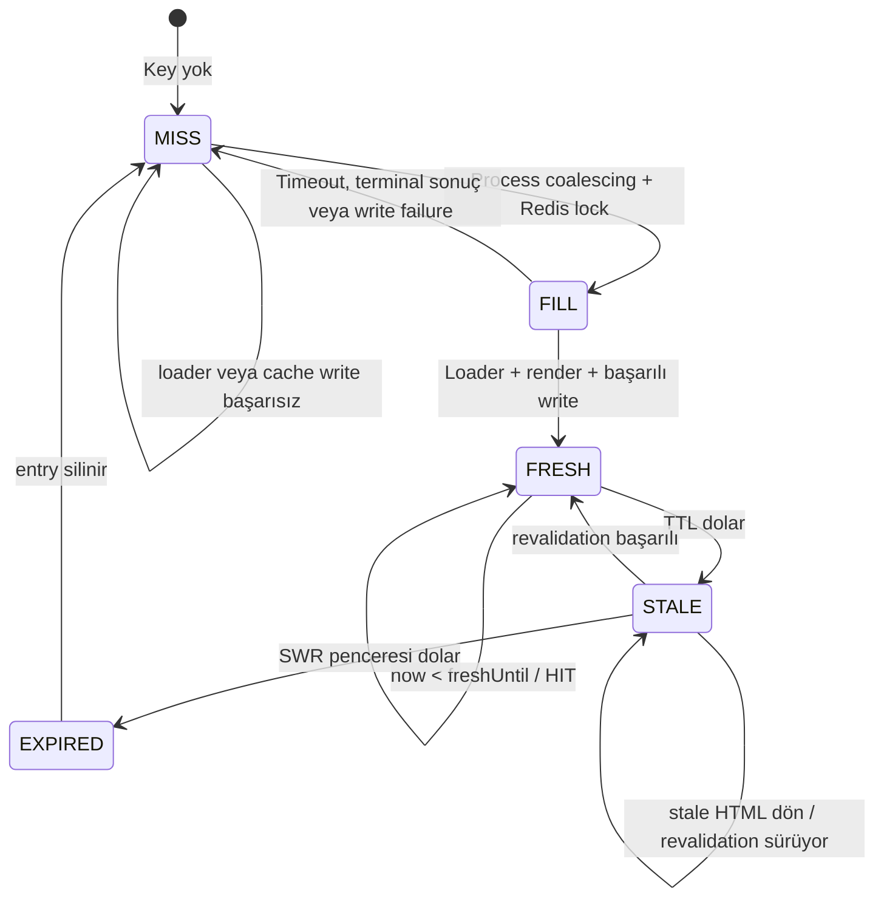
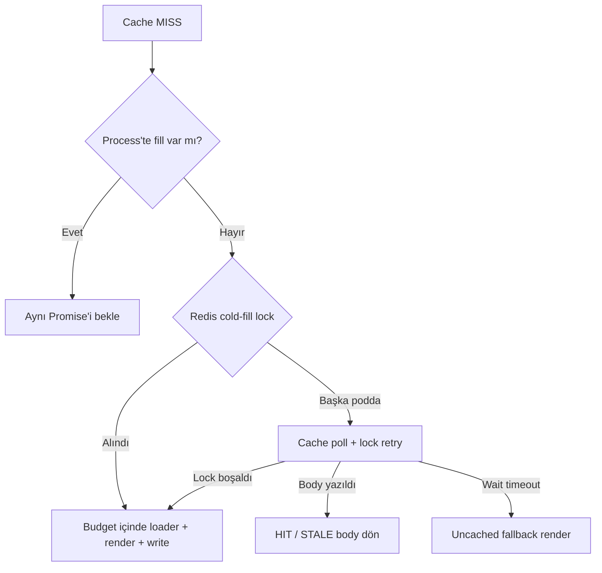
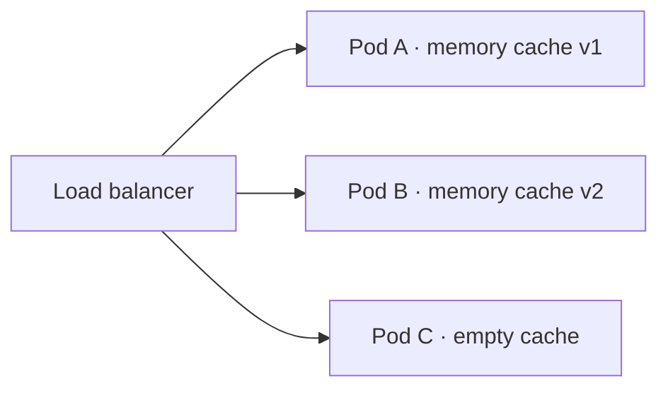
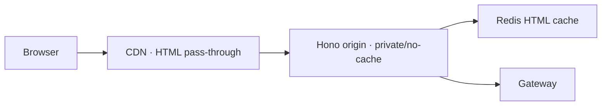

# Cache Bir Optimizasyon Değil, Route Kontratıdır

> Cache key’i görünmüyorsa sistemin hangi HTML’i kime servis ettiğini de kesin olarak bilmiyorsunuz

Cache çoğu projeye performans problemi ortaya çıktıktan sonra eklenir. Önce sayfa çalışır, sonra
gateway çağrılarının pahalı olduğu görülür, response süresi ölçülür ve araya Redis konur. Bu bakışta
cache, doğru çalışan sistemin önüne yerleştirilmiş hızlandırıcıdır. Kapatıldığında sistem yavaşlar ama
anlamı değişmez.

HTML cache’inde durum bu kadar basit değil.

Bir sayfanın çıktısı şehir, kredi tutarı, dil, cihaz, tema veya oturum durumuna göre değişiyorsa cache
key’i bu değişkenlerden hangilerinin aynı response’u paylaşacağını belirler. Eksik bir boyut yalnızca
eski veri göstermez; bir kullanıcının HTML’ini başka bir kullanıcıya taşıyabilir. Gereksiz bir boyut
ise aynı içeriği binlerce entry’ye bölerek hit oranını düşürür ve purge operasyonunu zorlaştırır.

Bu nedenle bizim sistemimizde cache, handler’ın çevresine sarılmış bir optimizasyon değil. Her
route’un şu soruya verdiği zorunlu cevaptır:

> Bu route hangi koşullarda aynı HTML’i tekrar kullanabilir ve bu eşdeğerliğin kimliği nedir?

Bu yazıda bu cevabın nasıl bir TypeScript kontratına dönüştüğünü, Next.js’in cache modeliyle nerede
çatıştığımızı ve Redis üzerinde stale-while-revalidate akışını birden fazla replica için nasıl
kurduğumuzu gerçek route örnekleriyle inceleyeceğiz.

## Cache key aslında bir eşdeğerlik tanımıdır

Bir SSR sayfasını matematiksel olarak düşünelim. Üretilen HTML, request’ten ve dış veriden gelen
girdilerin fonksiyonudur:

```text
HTML = F(
  route,
  publicPath,
  routeParams,
  contentQuery,
  locale,
  device,
  theme,
  layoutVariant,
  authClass,
  upstreamData
)
```

Cache sistemi `F` fonksiyonunu bilmez. Yalnızca bizim verdiğimiz key’i bilir. Aynı key’i üreten iki
request’in aynı HTML’i paylaşabileceğini varsayar.

Burada iki tür hata vardır:

### Eksik key boyutu: correctness hatası

İstanbul ve Ankara için teklifler farklıyken şehir key’e girmezse iki request aynı entry’ye düşer:

```text
F(istanbul, 100000) ≠ F(ankara, 100000)
K(istanbul, 100000) = K(ankara, 100000)  ← hata
```

İlk request İstanbul HTML’ini cache’e yazdıysa Ankara kullanıcısı İstanbul içeriğini görebilir.
Auth veya kişisel veri söz konusu olduğunda bunun adı performans sorunu değil, veri izolasyonu
ihlalidir.

### Gereksiz key boyutu: cardinality hatası

`utm_source` yalnızca analytics için kullanılıyor ve HTML’i değiştirmiyorsa şu iki request aynı
entry’yi paylaşmalıdır:

```text
/konut-kredisi?amount=2500000&page=1&utm_source=google
/konut-kredisi?amount=2500000&page=1&utm_source=newsletter
```

UTM değerini key’e eklersek correctness bozulmaz; fakat her kampanya, reklam seti ve tracking değeri
yeni bir HTML kopyası üretir. Cache ısınmaz, Redis büyür ve içerik değişikliğinde silinmesi gereken
key sayısı kontrolsüz artar.

Doğru cache key şu invariant’ı sağlamalıdır:

```text
Aynı key  ⇒ aynı HTML
Farklı HTML ⇒ farklı key veya cache bypass
```

Tersi zorunlu değildir; teknik olarak aynı HTML farklı key’lerde bulunabilir. Fakat bu da verimsizlik
ve operasyon maliyetidir. İyi bir key hem güvenli hem mümkün olduğunca küçüktür.

## Next.js’te yaşadığımız sorun yalnızca “çok fazla cache” değildi

Next.js cache konusunda yeteneksiz bir framework değil. Aksine App Router; data cache, route output,
client router state, revalidation, static generation ve CDN davranışı gibi çok sayıda problemi birlikte
çözer. Sorunumuz yetenek eksikliği değil, ürün seviyesindeki cache kararımız ile framework’ün farklı
katmanlarda çıkardığı sonuç arasındaki mesafeydi.

Önceki App Router modelinde bir route’un davranışını anlamak için şu sorular birlikte düşünülüyordu:

- Route static mi dynamic mi render ediliyor?
- Hangi `fetch` çağrısı cache’leniyor, hangisi `no-store`?
- `revalidate` süresi data fetch’e mi yoksa route output’una mı uygulanıyor?
- Component ağacında `cookies()`, `headers()` veya `searchParams` okunuyor mu?
- Full Route Cache devrede mi?
- Client Router Cache eski bir RSC payload’u tutuyor mu?
- `revalidatePath` veya `revalidateTag` hangi katmanları geçersiz kılıyor?
- CDN, Next.js server cache’inden bağımsız bir kopya tutuyor mu?

Bu soruların her birinin dokümante edilmiş cevabı vardı. Fakat bir üretim incident’ında “kullanıcı bu
HTML’i neden gördü?” sorusuna tek bir route dosyasından cevap veremiyorduk. Cache davranışı component
ağacındaki veri erişimlerinin, framework inference’ının ve birden fazla cache katmanının birleşik
sonucuydu.

Örneğin header’da kullanıcı adını göstermek için `cookies()` okumak teknik olarak request-time veri
gerektirir. Fakat sayfanın ana içeriği herkese aynı olabilir. Ürün seviyesindeki sorumuz şuydu:

```text
Bu route request sırasında mı çalışıyor?
```

değil,

```text
Bu route'un cache'e girecek HTML'i hangi girdilere göre değişiyor?
```

sorusuydu.

Bu ikisi aynı şey değil. Access token gateway’e taşınabilir ama public HTML’i değiştirmeyebilir.
Tracking cookie’si yazılabilir ama response body ile ilgisi olmayabilir. Request-time çalışan bir SSR
route yine de güvenli biçimde shared HTML üretebilir.

## Güncel Next.js modeli bu eleştirinin bir kısmına cevap veriyor

Burada güncel durumu dürüstçe ayırmak gerekiyor. Next.js 16 ile gelen Cache Components ve `use cache`
modeli önceki örtük davranışların bir bölümünü daha explicit hale getirdi. Runtime data varsayılan
olarak request zamanında kalabiliyor; cache’lenmesi istenen route, component veya fonksiyon `use cache`
ile işaretleniyor. `cacheLife` yaşam süresini, `cacheTag` invalidation grubunu tanımlıyor.

Güncel [`use cache` dokümantasyonu](https://nextjs.org/docs/app/api-reference/directives/use-cache)
cache key’inin build ID, function ID, serialize edilebilir argümanlar ve closure’dan yakalanan
değerlerden üretildiğini açıklıyor. `cookies()` ve `headers()` cached scope içinde doğrudan okunamıyor;
değerin dışarıda okunup argüman olarak geçirilmesi öneriliyor. Bu, “runtime girdisini cached alana
açıkça taşı” yönünde doğru ve değerli bir model.

Cache Components ayrıca static shell, cached component ve request-time içeriği Suspense sınırlarıyla
aynı route içinde birleştiriyor. Güncel
[Next.js caching rehberi](https://nextjs.org/docs/app/getting-started/caching) kişisel cookie bilgisinin
request-time component’te okunup cached component’e argüman olarak aktarılmasını doğrudan örnekliyor.

Dolayısıyla bizim deneyimimizi “Next.js’te cache key yoktur” veya “Next.js kişiselleştirme ile cache’i
birleştiremez” diye anlatmak yanlış olur.

Bizim ayrımımız daha spesifik:

- Next.js’in güncel modeli cache sınırını route, component veya fonksiyon seviyesinde kurabilir.
- Biz tam HTML belgesinin paylaşılabilirlik kontratını route seviyesinde tek bir key array’iyle görmek
  istiyoruz.
- Next.js key üretiminde framework kimliği, build ve serialize edilmiş çağrı girdileri rol oynar.
- Bizim key’imizde yalnız ürünün beyan ettiği HTML varyantları bulunur.
- Next.js static shell, RSC payload ve client navigation davranışını birlikte yönetir.
- Bizim sistemimiz full-document HTML ve bağımsız island’lar kullandığı için daha küçük bir cache
  yüzeyine sahiptir.

Bu daha güçlü veya evrensel bir yaklaşım değildir. Daha dar bir problemin daha görünür çözümüdür.

## Self-hosted Next.js’te dağıtık cache problemi ortadan kalkmaz

Next.js kullanmak horizontal scale sorununu otomatik olarak çözmez. Resmî
[self-hosting rehberi](https://nextjs.org/docs/app/guides/self-hosting), varsayılan memory ve disk
cache’inin Kubernetes ortamında pod başına ayrı olduğunu; tutarlılık için custom shared cache handler
ve in-memory cache’in kapatılmasının gerekebileceğini belirtiyor. Çoklu instance ortamında tag
invalidation bilgisinin ayrıca koordine edilmesi gerekiyor; bir instance üzerindeki `revalidateTag()`
diğerlerinin cache’ini kendiliğinden anında geçersiz kılmıyor.

Bu nokta bizim geçiş kararımızda önemliydi. Zaten Redis adapter’ı, tag koordinasyonu, deployment
namespace’i ve failure davranışını tasarlayacaksak cache’in ürün kontratını da doğrudan sahiplenmek
istedik.

Yine de bedeli unutmamak gerekir: Next.js custom cache handler ekosistemi ve framework-level
invalidation semantiği sunar. Biz kendi store interface’imizi, purge endpoint’imizi, lock akışımızı ve
operasyon araçlarımızı sürdürmek zorundayız.

## Bizim cache kontratımız yalnızca iki duruma sahip

Route’un verebileceği cache kararı bilinçli olarak küçük tutuldu:

```ts
type CachePolicy =
  | { kind: "none" }
  | {
      kind: "shared";
      ttl: number;
      swr?: number;
      key: string[];
    };
```

`kind: "none"`, bu route’un HTML’inin shared cache’e yazılamayacağını söyler. Her request loader ve
renderer’dan geçer; response `private, no-store` olur ve `x-cache: BYPASS` taşır.

`kind: "shared"`, aynı key’i üreten bütün request’lerin tek HTML entry’sini paylaşabileceğini söyler:

- `ttl`: Entry’nin fresh kabul edildiği süre.
- `swr`: Fresh süre bittikten sonra stale HTML’in servis edilebileceği ek süre.
- `key`: HTML eşdeğerliğini tanımlayan bütün boyutlar.

Kontratta `auto`, `dynamic`, `force-static` veya inference yok. Route cache fonksiyonu tanımlamazsa
varsayım `none`. Shared cache bilinçli opt-in.

```ts
const policy = route.cache?.(routeCtx) ?? { kind: "none" };
const key = cacheKey(policy);
```

Bu varsayılan performans açısından muhafazakâr, veri güvenliği açısından güvenlidir. Yeni bir route
cache davranışı düşünülmeden production’a çıkarsa hızlı olmayabilir ama yanlış HTML paylaşmaz.

## Cache registry neden route dosyalarından ayrı?

Her route `cache()` fonksiyonu taşısa da gerçek page policy’lerini merkezi bir registry’de topluyoruz:

```ts
type PageCacheDefinition = {
  id: PageCacheId;
  description: string;
  path: string;
  strategy: "shared" | "never";
  ttl?: number;
  swr?: number;
  bypassAuth?: boolean;
  contentQueryParams?: readonly string[];
  contentQueryDefaults?: Record<string, string>;
  contentQueryNormalize?: Record<string, NormalizeFn>;
  buildKey: (ctx: Ctx) => string[];
};
```

Bu registry üç farklı ihtiyacı aynı kaynaktan besliyor:

1. Route’un runtime `CachePolicy` kararı.
2. Purge API’nin tanıdığı page kimlikleri ve prefix’ler.
3. Testlerin bütün route’ların stratejiye sahip olduğunu doğrulaması.

Policy component’in yanına dağılmadığı için operasyon ekibi “hangi sayfa kaç dakika fresh, auth varsa
bypass ediyor mu, hangi query parametreleri içeriği değiştiriyor?” sorularına tek tablodan cevap
verebiliyor.

## Gerçek örnek: ihtiyaç kredisi sayfasının key’i

Şu request’i ele alalım:

```text
/konut-kredisi?amount=2500000&term=120&utm_source=google
```

Bu route için registry tanımı özünde şöyledir:

```ts
{
  id: "loan",
  strategy: "shared",
  contentQueryParams: ["amount"],
  contentQueryDefaults: { amount: "50000" },
  contentQueryNormalize: {
    amount: (raw) => String(parseLoanAmount(raw)),
  },
  buildKey: (ctx) => [
    "loan",
    ctx.params.city ?? "-",
    contentQueryFragment(ctx),
    deviceCacheFragment(ctx.request),
    locale(ctx.request),
    parseTheme(cookie(ctx.request, Cookie.theme)),
    layoutCacheFragment(ctx),
  ],
}
```

İnsan tarafından okunur gösterimi yaklaşık olarak şöyledir:

```text
loan::istanbul::amount=100000::Desktop::tr::light::full
```

Her parçanın bir gerekçesi var:

- `loan`: Başka route’ların key alanından ayırır ve page bazlı purge prefix’i sağlar.
- `istanbul`: Şehir teklifleri ve içerik değiştirir.
- `amount=100000`: Kredi tutarı sonucu değiştirir.
- `Desktop`: Render edilen layout veya server fallback’i cihaza göre farklıysa gereklidir.
- `tr`: Metin ve metadata dilini ayırır.
- `light`: Tema gerçekten SSR HTML’ini değiştiriyorsa key’e girmelidir.
- `full`: Header/footer gibi shell varyantını ayırır.

`utm_source=google` key’de yoktur. Session middleware bu değeri attribution cookie’sine yazabilir,
analytics client’ta kullanabilir; fakat HTML’i değiştirmediği için cache identity’nin parçası değildir.

Bu örnek cache key’inin URL olmadığını gösteriyor. URL, olası girdilerden yalnızca biri. Aynı URL
farklı cihazda farklı HTML üretiyorsa cihaz key’e girmeli; farklı URL’ler normalize edildikten sonra
aynı HTML’i üretiyorsa aynı key’i paylaşabilmelidir.

## Query string’i bütünüyle key’e koymak neden yanlış?

En kolay implementasyon `url.pathname + url.search` kullanmaktır. Bu yaklaşım iki problem üretir.

İlki kontrolsüz cardinality’dir:

```text
?amount=50000&utm_source=google
?amount=50000&utm_source=facebook
?amount=50000&gclid=abc
?amount=50000&gclid=def
```

Hepsi aynı içeriği üretirken dört entry oluşur.

İkincisi semantik olarak eşit değerlerin ayrışmasıdır:

```text
?amount=50000
?amount=050000
?amount=5e4
```

Domain parser bu değerleri aynı kredi tutarına çeviriyorsa üç farklı cache key gereksizdir. Bu yüzden
query parametreleri allowlist ile seçiliyor, default değer uygulanıyor ve key’e girmeden önce domain
değerine normalize ediliyor.

```ts
const value = config.normalize?.[name]?.(raw) ?? raw ?? config.defaults?.[name] ?? "-";
```

Allowlist’in de bir maliyeti vardır: geliştirici yeni bir `sort` parametresi ekler ve HTML’i
değiştirdiği halde registry’ye eklemeyi unutursa yanlış cache paylaşımı oluşur. Bunu sihirli biçimde
çözmüyoruz. `foreignQueryParamNames()` helper’ı allowlist dışında kalan, tracking olmayan parametreleri
tespit ediyor; ilgili route testleri yeni içerik parametresinin key’i değiştirdiğini kanıtlamak zorunda.

Kontrat görünür olduğu için hata ihtimali ortadan kalkmaz; fakat review ve test edilebilir bir yere
taşınır.

## Auth token gördüğümüzde neden her cache’i bypass etmiyoruz?

“Cookie veya Authorization varsa cache yok” güvenli görünen yaygın bir kuraldır. Veri sızıntısını
önler ama public sayfaların hit oranını giriş yapmış kullanıcılar için sıfıra indirir. Daha önemlisi,
auth bilgisinin varlığı ile HTML kişiselleştirmesini aynı şey kabul eder.

Biz üç route sınıfı kullanıyoruz.

### 1. Auth olsa da public HTML aynı

Ana sayfa token’ı gateway çağrılarında taşıyabilir, header’daki client island oturum durumunu daha
sonra doğrulayabilir; fakat cache’e giren server HTML’i aynıdır. Bu route shared cache kullanmaya devam
eder:

```text
anonymous request + home → shared
authenticated request + home → aynı shared entry
```

Test suite bunu özellikle korur: `Authorization` veya token cookie’si tek başına `BYPASS` üretmez.

### 2. Auth varsa SSR çıktısı gerçekten farklı

Emekli bankacılığı route’u authenticated durumda farklı server HTML’i üretiyorsa registry
`bypassAuth: true` tanımlar. Anonymous kullanıcı shared cache’ten yararlanır; authoritative auth
credential’ı bulunan request `kind: "none"` olur.

```ts
return sharedUnlessBypass(ctx, key, {
  bypass: isAuthenticated,
});
```

Burada authenticated HTML için kullanıcı bazlı cache kurmuyoruz. Kişisel varyant cardinality’sini ve
izolasyon riskini kabul etmek yerine cache’i tamamen bypass ediyoruz.

### 3. Route doğası gereği kişisel

`/hesabim` route’u her koşulda `neverCache()` kullanır. Server yalnız güvenli hesap shell’ini render
eder; kişisel özet `defer` island mount olduktan sonra internal BFF’den yüklenir. Shared HTML’e token,
kullanıcı adı veya hesap bakiyesi girmez.

Bu tasarımda `signed_in` ve `account_text` gibi kullanıcı tarafından değiştirilebilen UI cookie’leri
cache kararına katılmaz. Bunlar yetkilendirme otoritesi değildir. Auth sınıfı gerekiyorsa HttpOnly
access/refresh credential’ı veya server tarafından enjekte edilmiş `Authorization` kullanılır; kişisel
verinin son otoritesi yine gateway’in cevabıdır.

## Bypass mı, key boyutu mu?

Bir request girdisi HTML’i değiştirdiğinde iki seçenek vardır:

1. Değeri key’e eklemek ve her varyantı shared cache’lemek.
2. O durumda cache’i bypass etmek.

Karar yalnız teknik değil, cardinality ve güven kararıdır.

| Girdi                 | Önerilen davranış       | Neden                                             |
| --------------------- | ----------------------- | ------------------------------------------------- |
| Dil: `tr`, `en`       | Key boyutu              | Küçük, sınırlı ve public varyant                  |
| Cihaz: mobile/desktop | Key boyutu              | Sınırlı varyant, yüksek tekrar                    |
| Şehir                 | Key boyutu              | Public içerik, tekrar oranı yüksek                |
| Kredi tutarı          | Normalize edilmiş key   | Domain aralığı kontrollüyse tekrar kullanılabilir |
| UTM / gclid           | Yok say                 | HTML’i değiştirmez                                |
| Auth var/yok          | Route’a bağlı           | Yalnız SSR çıktısı değişiyorsa etkili             |
| User ID               | Genellikle bypass/defer | Yüksek cardinality ve veri izolasyonu riski       |
| Access token          | Asla ham key’e koyma    | Secret sızıntısı, sınırsız cardinality            |

Bir secret’ı key’e koymak güvenli izolasyon çözümü değildir. Redis key listesi, log veya operasyon API’si
üzerinden credential sızdırabilir. Kişisel cache gerçekten gerekliyse opaque, revocable bir user
partition tasarımı ve ayrı güvenlik modeli gerekir. Bu proje full HTML’de böyle bir cache sunmuyor.

## Rewrite sonrası hangi path key’e girer?

`/konut-kredisi` tarayıcıda görünen public URL iken internal route
`/housing-loans` olabilir. Cache key yalnız internal route adından oluşursa farklı public URL’ler
istemeden birleşebilir. Canonical, analytics veya sayfa içi linkler public path’e göre değişiyorsa bu
yanlış HTML paylaşımıdır.

Route context iki değeri bilinçli olarak ayırır:

```ts
type Ctx = {
  url: URL; // rewrite sonrası internal pathname
  publicPath: string; // browser'ın gördüğü pathname
};
```

Registry gerekli route’larda `publicPath` değerini key’e ekler. Böylece route matching ile cache
identity aynı URL semantiğine zorla bağlanmaz.

Fakat `publicPath` ham request path'i olarak bırakılamaz. Matcher boş segmentleri atarsa `/foo`,
`/foo/` ve `/foo//` aynı route'a ulaşırken üç Redis key'i ve üç canonical kimliği doğabilir. Request
pipeline bu nedenle rule resolution ve cache lookup'tan önce `normalizePublicUrl()` çalıştırır:
ardışık slash birleşir, trailing slash kaldırılır, Unicode NFC'ye normalize edilir ve normal olmayan
adres query korunarak `308` alır. Malformed percent-encoding ve encoded `/` veya `\` separator `400`
ile cache'e ulaşmadan reddedilir. Case ise global değiştirilmez; lowercase yalnız route bazında açık
bir ürün kontratı varsa opt-in olmalıdır.

## Key serialization da correctness problemidir

Key parçalarını basitçe `:` ile birleştirmek collision üretebilir:

```text
["a:b", "c"] → a:b:c
["a", "b:c"] → a:b:c
```

Bu nedenle mantıksal parçalar null karakteriyle ayrılıyor ve parça içindeki `%` ile null karakteri
escape ediliyor:

```ts
const CACHE_KEY_SEP = "\0";

function formatCacheKey(parts: string[]): string {
  return parts.map(escapePart).join(CACHE_KEY_SEP);
}
```

Operasyon API’sinde null karakterli ham key’i kopyalamak güvenli olmadığı için üç ayrı temsil var:

- `key`: Redis adapter’ının kullandığı gerçek mantıksal değer.
- `display`: İnsan için `loan::istanbul::amount=100000` gösterimi.
- `encoded`: Purge request’inde kullanılabilen base64url değer.

Bu ayrım gözden kaçabilecek bir ayrıntı gibi görünür. Oysa collision iki farklı HTML varyantını aynı
entry’de birleştirdiği için doğrudan cache güvenliğinin parçasıdır.

## Cache state machine: HIT yalnızca “key bulundu” demek değildir

Her Redis entry’si body ile birlikte iki zaman sınırı taşır:

```ts
type CacheEntry = {
  body: string;
  freshUntil: number;
  staleUntil: number;
};
```

Okuma sırasında dört durum oluşur:



Response üzerinde bunları şu şekilde görüyoruz:

- `HIT`: Fresh HTML Redis veya memory store’dan geldi.
- `STALE`: Eski HTML hemen döndü, yenileme planlandı.
- `MISS`: Cache entry yoktu; request cold-fill veya kontrollü uncached fallback yolunda render edildi.
- `BYPASS`: Route policy `none`; cache’e hiç bakılmadı.
- `ERROR`: Handler beklenmeyen hata üretti.

`MISS` ile `BYPASS` ayrımı operasyon için önemlidir. Sürekli `MISS` beklenmeyen key cardinality’si,
Redis problemi veya yetersiz TTL gösterebilir. `BYPASS` ise route’un bilinçli politikasıdır.

### İlk MISS neden SWR lock'undan ayrı korunur?

SWR yalnız stale body varken çalışır. Deploy sonrası, purge sonrası veya `staleUntil` aşıldığında body
yoktur; popüler bir URL'ye aynı anda gelen request'lerin tamamı loader ve React render'a girerse cold
cache stampede oluşur. Bu projede koruma iki kademelidir:



Process `Map`'i tek poddaki yüz request'i bir Promise'e indirir. Redis lock aynı işi replica'lar
arasında yapar. Lock değeri rastgele owner token'ıdır; release Lua karşılaştırması yalnız aynı token
hâlâ lock sahibiyse key'i siler. TTL, fill timeout'tan biraz uzun türetilir. Böylece durmuş bir pod
lock'u sonsuza kadar tutamaz, geç kalan eski owner da yeni owner'ın lock'unu silemez. Redis'in resmi
[`SET` komutu](https://redis.io/docs/latest/commands/set/) `NX` ve millisecond `PX` seçeneklerinin bu
atomik acquire davranışını sağlar.

Lock'u alamayan request boşta beklemez; bounded aralıkla hem body'yi hem lock'u tekrar kontrol eder.
Owner başarılıysa gateway ve render hiç tekrarlanmaz. Owner terminal sonuç veya hata üretip lock'u
bırakırsa waiter'lardan biri devralır. Wait bütçesi dolarsa availability seçilir: request tek bir
uncached fallback render yapar ve mevcut owner'la yarışarak cache'e yazmaz. Bu yol
`ssr_cache_lock_timeout_total` ile alarm üretir.

Cold fill'in loader + render toplamı `CACHE_FILL_TIMEOUT_MS` ile sınırlıdır. Timeout signal'ı
`ctx.request.signal` üzerinden gateway adapter'a taşınır; bir service bu signal'ı düşürürse Promise
bütçesi response'u sonlandırsa bile iptal edilemeyen upstream iş bırakabilir. Bu nedenle request signal
propagation route/service kontratının parçasıdır.

Üç bounded metric farklı soruları yanıtlar:

- `ssr_cache_fill_total` ve duration histogramı: Owner fill başarılı mı, terminal mi, timeout mu?
- `ssr_cache_coalesced_wait_total`: Request process Promise'i mi, Redis owner'ı mı bekledi?
- `ssr_cache_lock_timeout_total`: Distributed wait sonrası kaç uncached fallback çalıştı?

### Cardinality'yi key formatı değil, input domain'i sınırlar

Bir parametreyi 64 karakterde kesmek key boyutunu sınırlar; farklı key sayısını sınırlamaz. Örneğin
`/konut-kredisi/random-1`, `random-2`, `random-3` hâlâ sonsuz bir Redis entry akışına dönüşebilir.
Bu nedenle kredi şehirleri ve başvuru sayfaları deployment env'inde tutulan bir allowlist'ten değil,
gateway/CMS'in yayınladığı route-domain snapshot'ından doğrulanıyor. İş verisini env'e koymak iki
source-of-truth, config drift ve her içerik değişiminde deployment zorunluluğu üretirdi. Snapshot
runtime guard'dan geçiyor ve Redis'te kısa süreli paylaşılıyor.

Route'un `validateParams(ctx)` preflight'ı page cache lookup'tan önce çalışıyor. Registry'de olmayan
değer route-level 404 ve `BYPASS` üretiyor; content loader ve SSR page cache'e ulaşmıyor. Cache lookup
loader'dan önce olduğu için kontrolü yalnız loader'a koymak yeterli olmazdı. Bu ayrı route kontratı,
async domain doğrulamasının cache policy'nin saf ve senkron sorumluluğuna sızmasını da engelliyor.

Pagination da bounded domain kullanır. Public `page` aralığı `1..1000`; explicit `page=1` ve
zero-padded değerler canonical 308, malformed veya limit dışı değerler 404 olur. Gateway'in
`totalPages` alanı aynı üst sınırdan geçer ve UI `Array.from({length: totalPages})` yerine en fazla
dokuz öğelik `1 … current±2 … last` penceresi üretir. Buradaki sayfa öğeleri hydration sonrası
çalışan button'lar değildir: SSR doğrudan gerçek `<a href="?page=N">` linkleri üretir, aktif sayfa
ise link olmayan `aria-current="page"` elementidir. Böylece cache varyantı olan her sayfa JavaScript
çalıştırmayan crawler için de keşfedilebilir bir URL'dir.

Canonical kontratı cache kontratıyla aynı normalize page değerini kullanır. Page 1 query'siz liste
URL'sine gider; page 2+ kendi `?page=N` URL'sine self-canonical verir. Sitemap yalnız query'siz liste
girişini taşır. Pagination URL'leri sitemap'e eklenmez veya `noindex` yapılmaz; `index,follow` olarak
SSR prev/next/page link grafiği üzerinden keşfedilir. Böylece sitemap asıl içerik URL'lerine ayrılırken
pagination sayfaları yanlışlıkla page 1 altında birleştirilmez.

Koruma yalnız validation değildir; gözlemlenebilir olmalıdır. Başarılı write'larda route label'ı kapalı
bir setten seçilerek cache body/key byte histogramları ve pod-local bounded distinct-key gauge'i
üretiliyor. Gözlem penceresi dolarsa key'leri bellekte sınırsız tutmak yerine overflow counter artar.
Prometheus alarmı %80 eşik, overflow ve 512 KiB p95 HTML boyutunu izler. Bu gauge kesin Redis keyspace
sayımı değil erken uyarıdır; kesin envanter Redis exporter veya kontrollü SCAN/list API işidir.

## Stale-while-revalidate neden iki ayrı süre kullanır?

TTL tek başına kullanıldığında süre dolduğu anda ilk kullanıcı bütün loader ve render maliyetini
bekler. Popüler bir key aynı anda çok sayıda request alırsa hepsi upstream’e yönelebilir.

Stale-while-revalidate bu gecikmeyi kullanıcı yolundan çıkarır:

```text
t0                t0 + ttl                    t0 + ttl + swr
|---- FRESH ---------|-------- STALE ---------------|
       HIT                  STALE + revalidate        EXPIRED/MISS
```

[RFC 5861](https://www.rfc-editor.org/rfc/rfc5861.html), `stale-while-revalidate` penceresinde stale
response’un beklemeden servis edilebileceğini ve revalidation’ın arka planda yapılmasını tanımlar.
Ayrıca `ttl + swr` toplamının sistemin tolere edebileceği en uzun içerik yaşı olarak düşünülmesi
gerektiğini özellikle vurgular.

Biz aynı semantiği origin içindeki HTML store’da uyguluyoruz:

1. `now < freshUntil`: Body doğrudan `HIT` olarak döner.
2. `freshUntil ≤ now < staleUntil`: Body `STALE` olarak hemen döner.
3. Aynı key için background revalidation planlanır.
4. `now ≥ staleUntil`: Entry silinir; request normal `MISS` yolunda loader’ı bekler.

Bu uygulama HTTP intermediary cache’in birebir implementasyonu değildir; Redis bizim origin-level
render cache’imizdir. Mevcut kontratta aşağı akış CDN'e HTML cache yetkisi verilmez. Redis'in
`freshUntil` ve `staleUntil` alanları yalnız origin içindeki reuse ve revalidation kararını yönetir.

## Birinci savunma: process içinde revalidation deduplication

Stale entry’ye aynı process içinde yüz request aynı anda ulaşabilir. Her biri ayrı revalidation
başlatırsa kullanıcı gecikmesi azalırken gateway’e yüz kat yük bindirilir. Buna cache stampede denir.

Handler aktif işleri key bazlı bir `Map` içinde tutar:

```ts
const revalidationsInFlight = new Map<string, Promise<void>>();

function scheduleRevalidation(key: string, ...args): void {
  if (revalidationsInFlight.has(key)) return;

  const pending = revalidate(key, ...args).finally(() => {
    if (revalidationsInFlight.get(key) === pending) {
      revalidationsInFlight.delete(key);
    }
  });

  revalidationsInFlight.set(key, pending);
}
```

Bu Map yalnız process sınırında etkilidir. Tek Node instance için yeterlidir; Kubernetes’te üç pod
aynı stale key’i gördüğünde her pod kendi Map’inde boş durum görür. Horizontal scale için ikinci
savunma gerekir.

## İkinci savunma: Redis üzerinde replica’lar arası lock

Her revalidation başlamadan önce Redis lock almaya çalışır:

```text
SET ssr:{release}:lock:{cacheKey} {randomToken} NX PX {ttlMs}
```

`NX`, key yalnız yoksa yazılsın; `PX`, lock process ölse bile belirli sürede otomatik düşsün demektir.
Lock’u yalnız kazanan replica loader ve render çalıştırır. Diğer replica stale HTML’i döner fakat
yenileme yapmaz.

Lock rastgele token ile tutulur. Release sırasında düz `DEL` kullanılmaz:

```lua
if redis.call("get", KEYS[1]) == ARGV[1] then
  return redis.call("del", KEYS[1])
else
  return 0
end
```

Neden? Replica A’nın lock’u expire olduktan sonra Replica B aynı key’i almış olabilir. A geç
tamamlanıp düz `DEL` çalıştırırsa B’nin lock’unu siler. Token karşılaştırmalı atomik release yalnız
lock hâlâ A’ya aitse siler.

Bu model Redis’in resmi
[distributed lock rehberindeki](https://redis.io/docs/latest/develop/clients/patterns/distributed-locks/)
tek-instance `SET NX PX + unique token + compare-and-delete` desenini izliyor.

Buradaki garantiyi doğru adlandırmak önemli. Bu lock para transferi gibi correctness-kritik bir
distributed transaction kilidi değildir. Tek Redis instance arızasında kısa süreli çift revalidation
teorik olarak mümkün olabilir. Bizim kullanımımızda sonuç iki kez aynı public HTML’in üretilmesi ve
son yazanın kazanmasıdır; kabul edilemez durum veri bozulması değil, gereksiz upstream maliyetidir.
Bu nedenle çözüm maliyeti ile ihtiyaç duyulan garanti dengelidir.

## Lock TTL rastgele seçilemez

Lock sonsuz yaşarsa process crash sonrası key bir daha yenilenemez. Çok kısa yaşarsa ilk revalidation
bitmeden ikinci replica lock’u alır. TTL bu nedenle işin en kötü beklenen süresinden türetiliyor:

```ts
const retryDelayMs = backoffMs * (2 ** (attempts - 1) - 1);

const lockTtlMs = gatewayTimeoutMs * attempts + retryDelayMs + 5_000;
```

Formülde bütün gateway denemeleri, exponential backoff toplamı ve render/write için güvenlik payı var.
Timeout veya retry sayısı değiştiğinde lock TTL’nin de otomatik değişmesi, iki ayrı config’in zamanla
uyumsuzlaşmasını önlüyor.

## Revalidation başarısız olursa stale içerik neden korunur?

SWR akışının tehlikeli implementasyonu şudur:

1. Stale entry’yi sil.
2. Loader’ı çalıştır.
3. Yeni sonucu yaz.

Gateway o anda `503` verirse çalışan eski sayfa da kaybedilir. Sonraki bütün request’ler miss olur ve
aynı arızalı gateway’e yük bindirir.

Biz stale entry’yi revalidation başlamadan silmiyoruz. Yeni loader sonucu ancak başarılı `200`,
başarılı document render ve başarılı cache write sonrasında eski entry’nin üzerine geçer.

```ts
const result = await route.loader(routeCtx);
if ((result.status ?? 200) !== 200) {
  throw new Error("revalidation loader failed");
}

const body = await renderDocument(route, result.data, assets, { routeCtx });
if (!(await cache.write(key, body, policy))) {
  throw new Error("revalidation cache write failed");
}
```

Başarısız deneme exponential backoff ile sınırlı sayıda tekrar edilir. Bütün denemeler başarısızsa
eski body SWR penceresinin sonuna kadar kalır. Hatalı `503` body’si veya yarım render cache’e yazılmaz.

SWR penceresi bittikten sonra sistem sonsuza kadar stale servis etmez. Entry expire olur ve sonraki
request loader’ı foreground’da bekler. Bu, availability ile freshness arasında route policy’nin
belirlediği sınırdır. RFC 5861’deki `stale-if-error` ayrı bir semantiktir; mevcut store SWR penceresi
dışında sınırsız stale-if-error uygulamaz.

## Background iş “fire-and-forget” değildir

Stale request yenilemeyi beklemez; fakat bu Promise’in sahipsiz olduğu anlamına gelmez.
`revalidationsInFlight` Map’i işi yaşam döngüsü boyunca takip eder. Server `SIGTERM` aldığında:

1. Yeni trafik kabulünü durdurur.
2. Aktif revalidation Promise’lerini toplar.
3. `SWR_DRAIN_TIMEOUT_MS` süresince tamamlanmalarını bekler.
4. Redis bağlantısını ancak sonra kapatır.

Drain timeout sonsuz beklemeyi önler; global shutdown timeout da son güvenlik sınırıdır. Böylece deploy
anında cache write’ın ortasında process’i kesme ihtimali azaltılır ve hangi işlerin bekletildiği
gözlemlenebilir kalır.

## Neden production’da memory cache yasak?

Memory adapter development ve testte değerlidir: Redis çalıştırmadan hızlı test, deterministik
fixture ve küçük local ortam sağlar. Maksimum entry sayısında en eski kaydı silen sınırlı bir Map’tir.

Production’da ise her replica kendi Map’ine sahip olur:



Aynı kullanıcı ardışık request’lerde farklı içerik görebilir. Bir pod’a gönderilen purge diğerlerini
etkilemez. Rolling deploy sırasında eski ve yeni HTML rastgele karışır. Bu nedenle production config
`CACHE_BACKEND=memory` ile başlamayı reddeder.

Redis yoksa da sessizce memory cache’e fallback yapılmaz. Böyle bir fallback availability sağlıyor
gibi görünür ama replica’ları birbirinden ayırır. Bunun yerine Redis adapter’ı korunur; read/write
hataları cache miss gibi fail-open davranır ve ioredis arka planda reconnect eder. Uygulama daha yavaş
SSR üretir ama farklı pod’lar farklı local truth oluşturmaz.

`CACHE_REQUIRED=true` seçilirse readiness Redis ping’ine bağlanabilir. Bu operasyon kararıdır:

- Cache yalnız performans katmanıysa fail-open ve trafik almaya devam etmek mantıklı olabilir.
- Gateway cache olmadan yükü taşıyamıyorsa pod’un ready olmaması daha güvenli olabilir.

## Release namespace rolling deployment sorununu küçültür

Redis key’leri release kimliğiyle prefix’lenir:

```text
ssr:{releaseId}:{logicalKey}
```

Yeni kod aynı route için farklı HTML veya asset referansı üretiyorsa eski release’in cached document’i
yeni process tarafından okunmaz. Rolling deploy sırasında iki sürüm kendi namespace’inde çalışır.
Eski entry’ler Redis TTL dolduğunda doğal olarak silinir.

Bu yalnız cache busting değildir. HTML document’i belirli JS/CSS asset isimlerini içerdiği için cache
ile build artifact’ı arasında uyumluluk sınırıdır. Eski HTML’in yeni server’dan dönmesi, artık mevcut
olmayan client chunk’larını işaret edebilir.

Next.js güncel `use cache` key’ine build ID ekleyerek benzer sürüm ayrımını framework içinde yapar.
Self-hosting rehberi aynı build’in bütün container’larda tutarlı kimliğe sahip olmasının önemini ayrıca
belirtiyor. Biz bu ilişkiyi Redis namespace’inde doğrudan görünür tutuyoruz.

## Redis entry TTL’si neden `ttl + swr`?

Redis fiziksel expiry süresi yalnız fresh TTL kadar olursa entry stale pencereye ulaşamadan silinir.
Bu nedenle store şu süreyle yazar:

```ts
const ttlSeconds = Math.max(1, policy.ttl + (policy.swr ?? 0));
await redis.set(key, JSON.stringify(entry), "EX", ttlSeconds);
```

`freshUntil` uygulamaya body’nin HIT mi STALE mi olduğunu söyler. Redis `EX` ise stale pencere bittiğinde
entry’nin fiziksel olarak da temizlenmesini sağlar. Read sırasında süresi geçmiş bozuk veya eski entry
görülürse defensive olarak silinir.

Entry JSON parse ve shape validation’dan geçer. Geçersiz body, `NaN` timestamp veya eski şema sessizce
HTML olarak servis edilmez; key silinir ve normal miss yolu çalışır.

## Origin cache ile CDN cache aynı şey değildir

Shared route response’u şu header’ı üretir:

```http
Cache-Control: private, no-cache, max-age=0
X-Cache: HIT
```

`X-Cache: HIT`, body'nin Redis'ten geldiğini söyler; response'un browser veya CDN tarafından shared
olarak saklanabileceğini söylemez. Bu ayrım zorunludur çünkü origin cache key'i device, locale, theme
ve public rewrite path gibi boyutlar içerebilir. URL'yi gören bir CDN bu kapalı boyutları kendiliğinden
bilemez.



Response finalization ayrıca daha güçlü bir invariant uygular: token refresh, UI session, tracking,
UTM veya theme nedeniyle en az bir `Set-Cookie` yazılıyorsa policy koşulsuz değişir:

```http
Cache-Control: private, no-store
```

Bu koruma body anonim olsa bile gereklidir. Intermediary'nin `Set-Cookie` header'ını body ile birlikte
saklayıp başka ziyaretçiye replay etmesi token veya tracking state karışmasına dönüşebilir.

HTML edge cache ileride gerçekten gerekirse mevcut header'ı `public, s-maxage=...` yapmak tek başına
yeterli değildir. Önce şu ayrı platform kontratı kurulmalıdır:

- Device ve locale, trusted edge tarafından küçük ve kapalı header değerlerine normalize edilmeli.
- Edge cache key bu header'ları içermeli; serbest `User-Agent` veya bütün `Cookie` header'ı ile
  parçalanmamalı.
- `Set-Cookie` üreten response'lar cache dışında kalmalı ve header stripping davranışı test edilmeli.
- Redis purge ile CDN purge ayrı operasyonlar olarak birlikte koordine edilmeli.
- Origin ve edge SWR pencerelerinin toplam içerik yaşını nasıl etkilediği hesaplanmalı.

Next.js’in güncel [CDN caching rehberi](https://nextjs.org/docs/app/guides/cdn-caching) de
`revalidatePath()` veya `revalidateTag()` çağrısının Next.js server cache’ini temizlediğini, CDN
kopyasının `s-maxage` dolana kadar kalabileceğini ve CDN purge’ünün ayrıca tetiklenmesi gerektiğini
belirtiyor. Biz edge HTML cache'i varsayılan olarak kapatarak bu ikinci invalidation alanını şimdilik
bilinçli biçimde sistemden çıkarıyoruz; hash'li statik asset CDN cache'i bundan etkilenmiyor.

## Purge bir admin butonu değil, cache modelinin devamıdır

TTL tek başına içerik operasyonu için yeterli değildir. Yanlış fiyat, kaldırılmış kampanya veya hukuki
metin değişikliği dakikalarca bekleyemez. Bu nedenle cache store şu invalidation yüzeyini sunuyor:

```ts
deleteKey(key);
deleteKeys(keys);
deleteByPrefix(prefix);
flushAll();
listKeys({ prefix, limit, cursor });
```

Internal API dört purge modu kabul ediyor:

```json
{ "keysEncoded": ["..."] }
{ "prefix": "loan" }
{ "pageIds": ["loan", "home"] }
{ "all": true }
```

`pageIds`, runtime policy ile aynı merkezi registry’den doğrulanıyor. Bilinmeyen page ID reddediliyor.
Prefix içinde `*` ve `?` kabul edilmiyor; aksi halde operatörün literal sandığı input geniş bir key
alanını silebilir. Tek request en fazla 500 exact key/page ID taşıyabiliyor.

Redis’te toplu arama `KEYS` ile değil cursor tabanlı `SCAN` ile yapılıyor. Böylece büyük keyspace’de
tek bir blocking komutla Redis event loop’u kilitlenmiyor. Listeleme API’si de cursor ve limit
kullanıyor.

Production’da purge endpoint’i secret olmadan uygulamayı başlatmıyor; bearer veya özel header token’ı
gerekli. Bu endpoint dışarıdan gelen sıradan auth cookie’sine güvenmiyor. Çünkü purge, bütün
kullanıcıların göreceği içeriği değiştiren ayrı bir operasyon yetkisidir.

### Purge ile in-flight revalidation yarışı

Dağıtık cache’te dürüstçe konuşulması gereken bir yarış vardır: operatör key’i sildikten hemen önce
başlamış revalidation eski upstream verisini daha sonra yeniden yazabilir. Basit delete, devam eden
write’ı iptal etmez.

Mevcut tasarım release namespace’i ve kısa revalidation lifecycle’ıyla bu pencereyi küçültür; fakat
strict “purge’den eski hiçbir iş bir daha yazamaz” garantisi için generation/fencing token gerekir.
İçerik invalidation’ı bu seviyede kesinlik gerektirirse purge her page prefix için generation artırır,
revalidation başladığı generation’ı write öncesi doğrular. Alternatif olarak CMS version’ı doğrudan
cache key’ine katılabilir.

Bu ayrıntı cache’in neden optimizasyon değil consistency sistemi olduğunu iyi gösterir. Delete API’si
yazmak kolaydır; concurrent writer’larla semantiğini tanımlamak asıl iştir.

## Gözlemlenebilir olmayan cache yönetilemez

Her HTML response `x-cache` taşır ve aynı state structured request log’una yazılır:

```json
{
  "path": "/konut-kredisi",
  "status": 200,
  "cache": "STALE",
  "durationMs": 7,
  "requestId": "..."
}
```

Cache adapter hataları ayrıca key ile log’lanır. Redis read/write hata verdiğinde kullanıcıya doğrudan
500 dönmek yerine miss yolu çalışır; fakat hata görünmez bırakılmaz. Readiness ping’i backend sağlık
durumunu ayrı gösterir.

İzlenmesi gereken temel sinyaller şunlardır:

- Route/page ID bazında HIT, MISS, STALE ve BYPASS oranı.
- Revalidation başarı, retry ve failure sayısı.
- Lock kazanma/kaybetme oranı.
- Cold fill sonucu, process/Redis coalesced wait süresi ve lock timeout sayısı.
- Loader ve render süresi.
- Redis read/write latency ve hata oranı.
- Key cardinality ve memory kullanımı.
- Purge sayısı, kapsamı ve süresi.
- Stale entry yaşı.

Yüksek HIT oranı tek başına başarı değildir. Yanlış key ile herkes aynı HTML’i alıyorsa hit oranı
mükemmel görünür. Cache metriği correctness testlerinin yerine geçmez; ancak doğru kontratın production
davranışını doğrular.

## Testler implementasyonu değil invariant’ı korumalı

Cache testlerinin en değerlileri “Redis `set` çağrıldı mı?” testleri değildir. Ürün davranışını
kanıtlayan testlerdir:

```ts
it("UTM değişse de blog cache key'i aynı kalır", () => { ... });
it("page değişince blog cache key'i değişir", () => { ... });
it("şehir ve kredi tutarı loan key'ine girer", () => { ... });
it("auth token public ana sayfayı bypass etmez", () => { ... });
it("kişisel SSR route auth varken bypass eder", () => { ... });
it("account route hiçbir zaman cache'lenmez", () => { ... });
it("başarısız revalidation stale body'yi ezmez", () => { ... });
it("aynı key için concurrent revalidation tekilleştirilir", () => { ... });
it("aynı key için concurrent cold miss tek loader/render çalıştırır", () => { ... });
it("Redis lock waiter başka podun yazdığı body'yi loader çalıştırmadan kullanır", () => { ... });
it("cold fill timeout request signal'ını abort eder", () => { ... });
```

Handler seviyesinde ilk request’in `MISS`, ikincinin `HIT` olduğu; TTL sonrası `STALE` döndüğü ve
background iş tamamlanınca yeni body’nin `HIT` olduğu doğrulanıyor. Başarısız loader’ın eski başarılı
HTML’i değiştirmediği özellikle test ediliyor.

Her yeni route için review soruları da test kadar önemlidir:

1. Component ve metadata hangi request girdilerini okuyor?
2. Loader sonucu hangi params/query/cookie/header’a göre değişiyor?
3. Bu fark gerçekten HTML’e giriyor mu?
4. Giriyorsa key boyutu sınırlı ve normalize edilebilir mi?
5. Değilse route bypass mı etmeli, kişisel alan defer island’a mı taşınmalı?
6. Purge gerektiğinde bu entry’ler nasıl bulunacak?
7. Kabul edilebilir maksimum stale süre nedir?

Cache policy bu soruların kod review çıktısıdır.

## Bu tasarımın bedeli ve sınırları

Explicit model belirsizliği azaltır ama otomasyon sağlamaz. Geliştirici HTML’i değiştiren yeni bir
girdiyi key’e eklemeyi unutabilir. Merkezi registry ve testler riski görünür yapar; tamamen yok etmez.

Tam HTML cache’i component-level cache kadar granular değildir. Sayfanın yalnız küçük bir public
bölümü değiştiğinde bütün document yeniden üretilir. Next.js Cache Components ve `use cache`, fonksiyon
ve component seviyesinde daha ince yeniden kullanım sunabilir. Biz daha küçük invalidation graph’ı ve
operasyonel açıklık karşılığında bu granularity’den vazgeçiyoruz.

Tag graph’ımız yok. Page ID ve prefix purge birçok içerik senaryosu için yeterli; aynı CMS kaydı farklı
route’larda görünmeye başladığında tag/resource dependency modeli gerekebilir.

Redis lock mutlak distributed consistency sağlamaz; revalidation stampede’ini maliyet-etkin biçimde
azaltır. Strong invalidation gerekiyorsa fencing/version kontrolü eklenmelidir.

CDN devreye girdiğinde origin purge tek başına yeterli değildir. Downstream cache politikası ve purge
entegrasyonu deployment mimarisinin parçası olmak zorundadır.

Bu sınırları açıkça yazmak tasarımı zayıflatmaz. Cache sisteminin hangi garantileri verdiğini ve
hangilerini vermediğini bilmek, “Redis kullanıyoruz” demekten çok daha değerlidir.

## Next.js’te kalsaydık ne yapmamız gerekirdi?

Bugünkü Next.js ile aynı ihtiyaçları çözmek mümkün. Muhtemel tasarım şunları içerirdi:

- `cacheComponents: true` ile cached ve request-time sınırları explicit kurmak.
- Public veriyi `use cache`, `cacheLife` ve `cacheTag` ile işaretlemek.
- `cookies()` ve `headers()` değerlerini cached scope dışında okuyup yalnız gerekli normalize edilmiş
  değerleri argüman olarak geçirmek.
- Kişisel alanları Suspense altında request-time render etmek veya client component’e taşımak.
- Self-hosted Kubernetes için shared custom cache handler kurmak ve local memory cache’i kapatmak.
- Tag invalidation bilgisini Redis benzeri shared storage üzerinden replica’lar arasında koordine
  etmek.
- CDN kullanılıyorsa `revalidatePath`/`revalidateTag` yanında CDN purge çalıştırmak.
- Build ID ve deployment ID’yi bütün pod’larda tutarlı yönetmek.

Yani sorun “Next.js bunu yapamaz” değildi. Sorun, bu yetenek setinin bizim ürünümüzde full-document
HTML cache’inin identity’sini tek bir route kontratı olarak görmekten daha geniş ve katmanlı bir
operasyon modeli oluşturmasıydı.

Biz RSC payload, client router cache ve component-level server cache kullanmıyoruz. Bu özelliklerden
vazgeçtiğimiz için cache yüzeyini de küçültebildik:

```text
Route policy → logical key → Redis HTML → HTTP Response
```

Bu sadeliğin bedelini kendi runtime’ımızın bakımını üstlenerek ödüyoruz.

## Cache edilen HTML yalnız body değil, crawl inventory de taşır

Full-document cache'e yazılan response, island hydration payload'larını da içerir. Bir `publicPath`
veya CMS URL'si `data-props` içinde ham `/...` olarak tekrar ederse bu tekrar yalnız tek request'in
sorunu değildir; aynı HTML HIT ve STALE cevaplarıyla geniş kullanıcı ve crawler trafiğine dağıtılır.
Bu nedenle embedded JSON serialization cache correctness'in SEO tarafındaki devamıdır.

Çözüm cache key'e yeni boyut eklemek değildir. Gerçek linkler aynı kalır; link olmayan JSON değerleri
`serializeEmbeddedJson()` ile `\/` biçimine getirilir. Parse edilen runtime değeri değişmediği için
cache identity, hydration props ve component davranışı aynı kalır. Değişen yalnız crawler-visible
wire representation'dır. Böylece purge, TTL veya canonical ile sonradan temizlemeye çalışmak yerine
istenmeyen URL adayını document üretilirken ortadan kaldırırız.

## Canlı fiyatı HTML cache'ine çevirmemek

Bir piyasa ekranında “veri sürekli değişiyor” deyip route'u bütünüyle `no-store` yapmak kolaydır.
Fakat bu karar her ziyaretçiye gateway listesi + React SSR maliyetini yeniden ödetir. Ters yöndeki hata
ise her fiyat tick'ini Redis'e yazmak veya fiyatı cache key'e eklemektir; write amplification ve
kontrolsüz cardinality üretir.

BIST route'u bu iki uçtan da kaçınır:

- İlk HTML snapshot'ı `ttl=30s`, `swr=300s` ile cache edilir.
- `sortBy` ve `page` çıktıyı değiştirdiği için normalize edilerek key'e girer.
- `q` ve `sector` gibi açık arama filtrelerinde route şimdilik `BYPASS` olur.
- Hydration sonrasındaki quote batch'leri SSE üzerinden gelir; Redis HTML key'i veya body yazısı
  üretmez.
- Akış koparsa kullanıcı son SSR/client snapshot'ını görmeye devam eder.

Burada iki ayrı freshness SLO'su vardır: “ilk document en fazla ne kadar eski olabilir?” ve “bağlı
client son quote'u ne kadar gecikmeli görür?” Bu iki soruya tek TTL ile cevap vermeye çalışmak cache
modelini yanlış katmana taşır. Detaylı güvenlik ve fan-out tasarımı
[canlı piyasa yazısında](./13-ssr-snapshot-ile-guvenli-canli-piyasa-verisi.md) ele alınıyor.

## Sonuç: Cache key, sayfanın veri sınıflandırmasıdır

## Güncel uygulama notu: HTML cache ile media cache aynı şey değildir

Route HTML’i TTL/SWR ve kullanıcı paylaşım kurallarıyla cache edilirken hash’li image/font dosyaları
`public, max-age=31536000, immutable` kontratıyla yaşar. HTML purge etmek media dosyasını invalidate
etmez; yeni build yeni content hash üretir. `IMAGE_CDN_URL` kullanıldığında da path ve hash korunur,
dolayısıyla CDN dağıtımı cache kimliğini değiştirmez.

Unoptimized burada “cache edilmez” demek değildir. Yalnız responsive varyant üretimi veya runtime
transformation yapılmadığını söyler. Dosya yine hash’li ve immutable olabilir. Buna karşılık
`IMAGE_TRANSFORM_URL` ile üretilen URL’nin `url`, `w`, `q` ve `format` parametreleri CDN cache key’inin
parçasıdır. `/medya-pipeline`, aynı kaynak için bu delivery kontratlarını görünür kılar.

Bu mimariden çıkardığımız en önemli ders şu oldu:

> Cache key, response’u nerede sakladığımızı değil, hangi request’lerin aynı response’u görmesine izin
> verdiğimizi tanımlar.

Bu yüzden cache policy performans ekibinin sonradan ayarladığı TTL değeri değildir. Route tasarlanırken
component, loader, metadata, auth ve URL semantiğiyle birlikte belirlenir.

İyi bir route kontratı şu cümleleri kesin biçimde kurabilmelidir:

- Bu HTML public ve shared’dır.
- Şehir, tutar, cihaz ve dil HTML’i değiştirdiği için key’dedir.
- UTM yalnız analytics girdisidir ve key’de değildir.
- Token’ın varlığı public HTML’i değiştirmediği için cache’i bozmaz.
- Kişisel veri shared document’e girmez; gerekirse route bypass veya defer island kullanır.
- Entry belirli süre fresh, belirli süre stale olabilir; daha sonra bloklayan miss’e döner.
- Aynı key yalnız bir replica tarafından yenilenir.
- Başarısız yenileme çalışan eski body’yi ezmez.
- Redis yoksa farklı pod’larda gizli local truth oluşmaz.
- Purge edilecek entry’nin kimliği ve kapsamı operasyon tarafından bulunabilir.

Bu cümleler doğruysa Redis uygulamayı hızlandırır. Yanlışsa Redis yalnız hatayı daha hızlı ve daha geniş
bir kullanıcı kitlesine dağıtır.

Cache’i optimizasyon olarak görmek “ne kadar hızlı?” sorusuyla başlar. Route kontratı olarak görmek ise
önce daha önemli soruyu sorar:

> Bu HTML’i kimlerle paylaşmak güvenlidir?

Serinin sonraki yazısında bu sınırın client tarafındaki devamına geçeceğiz: island architecture,
selective hydration ve kişiselleştirmeyi shared HTML’den ayırmanın JavaScript maliyeti.

---

## Kaynaklar

- [Next.js Caching ve Cache Components](https://nextjs.org/docs/app/getting-started/caching)
- [Next.js `use cache` directive](https://nextjs.org/docs/app/api-reference/directives/use-cache)
- [Next.js `cacheComponents` yapılandırması](https://nextjs.org/docs/app/api-reference/config/next-config-js/cacheComponents)
- [Next.js self-hosting ve multi-instance cache koordinasyonu](https://nextjs.org/docs/app/guides/self-hosting)
- [Next.js CDN caching rehberi](https://nextjs.org/docs/app/guides/cdn-caching)
- [RFC 5861 — stale-while-revalidate ve stale-if-error](https://www.rfc-editor.org/rfc/rfc5861.html)
- [Redis distributed locks](https://redis.io/docs/latest/develop/clients/patterns/distributed-locks/)
- [Redis `SET` komutu](https://redis.io/docs/latest/commands/set/)
- [Google crawl budget management](https://developers.google.com/crawling/docs/crawl-budget)
- [RFC 8259 — JSON solidus escape](https://www.rfc-editor.org/rfc/rfc8259)
