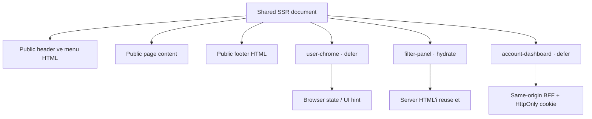
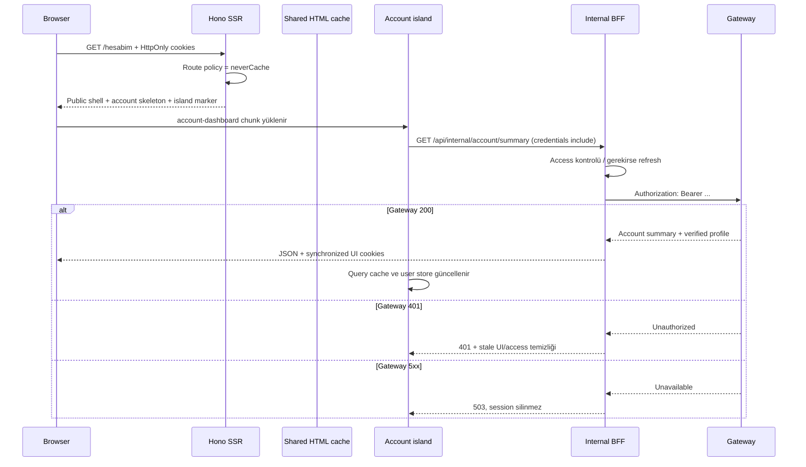

# Island Architecture ile Cache-Safe Kişiselleştirme ve Auth

> Public HTML’i herkesle paylaşırken kullanıcıya özel deneyimi güvenli, doğrulanabilir ve bağımsız
> JavaScript adalarına taşımak

Bir sayfayı kişiselleştirmenin en kolay yolu kullanıcı bilgisini server’da okuyup React ağacına
vermektir:

```tsx
<Header user={user} />
<Page offers={personalizedOffers} />
```

Bu yaklaşım ilk bakışta kusursuz görünür. Kullanıcı daha HTML gelirken adını, avatarını ve tekliflerini
görür. JavaScript çalışmadan doğru içerik ekrandadır. Fakat aynı document’i shared cache’e koymak
istediğiniz anda çok daha zor bir soru ortaya çıkar:

> Bu HTML gerçekten herkese açık mı, yoksa belirli bir kullanıcıya mı ait?

Header’ın yalnızca sağ üst köşesinde kullanıcı adı bulunması bile bütün HTML belgesini kişisel hale
getirir. Cache key’e session veya user ID eklemek cardinality’yi büyütür ve izolasyon riskini artırır.
Cache’i tamamen bypass etmek ise sayfanın geri kalan yüzde doksan dokuzunu her request’te yeniden
render etmeye zorlar.

Biz üçüncü bir yol seçtik: public document shared kalıyor; interaktif veya kişisel alanlar kendi
JavaScript yaşam döngüsüne sahip küçük React island’larına dönüşüyor.

Bu yazı yalnızca selective hydration performansını anlatmıyor. Island sınırının cache güvenliği ve
auth modeliyle nasıl birleştiğini inceliyor. Çünkü bizim sistemimizde island, “daha az JavaScript”
optimizasyonundan önce bir veri sınıflandırma aracıdır.

## Asıl problem hydration değil, veri sınırıydı

Klasik bir SSR uygulamasında bütün sayfa server’da render edilir, ardından client aynı React ağacını
hydrate eder:

```text
Request → full React render → full HTML → full application hydration
```

Bu modelde public içerik, menü, footer, mobil drawer, kullanıcı alanı ve hesap paneli aynı client
graph’ın parçaları olabilir. Ağacın küçük bir bölümü browser API veya kullanıcı state’i istediğinde
geniş bir client boundary oluşabilir.

Biz sayfayı üç veri sınıfına ayırdık:

| Sınıf                 | Örnek                            | Render stratejisi               |
| --------------------- | -------------------------------- | ------------------------------- |
| Public ve statik      | Başlık, metin, SEO, desktop menü | Yalnız SSR HTML                 |
| Public ama interaktif | Kredi filtresi, accordion        | SSR + `hydrate` island          |
| Kullanıcıya özel      | Header hesabı, hesap özeti       | Fallback + `defer` island + BFF |

İlk sınıf browser’da React çalıştırmak zorunda değil. İkinci sınıf server’ın ürettiği public HTML’i
yeniden kullanıp event handler ekleyebilir. Üçüncü sınıf ise kişisel veriyi shared HTML’e hiç sokmaz;
browser’da HttpOnly credential taşıyan same-origin API çağrısıyla yükler.

Bu ayrım cache kontratını sadeleştiriyor:

```text
Shared HTML = public data + güvenli fallback + island işaretleri
Personal data = client request + authoritative BFF response
```

## Island architecture neyi değiştiriyor?

Island architecture, sayfanın büyük bölümünü server-rendered HTML olarak bırakır ve yalnız
interaktivite gereken bölgelerde bağımsız client uygulamaları başlatır. Astro’nun
[islands architecture dokümantasyonu](https://docs.astro.build/en/concepts/islands/) bu yaklaşımı
“statik HTML denizindeki interaktif adalar” olarak tarif eder. Astro bu modeli framework özelliği
olarak sunuyor; bizim implementasyonumuz ise React ve Vite üzerinde küçük bir runtime.



Burada her island ayrı bir React root. Sayfanın geri kalanı React client tree’sinin parçası değil.
Header’ın public navigasyonu HTML olarak kalabilirken yalnız hesap düğmesi JavaScript ile yönetilir.
Footer desktop’ta tamamen statik kalabilir; mobil accordion viewport’a yaklaştığında yüklenebilir.

Bu modelin sonucu yalnız daha küçük başlangıç bundle’ı değildir. Client state’in erişebildiği veri
alanı da küçülür.

## Island kontratı bilinçli olarak küçük

Server tarafında kullanılan `Island` component’i DOM’a dört bilgi yazar:

```tsx
export function Island({ name, mode = "hydrate", props, eager, children }: IslandProps) {
  return (
    <div
      data-island={name}
      data-mode={mode}
      data-eager={eager ? "" : undefined}
      data-props={serializeEmbeddedJson(props ?? {})}
    >
      {mode === "hydrate" ? children : <div data-fallback="">{children}</div>}
    </div>
  );
}
```

- `name`: Client registry’de yüklenecek module adı.
- `mode`: Server HTML’i hydrate mı edilecek, yoksa client component sıfırdan mı mount edilecek?
- `eager`: Module hemen mi yüklenecek, viewport’a yaklaşması mı beklenecek?
- `props`: Server’dan client’a taşınan JSON-serializable public başlangıç verisi.
- `children`: Hydrate edilecek gerçek HTML veya defer modunda gösterilecek fallback.

Bu kontrat bir framework’ün genel component serialization protokolü değil. `Date`, `Map`, function,
cyclic object veya `BigInt` taşımayı vaat etmiyor. Props JSON ile serialize edilebilmeli, küçük olmalı
ve secret içermemeli.

React attribute değerlerini HTML için escape eder; yine de bu alanı güven sınırı olarak görmüyoruz.
DOM’a yazılan her veri kullanıcı tarafından okunabilir ve değiştirilebilir. Access token, refresh
token, kişisel hesap verisi veya server-only karar island prop’una konmaz.

### Island props link değildir: embedded JSON wire formatı

`layout-client` island'ı `publicPath` ve `pathname`, mobile menu island'ı gerçek linklerin client
kopyalarını, analytics island'ı ise page metadata taşır. Bu değerlerin browser'daki karşılığı normal
`/path` olmalıdır; fakat HTML source'ta link olmayan payload'ın ikinci bir URL inventory'si gibi
görünmesini istemiyoruz.

Merkezi serializer şu dönüşümü uygular:

```ts
serializeEmbeddedJson({ publicPath: "/blogs/paginated?page=2" });
// {"publicPath":"\/blogs\/paginated?page=2"}

parseEmbeddedJson(serialized);
// { publicPath: "/blogs/paginated?page=2" }
```

Bu double encoding değildir. `\/`, JSON standardında `/` karakterinin eşdeğer escape temsilidir.
DOM `dataset.props` değeri backslash'ı korur; `JSON.parse` bunu slash'a çevirir. Manuel
`replaceAll("\\/", "/")` yapılmaz; böyle bir adım nested değerlerde hata riski üretir ve JSON parser'ın
zaten verdiği garantiyi tekrarlar.

Serializer bütün island'ların geçtiği `Island` component'inde olduğu için `layout-client`,
`page-analytics`, menu/footer, blog ve gelecekteki island'lar aynı kontratı kullanır. Gerçek fallback
`<a href>` linkleri escape edilmez; crawler'a göstermek istediğimiz linkler onlar olduğu için ham
kalır. `<`, `>`, `&`, U+2028 ve U+2029 escape'leri de aynı boundary'de uygulanır. Escape bir security
sınırı değildir: secret veya kişisel veri island prop'una yine konamaz.

## İki mode, iki farklı doğruluk kontratı

`hydrate` ve `defer` görünüşte küçük bir seçenek farkı. Gerçekte cache ve veri sahipliği açısından iki
ayrı model.

### `hydrate`: Aynı public HTML’i uyandır

Kredi filtre paneli server’da gerçek kontrol ve değerleriyle render edilir:

```tsx
<Island name="filter-panel" mode="hydrate" props={{ amount: data.amount, city: data.city }}>
  <FilterPanel amount={data.amount} city={data.city} />
</Island>
```

Client aynı component’i aynı props ile `hydrateRoot` üzerinden başlatır. React mevcut DOM’u silmez;
event handler ve client state’i bağlar.

```ts
hydrateRoot(element, <FilterPanel {...props} />);
```

Bu mode’un invariant’ı kesindir:

> Server’ın ürettiği ilk ağaç ile client’ın ilk render ettiği ağaç aynı olmalıdır.

React’in [`hydrateRoot` dokümantasyonu](https://react.dev/reference/react-dom/client/hydrateRoot)
hydration mismatch’lerinin bug olarak ele alınması gerektiğini vurgular. React development’ta bazı
farkları uyarabilir; production’da bütün attribute farklarının otomatik düzeltilmesi garanti edilmez.

Bu nedenle hydrate island içinde ilk render sırasında şunlar kullanılmamalıdır:

- `Date.now()` veya `new Date()` ile ortamlar arasında değişen metin.
- `Math.random()` veya `crypto.randomUUID()`.
- Guard olmadan `window.innerWidth`.
- Client’ta okunup server’dan farklı sonuç veren cookie/localStorage.
- Locale veya timezone’u iki ortamda farklı çözen formatlama.

Gerekli değer server’da belirlenip prop olarak taşınmalı ya da component `defer` moduna geçmelidir.

### `defer`: Fallback’i göster, kişisel component’i client’ta kur

Defer mode’da server gerçek client component’i render etmez. Yalnız public ve cache-safe fallback
HTML’i üretir:

```tsx
<Island name="user-chrome" mode="defer">
  <UserChromeFallback />
</Island>
```

HTML ilk geldiğinde kullanıcı “Giriş yap” düğmesini görür. Client module yüklendiğinde runtime
`createRoot` ile island alanını devralır:

```ts
createRoot(element).render(<UserChrome />);
```

React’in [`createRoot` referansı](https://react.dev/reference/react-dom/client/createRoot), ilk render
sırasında root içindeki mevcut HTML’in temizlenip client ağacıyla değiştirildiğini açıklar. Bu yüzden
defer fallback’i hydrate edilmez; geçici ve bilinçli olarak replace edilir.

Defer mode’un invariant’ı farklıdır:

> Server fallback’i herkese güvenle gösterilebilir olmalı; gerçek component kişisel veriyi yalnız
> client tarafında authoritative kaynaktan almalıdır.

Hydration equality gerekmez. Buna karşılık JavaScript gecikirse veya hiç çalışmazsa fallback’in
anlamlı kalması gerekir.

## `hydrate` ile `defer` karar tablosu

Bir component için mode seçerken şu tabloyu kullanıyoruz:

| Soru                                                   | Evet                    | Hayır                       |
| ------------------------------------------------------ | ----------------------- | --------------------------- |
| Server HTML’i herkese aynı mı?                         | `hydrate` düşünülebilir | `defer` veya cache bypass   |
| JS olmadan gerçek içerik gerekli mi?                   | `hydrate`               | Fallback yeterliyse `defer` |
| İlk client render server ile birebir aynı olabilir mi? | `hydrate`               | `defer`                     |
| Kişisel/credential gerektiren veri var mı?             | Genellikle `defer`      | Her iki mode mümkün         |
| Alan yalnız browser API’si mi kullanıyor?              | `defer` daha sade       | `hydrate` mümkün            |

Mode performans tercihi değil, veri ve rendering kontratıdır. “Hydration pahalı, her şeyi defer
edelim” demek erişilebilir SSR içeriğini kaybettirebilir. “SEO için her şeyi hydrate edelim” demek de
kişisel veriyi shared document’e sokabilir.

## Client registry: dosya adı runtime kimliğine dönüşüyor

Client entry bütün island module’lerini eager import etmiyor. Vite glob import ile lazy loader map’i
üretiyor:

```ts
const registry = import.meta.glob<IslandModule>("./islands/*.tsx");

const byName = new Map<string, () => Promise<IslandModule>>();
for (const [path, load] of Object.entries(registry)) {
  byName.set(path.slice("./islands/".length, -".tsx".length), load);
}
```

Vite’ın [glob import dokümantasyonuna](https://vite.dev/guide/features.html#glob-import) göre eşleşen
module’ler varsayılan olarak dynamic import ile lazy yüklenir ve ayrı chunk’lara bölünür. Böylece
`account-dashboard` olmayan bir sayfa o island’ın component kodunu ilk bundle içinde taşımak zorunda
değil.

DOM’daki `data-island="account-dashboard"` değeri ile dosya adı arasında açık bir convention var:

```text
data-island="account-dashboard"
             ↓
src/islands/account-dashboard.tsx
```

Registry bilinmeyen bir isim görürse bütün client bootstrap’ı düşürmek yerine warning üretip o
island’ı fallback halinde bırakır. Bu graceful degradation faydalıdır; fakat production’da missing
island metriği veya error reporting olmadan yalnız console warning yeterli değildir.

## Eager ve viewport scheduling

Her island aynı öncelikte değil. Layout store bootstrap ve analytics sayfa yüklenir yüklenmez
çalışmalı; footer accordion kullanıcı footer’a hiç inmezse indirilmeyebilir.

```ts
const observer = new IntersectionObserver(
  (entries, observer) => {
    for (const entry of entries) {
      if (!entry.isIntersecting) continue;
      observer.unobserve(entry.target);
      void mount(entry.target as HTMLElement);
    }
  },
  { rootMargin: "200px" },
);

for (const element of document.querySelectorAll("[data-island]")) {
  if (element.dataset.eager !== undefined) void mount(element);
  else observer.observe(element);
}
```

`rootMargin: 200px`, island viewport’a girmeden biraz önce module download’unu başlatır. Kullanıcı
alana ulaştığında interaction’ın hazır olma olasılığı artar.

Bu strateji üç maliyeti dengeler:

- **Network:** Kullanılmayacak chunk’ı indirmemek.
- **Main thread:** Bütün React root’larını ilk anda kurmamak.
- **Interaction latency:** Kullanıcı tıklamadan kısa süre önce hazırlamak.

Eager flag dikkatli kullanılmalı. Her island eager olursa architecture tekrar monolithic başlangıç
maliyetine yaklaşır. Hiçbiri eager olmazsa above-the-fold kullanıcı menüsü görünür olduğu anda dahi
observer callback’ini ve chunk download’unu bekleyebilir.

Mevcut runtime modern browser’da `IntersectionObserver` bulunduğunu varsayıyor. Daha geniş browser
desteği gerekiyorsa observer yokluğunda bütün island’ları mount eden bir fallback eklenmelidir.

## Fallback tasarımı yalnız loading spinner değildir

Defer island’ın server çıktısı gerçek kişisel veri taşımaz ama boş olmak zorunda da değildir. İyi
fallback üç özelliğe sahip olmalı:

1. Güvenli: Kullanıcıya özel veya doğrulanmamış bilgi içermemeli.
2. Yararlı: JavaScript çalışmazsa temel navigasyon mümkün kalmalı.
3. Boyutsal olarak kararlı: Client component mount olduğunda büyük layout shift üretmemeli.

Header örneğinde fallback ile gerçek düğme aynı yükseklik ve minimum genişliği kullanıyor:

```tsx
export function UserChromeFallback() {
  return (
    <Button size="sm" className="min-w-[5.5rem]" asChild>
      <a href="/giris">Giriş yap</a>
    </Button>
  );
}
```

Mobile menu fallback’i semantic button; footer fallback’i native `<details>` elementlerinden oluşuyor.
JavaScript hiç yüklenmese bile linkler ve temel aç/kapa davranışı kullanılabilir.

Account dashboard fallback’i gerçek panelin yaklaşık geometrisini taşıyan skeleton’dır. Cache’e giren
HTML’de kullanıcı adı, hareketler veya istatistik yoktur. Bu hem veri sızıntısını hem hydration
mismatch riskini ortadan kaldırır.

## Kişiselleştirme mimarisinin tam akışı

`/hesabim` sayfasını baştan sona takip edelim.



Route’un loader’ı kişisel veri çekmez:

```tsx
export default defineRoute({
  path: "/hesabim",
  cache: (ctx) => pageCachePolicy(PageCacheId.account, ctx),
  loader: async () => ({ data: {} }),
  Component: () => (
    <Island name="account-dashboard" mode="defer">
      <AccountDashboardShell />
    </Island>
  ),
});
```

Account route ayrıca `neverCache()` kullanıyor. Teorik olarak yalnız public skeleton içeren document
shared cache’e uygun hale getirilebilir; mevcut seçim savunmacı. Account sayfası `noindex`, kişisel
navigation bağlamında ve yanlışlıkla server data eklendiğinde shared cache’e sızmaması isteniyor.
Kişisel veri boundary’sinin asıl güvencesi yine defer island ve BFF’dir.

## BFF neden doğrudan gateway çağrısından daha önemli?

Browser gateway’e doğrudan access token göndermiyor. Island same-origin internal endpoint’i çağırıyor:

```ts
fetch("/api/internal/account/summary", {
  credentials: "include",
});
```

Tarayıcı HttpOnly cookie’yi JavaScript’e göstermez; uygun request’lerde otomatik taşır. BFF cookie’yi
okur, access süresini değerlendirir, gerekirse refresh eder ve gateway request’ine `Authorization`
header’ı ekler.

Bu model üç sınır kuruyor:

- Token DOM’a, island props’a veya client store’a girmez.
- Gateway origin’i ve kontratı browser bundle’ına yayılmaz.
- Refresh, cookie rotasyonu ve gateway error sınıflandırması server’da merkezileşir.

MDN’in [`Set-Cookie` referansı](https://developer.mozilla.org/en-US/docs/Web/HTTP/Reference/Headers/Set-Cookie),
`HttpOnly` cookie’lerin `document.cookie` üzerinden okunamadığını; `Secure` ve `SameSite` alanlarının
transport ve cross-site davranışını sınırladığını açıklar. Production token cookie’leri `HttpOnly`,
`Secure`, `SameSite=Lax` ve `Path=/` ile yazılıyor.

`HttpOnly` tek başına tam XSS savunması değildir. Zararlı script token değerini okuyamasa da kullanıcının
browser’ından same-origin request başlatabilir. CSP, output escaping ve dependency güvenliği hâlâ
gereklidir. Benzer biçimde `SameSite=Lax` CSRF riskini azaltır ama bütün state-changing endpoint’ler
için genel CSRF tasarımının yerine geçmez. Yeni mutation BFF’leri method, Origin/Referer kontrolü veya
CSRF token ihtiyacı açısından ayrıca değerlendirilmelidir.

Bir başka sınır shared cache'tir. Token refresh veya UI session senkronizasyonu `Set-Cookie`
ürettiğinde response, body anonim ve Redis-cacheable olsa bile CDN-cacheable kabul edilmez. Finalizer
bu response'u `private, no-store` yapar. Cookie yazılmayan normal HTML response'ları da varsayılan
olarak edge cache'e açılmaz; Redis origin cache'i ile kullanıcıya giden HTTP cache policy'si ayrı
tutulur. Böylece refresh token rotasyonu ya da tracking cookie'si bir intermediary tarafından başka
ziyaretçiye replay edilemez.

## UI cookie’si ile auth credential aynı şey değildir

Header hızlı bir ilk görünüm için iki JavaScript-readable cookie kullanır:

```text
signed_in=1
account_text=Cem Bakca
```

`layout-client` island’ı bu değerleri okuyup client store’u seed eder:

```ts
const signedIn = hasAuthCookies();
const accountText = readCookie(Cookie.accountText);

seedUserInfo({
  isSignedIn: signedIn,
  displayName: accountText,
});
```

Bu cookie’ler kullanıcı tarafından DevTools ile değiştirilebilir. XSS varsa script de değiştirebilir.
Dolayısıyla güvenlik kararı vermezler. Yalnız şu soruya iyimser cevap sağlarlar:

> Header ilk client render’ında “Giriş yap” mı, hesap düğmesi mi göstersin?

Gerçek yetkilendirme şu kaynaklardan gelir:

```text
HttpOnly access/refresh cookie
        ↓
server auth core
        ↓
gateway Authorization doğrulaması
        ↓
200 / 401 / 5xx authoritative sonuç
```

Kullanıcı `signed_in=1` yazar ama token’ı yoksa header geçici olarak giriş yapılmış görünebilir.
Korumalı account çağrısı `401` döndüğünde UI state ve hint cookie’leri temizlenir. Kullanıcı
`signed_in=0` yapar fakat geçerli HttpOnly token’ları varsa header geçici olarak “Giriş yap” gösterir;
başarılı korumalı çağrı verified profile’dan hint cookie’lerini tekrar üretir. Sonraki sayfa yenilemesi
güncel ipuçlarını kullanır.

Bu eventual-consistency bilinçli bir trade-off. Her public sayfada yalnız header’ı doğrulamak için
`/auth/session` çağrısı yapmıyoruz. Böyle bir çağrı cache-safe public navigasyonu auth servisinin
latency ve availability’sine bağlardı. Authoritative doğrulama ancak gerçekten korumalı veri
istendiğinde devreye giriyor.

Projede gerektiğinde açıkça çağrılabilecek `/api/internal/auth/session` endpoint’i var; fakat global
layout her navigation’da bunu otomatik çağırmıyor.

## “UI spoof edilebilir” neden yetkilendirme açığı değildir?

Tehdit modelini response türüne göre ayırmak gerekir:

| İşlem                           | `signed_in` yeterli mi? | Otorite                             |
| ------------------------------- | ----------------------- | ----------------------------------- |
| Header’da hesap ikonu göstermek | Evet, yalnız ipucu      | Client cookie/store                 |
| `/hesabim` linkini göstermek    | Evet                    | Link gizlemek güvenlik değildir     |
| Hesap özetini döndürmek         | Hayır                   | HttpOnly credential + gateway       |
| Token refresh etmek             | Hayır                   | Refresh cookie + auth gateway       |
| Para/başvuru mutation’ı         | Hayır                   | BFF authorization + CSRF politikası |

Bir kullanıcının kendisine sahte hesap ikonu göstermesi güvenlik açığı değildir. Server aynı cookie’ye
bakarak kişisel JSON döndürürse açık oluşur. Bizim BFF endpoint’leri `signed_in` veya `account_text`
değerini authorization için okumuyor.

Test suite bunu doğrudan kanıtlıyor: yalnız spoof edilmiş UI cookie’leriyle `/auth/session` çağrısı
`401` döner, `displayName` üretmez ve stale hint’leri siler.

## Access token expiry kontrolü doğrulama değildir

Server access token JWT biçimindeyse `exp` alanına bakarak süresinin dolmasına 30 saniye kalmış token’ı
refresh etmeye çalışır. Opaque veya malformed token da refresh gerektiriyor kabul edilebilir.

Bu yalnız scheduling heuristic’idir. Token’ın imzasını, issuer’ını, audience’ını veya revocation
durumunu kanıtlamaz. BFF token’ı gateway’e iletir; authoritative karar gateway’in `200` ya da `401`
cevabıdır.

Bu ayrım önemlidir: client veya SSR katmanında JWT payload decode edebilmek authorization yapmak
değildir. Payload’dan çıkarılan display name de ancak UI metni olabilir; verified profile cevabı
geldiğinde yeniden senkronize edilir.

## `401 → refresh → tek retry` neden client wrapper’da?

Korumalı BFF kendi request’i başında token süresini kontrol eder ve expired access varsa refresh
etmeye çalışır. Fakat gateway henüz süresi dolmamış görünen bir token’ı revoke edilmiş olduğu için
`401` döndürebilir. Bu durumda BFF stale access ve UI hint’lerini temizler ama geçerli olabilecek refresh
cookie’sini korur.

Client wrapper ilk `401` sonrasında refresh endpoint’ini çağırır:

```ts
if (response.status === 401 && !options.retried) {
  const refreshed = await fetch("/api/internal/refresh", {
    method: "POST",
    credentials: "include",
  });

  if (refreshed.ok) {
    return clientApiFetch(path, init, { retried: true });
  }
}
```

Refresh başarılıysa orijinal request yalnız bir kez tekrarlanır. `retried` guard’ı sonsuz
`401 → refresh → 401` döngüsünü engeller. Refresh endpoint’inin kendisi wrapper tarafından tekrar
refresh edilmeye çalışılmaz.

Final response hâlâ `401` ise client user store `{ isSignedIn: false }` olur; eski display name ve
initials atomik olarak silinir.

```ts
if (!response.ok) {
  if (response.status === 401) {
    seedUserInfo({ isSignedIn: false });
  }
  throw new ClientApiError(response.status, message);
}
```

Server aynı refresh token için eşzamanlı refresh Promise’lerini process içinde deduplicate ediyor.
Bu, aynı browser’da paralel island request’lerinin token rotasyon yarışını azaltır. Çoklu replica’da
strong global dedup sağlamaz; gerçek gateway refresh token rotation semantiği gerektiriyorsa shared
lock veya idempotent refresh kontratı ayrıca gerekir.

## `401` ile `5xx` aynı auth sonucu değildir

Gateway ulaşılamaz veya `503` dönerse kullanıcının credential’ının geçersiz olduğunu bilmiyoruz.
Oturumu temizlemek availability problemini yanlışlıkla logout’a çevirir.

BFF sonuçları bu nedenle üç sınıfa ayrılır:

```ts
type GatewayResult<T> =
  { kind: "success"; data: T } | { kind: "unauthorized" } | { kind: "unavailable" };
```

- `success`: Profile authoritative; UI cookie ve store senkronize edilir.
- `unauthorized`: Access/UI state challenge edilir; final `401` client’ı signed-out yapar.
- `unavailable`: `503` döner; token ve UI hint’leri korunur.

Account island `401` için “Giriş gerekli”, diğer hatalar için retry edilebilir hata görünümü gösterir.
TanStack Query config’i `401` hatasını otomatik tekrar etmez; diğer hatalara yalnız bir ek deneme
tanır. TanStack Query’nin
[retry rehberi](https://tanstack.com/query/latest/docs/framework/react/guides/query-retries), status’a
göre retry kararı veren function kullanımını destekliyor.

Bu ayrım auth UX’inde kritik: “servis şu an cevap vermiyor” ile “sen artık yetkili değilsin” aynı
mesaj ve state transition değildir.

## Birden fazla island ortak auth state’i nasıl görüyor?

Her island ayrı React root olduğu için normal React Context root sınırını geçemez. `layout-client`,
`user-chrome` ve `account-dashboard` birbirinden bağımsız mount edilir. Buna rağmen verified profile
geldiğinde header’ın anında güncellenmesi gerekir.

Bu amaçla küçük bir external store kullanıyoruz:

```ts
let userInfo: UserInfo = { isSignedIn: false };
const listeners = new Set<() => void>();

export function seedUserInfo(patch: Partial<UserInfo>) {
  userInfo = patch.isSignedIn === false ? { isSignedIn: false } : { ...userInfo, ...patch };

  for (const listener of listeners) listener();
}
```

`UserChrome`, store’a `useSyncExternalStore` ile bağlanır:

```ts
const user = useSyncExternalStore(subscribeUserInfo, getUserInfo, getUserInfo);
```

React’in [`useSyncExternalStore` referansı](https://react.dev/reference/react/useSyncExternalStore),
React dışındaki mutable store’a subscribe olmak için `subscribe`, `getSnapshot` ve SSR/hydration varsa
`getServerSnapshot` kontratını tanımlar.

Bizim `user-chrome` island’ımız defer olduğu için server/client snapshot equality ile hydrate edilmiyor;
üçüncü argüman yine stabil ilk snapshot sağlıyor. `layout-client` hint cookie’lerinden seed ettiğinde
veya account query verified profile döndürdüğünde bütün subscribed island’lar yeniden render olur.

`isSignedIn: false` özel olarak eski profile alanlarını tamamen atar. Aksi halde spoof edilmiş
`displayName` store’da signed-out state ile birlikte kalabilirdi.

## TanStack Query cache ile SSR HTML cache aynı cache değildir

Account data, Redis HTML cache’ine girmez. Browser’da TanStack Query tarafından kısa süreli tutulur:

```ts
useQuery({
  queryKey: ["account", "summary"],
  queryFn: fetchAccountSummaryApi,
  retry: (count, error) => {
    if (error instanceof ClientApiError && error.status === 401) return false;
    return count < 1;
  },
});
```

İki cache’in kapsamı farklı:

| Özellik          | Redis HTML cache              | TanStack Query cache                   |
| ---------------- | ----------------------------- | -------------------------------------- |
| Konum            | Server/shared                 | Browser memory                         |
| Veri             | Public full HTML              | Kullanıcının JSON verisi               |
| Kimler paylaşır? | Aynı route key’indeki herkes  | Aynı browser runtime’ındaki island’lar |
| Yaşam            | TTL + SWR + release namespace | `staleTime` + `gcTime`                 |
| Auth data        | Yasak/bypass                  | Beklenen kullanım                      |

Bütün island’lar ayrı `QueryClientProvider` ile sarılıyor gibi görünse de provider aynı browser
singleton `QueryClient`’ı kullanır. Böylece iki island aynı query key’i isterse request ve data cache’i
paylaşabilir.

TanStack Query’nin [query key rehberi](https://tanstack.com/query/latest/docs/framework/react/guides/query-keys),
query function’ın sonucunu değiştiren bütün değişkenlerin key’e girmesi gerektiğini belirtir. Bu,
önceki makaledeki route cache kontratının browser tarafındaki karşılığıdır. Account summary current
session’a bağlı olduğu için logout/login geçişinde account query’lerinin remove/invalidate edilmesi de
auth lifecycle’ın parçası olmalıdır.

## Her root’a provider koymanın maliyeti

Bağımsız root’ların faydası izolasyon; maliyeti provider ve lifecycle tekrarlarıdır. Her island şu
ağaçla başlıyor:

```tsx
<AppQueryProvider>
  <IslandComponent {...props} />
</AppQueryProvider>
```

Singleton QueryClient veri cache’ini paylaşır; fakat React provider instance’ları ve root scheduler’ları
ayrıdır. Onlarca küçük island oluşturmak şu maliyetleri büyütebilir:

- Çok sayıda dynamic import ve chunk request’i.
- Birden fazla React root initialization.
- Tekrarlanan provider component’leri.
- Island’lar arası state koordinasyonu için external store ihtiyacı.
- Focus, modal ve portal ownership problemleri.

Island sınırı her button’a çizilmemeli. Birlikte etkileşen component’ler tek island olmalı. Örneğin
dialog trigger ile dialog content farklı root’lara bölünürse focus management ve context zorlaşır.
Radix benzeri component grupları bir island içinde kalmalıdır.

## Next.js ile aynı problem bugün nasıl çözülürdü?

Güncel Next.js App Router farklı ama daha zengin bir çözüm sunuyor. Layout ve page’ler varsayılan
Server Component; interaktivite gereken dosyada `"use client"` boundary’si açılır. Resmî
[Server and Client Components rehberi](https://nextjs.org/docs/app/getting-started/server-and-client-components),
ilk yüklemede HTML’in hızlı preview verdiğini, RSC payload’un server/client ağacını uzlaştırdığını ve
Client Component’lerin hydrate edildiğini anlatıyor.

Cache Components ile public shell build/cache scope’una alınabilir; cookie okuyan kişisel component
Suspense altında request-time render edilebilir. Bu model kişisel alanı browser fetch’ine bırakmadan
server’da stream edebilir. Kullanıcı header’ının ilk doğru görünümü açısından bizim defer island’ımızdan
daha iyi UX sağlayabilir.

Bizim deneyimimizde sorun Next.js’in bu ayrımı yapamaması değildi. Operasyon modelinin daha geniş
olmasıydı:

- HTML yanında RSC payload ve Router Cache de düşünülür.
- `"use client"` bir module graph boundary’sidir; o dosyanın import ettiği çocuklar client bundle’a
  katılır.
- Cache Components, Suspense ve runtime API kullanımı prerender sınırını belirler.
- Self-hosted çoklu instance’ta shared cache ve tag koordinasyonu gerekir.

Biz RSC, streaming kişisel server island veya client router kullanmıyoruz. Bunun karşılığında daha
basit ama daha geç kişiselleşen bir akış seçiyoruz:

```text
shared full HTML → independent client island → same-origin BFF
```

Bu bir üstünlük iddiası değil, trade-off:

| Konu               | Next.js Cache Components    | Bizim React island runtime         |
| ------------------ | --------------------------- | ---------------------------------- |
| Kişisel ilk içerik | Server’da stream edilebilir | Client BFF çağrısından sonra gelir |
| Client protokolü   | RSC + Client Components     | DOM marker + JSON props            |
| Navigation         | App Router ve prefetch      | Normal document navigation         |
| Cache granularity  | Route/component/function    | Full HTML route + client query     |
| Runtime sahipliği  | Framework                   | Uygulama ekibi                     |
| JS scheduling      | Framework boundary/prefetch | Eager veya IntersectionObserver    |

İçerik sitesi ağırlıklı, public cache oranı yüksek ve kişisel alanları sınırlı bir ürün için bizim
modelimiz açıklık sağlıyor. Çok yoğun kişiselleştirilmiş dashboard veya app-like navigation için
Next.js’in Server/Client Component modeli ya da klasik SPA daha uygun olabilir.

## Selective hydration otomatik olarak daha hızlı demek değildir

Island mimarisi başlangıç JavaScript’ini azaltma fırsatı verir; garanti vermez. Şu hatalar avantajı
ortadan kaldırabilir:

- Bütün island’ları `eager` işaretlemek.
- Büyük ortak dependency’leri her chunk graph’ına taşımak.
- Çok küçük island’larla request/root sayısını artırmak.
- Above-the-fold island’ı viewport scheduling yüzünden geç interactive yapmak.
- Server fallback ile client component arasında büyük layout shift üretmek.
- Her island mount’unda aynı API’yi query dedup olmadan çağırmak.
- Props attribute’una büyük JSON payload gömmek.

Ölçülmesi gerekenler yalnız total JS byte değildir:

- Island chunk load başlangıç/bitiş zamanı.
- SSR paint ile island interactive olma arasındaki süre.
- Interaction to Next Paint.
- Hydration mismatch ve mount error sayısı.
- Island başına bundle ve shared chunk boyutu.
- Fallback’ten gerçek içeriğe Cumulative Layout Shift.
- Kişisel BFF request latency ve error oranı.

Bir hesap island’ı data gelmeden interactive olamaz. JavaScript 20 ms’de yüklense ama auth gateway
800 ms sürse kullanıcı 800 ms skeleton görür. Island performansı backend pipeline’dan ayrı ölçülemez.

## Progressive enhancement sınırı

Public içerik ve navigasyon JavaScript olmadan çalışıyor. Fakat account dashboard client BFF’ye
bağımlı; JavaScript olmadan yalnız skeleton görünür. Bu tam progressive enhancement değildir.

Bu tercih bilinçli çünkü kişisel veriyi shared document’e koymuyoruz ve ayrı server-island streaming
altyapımız yok. Eğer JavaScript’siz account erişimi ürün gereksinimi olursa seçenekler şunlardır:

- Account route’unu cache dışı personalized SSR yapmak.
- Ayrı bir server island endpoint’i ile HTML fragment stream etmek.
- Form/navigation tabanlı klasik server response sunmak.

Her seçenek latency, cache ve complexity maliyeti getirir. “Island kullanıyoruz” demek erişilebilirlik
ve no-JS davranışını otomatik çözmez.

## Error boundary’ler root bazında düşünülmeli

Bir island mount sırasında throw ederse diğer React root’lar çalışmaya devam edebilir; bu izolasyon
önemli bir avantaj. Fakat mevcut bootstrap `mount()` Promise’ini global error reporting’e bağlamazsa
rejection console’da kalabilir.

Production runtime için her island root’un şu bilgileri raporlaması değerlidir:

- Island adı ve mode’u.
- Module load failure.
- Props parse failure.
- Hydration recoverable error.
- Render error boundary sonucu.
- Mount süresi.

React `hydrateRoot` `onRecoverableError`, `onCaughtError` ve `onUncaughtError` gibi root options sunar.
Hydrate island’larda bu callback’leri merkezi telemetry’ye bağlamak mismatch ve client-only hataları
route/request bilgisiyle ilişkilendirmeyi kolaylaştırır.

Kişisel island hata verdiğinde public document kullanılabilir kalmalı. Account summary düşerse header,
menü ve içerik sayfasının tamamı unmount edilmemeli. Bağımsız root izolasyonu bu failure domain’i doğal
olarak küçültür.

## Güvenlik checklist’i

Cache-safe personalization için island review’ında şu soruları soruyoruz:

1. Island prop’larında secret veya kişisel veri var mı?
2. Fallback bütün kullanıcılara gösterilebilir mi?
3. `hydrate` mode ise ilk client tree server tree ile aynı mı?
4. Authorization kararı JavaScript-readable cookie’ye dayanıyor mu?
5. BFF HttpOnly cookie ve gateway cevabını otorite kabul ediyor mu?
6. `401`, `403` ve `5xx` farklı state transition üretiyor mu?
7. Refresh yalnız bir kez retry ediliyor mu?
8. State-changing request için CSRF sınırı tanımlı mı?
9. Logout olduğunda query cache ve external user store temizleniyor mu?
10. Shared HTML’in cache key’i kişisel state’ten bağımsız mı?

Bu checklist’te performans maddeleri yok gibi görünebilir. Çünkü önce veri sınırı doğru olmalı.
Güvensiz bir island architecture daha küçük bundle ile veri sızdırmaktan başka bir şey yapmaz.

## Test edilmesi gereken gerçek senaryolar

Auth testleri yalnız “token varsa 200” ile bitmemeli. Mevcut suite şu davranışları koruyor:

- UI hint cookie’leri var ama HttpOnly token yoksa session endpoint’i `401` döner.
- Gateway verified profile döndürürse hint cookie’leri server cevabından yeniden yazılır.
- Gateway access token’ı reddederse stale access ve UI hint’leri temizlenir, refresh korunur.
- Gateway `503` dönerse kullanıcı logout edilmez.
- Expired access + refresh token, yeni cookie’lerle başarılı account response’u üretir.
- Client ilk `401` sonrasında refresh endpoint’ini çağırır ve protected request’i bir kez tekrarlar.
- Final `401`, external user store’daki spoof edilmiş profile alanlarını tamamen siler.
- Account query `401` için otomatik retry yapmaz.

Island runtime için ek browser testleri de değerlidir:

- Hydrate island event handler’ı server DOM’u koruyarak çalışıyor mu?
- Defer island fallback’i module gelene kadar görünür mü?
- Module geldikten sonra fallback doğru boyutta replace ediliyor mu?
- Viewport dışındaki island gerçekten lazy kalıyor mu?
- Unknown island adı diğer island’ları engelliyor mu?
- JavaScript kapalıyken public navigation erişilebilir mi?
- Hint cookie spoof edildiğinde hiçbir protected JSON sızıyor mu?

Bu testler cache, browser ve auth sınırlarını birlikte doğrular.

## Mock gateway bu yazıdaki akışta neden önemli?

Auth davranışını UI içinde hard-code edilmiş fixture ile test etmek gerçek sınırı gizler. Bu nedenle
mock gateway ayrı Node process’i olarak access/refresh, profile ve account endpoint’lerini gerçek HTTP
üzerinden sunuyor.

Amaç kusursuz bir identity provider yazmak değil. Amaç şu invariant’ı local development’ta da
korumak:

```text
Island → same-origin BFF → gateway boundary
```

Gateway yoksa protected data çağrısı hata verir; UI doğrudan local account fixture’a düşmez. Gerçek
gateway hazır olduğunda island veya BFF kontratı değişmez, yalnız gateway adresi ve gerçek response
uyumluluğu devreye girer.

Bu ayrım auth bug’larını daha erken görünür kılar: cookie taşınmaması, refresh response’u, `401` ile
`503` ayrımı ve timeout davranışı gerçek network sınırında test edilir.

## Bu mimarinin açık bedelleri

Island architecture burada üç önemli bedel getiriyor.

### Kişiselleştirme daha geç görünür

Server bütün kullanıcılar için güvenli fallback döndürür. Client JS, BFF ve gateway tamamlanmadan
verified kullanıcı verisi görünmez. Yavaş cihaz veya ağda header kısa süre yanlış/anonim görünebilir.
UI hint cookie’leri bu süreyi azaltır ama authoritative değildir.

### Runtime artık bize ait

Registry, props serialization, scheduling, error reporting, root lifecycle ve provider paylaşımını
biz sürdürüyoruz. Astro veya Next.js’in yıllar içinde çözdüğü edge case’leri otomatik almıyoruz.

### Island’lar arası koordinasyon özel tasarım ister

React Context bağımsız root’lar arasında çalışmaz. External store, browser event’i veya singleton query
client gerekir. Çok karmaşık cross-island interaction başladığında boundary’ler yeniden
birleştirilmelidir.

Bu maliyetler, yalnız public içerik ağırlıklı ve kişisel yüzeyi küçük ürünlerde anlamlıdır. Uygulamanın
çoğu kullanıcıya özelse shared HTML denizi küçülür ve islands yaklaşımının avantajı kaybolur.

## Sonuç: Kişiselleştirme HTML’e girmek zorunda değil

Bu mimariden çıkardığımız temel ders şu:

> Kullanıcının sayfada kişisel bir alan görmesi, kişisel verinin shared SSR HTML’ine girmesini
> gerektirmez.

## Güncel uygulama notu: görsel önceliği island’a bırakılmaz

LCP görselinin kaynağı ve preload kararı public SSR document’in parçasıdır; hydration beklemez.
`ResponsiveImage` intrinsic dimensions, `picture`, `srcset` ve `sizes` üretirken route aynı aday için
head preload’u tanımlar. Böylece kişiselleştirme island’ları çalışmadan önce browser doğru görseli
seçmeye başlayabilir. Dönüşüm istemeyen CDN kaynağı ise `UnoptimizedImage` ile tek `src` olarak gelir,
ama width/height zorunluluğunu korur.

Fontlar da island lifecycle’ına bağlı değildir. Inter subset preload ve `@font-face` tanımları SSR
head’de yer alır; UI hydrate olduğunda font kaynağı veya layout metriği değişmez. Bu davranışlar
`/medya-pipeline` sayfasında hydration gerektirmeyen SSR örnekleriyle gösterilir.

Public document SEO, içerik, menü ve güvenli fallback’leri taşır. Hydrate island’lar aynı public HTML’i
interactive hale getirir. Defer island’lar kişisel veriyi browser’da, HttpOnly credential kullanan BFF
üzerinden alır.

Auth modelinin güvenliği UI’ın ilk anda ne gösterdiğinden değil, korumalı veriyi kimin döndürdüğünden
gelir:

- `signed_in` ve `account_text` hızlı fakat değiştirilebilir UI ipuçlarıdır.
- Access ve refresh token JavaScript’e açılmaz.
- BFF token lifecycle’ını ve gateway çağrısını yönetir.
- Gateway `200` cevabı profile’ı doğrular ve UI state’ini senkronize eder.
- Final `401` stale state’i temizler.
- `5xx` kullanıcıyı yanlışlıkla logout etmez.
- Public HTML kişisel veri taşımadığı için shared cache güvenli kalır.

Island architecture bize sihirli biçimde auth sağlamadı. Yaptığı daha değerliydi: public content,
interactive behavior, optimistic UI state ve authoritative personal data arasına fiziksel sınırlar
koydu.

Bu sınırlar doğru kurulduğunda header’daki küçük bir hesap düğmesi bütün sayfanın cache politikasını
ele geçirmek zorunda kalmıyor.

Serinin son yazısında bu parçaları production operasyonunda birleştireceğiz: mock gateway sınırı,
observability, health/readiness, güvenli shutdown, deployment ve “production-ready” sözcüğünün gerçekte
hangi koşulları gerektirdiği.

---

## Kaynaklar

- [React `hydrateRoot`](https://react.dev/reference/react-dom/client/hydrateRoot)
- [React `createRoot`](https://react.dev/reference/react-dom/client/createRoot)
- [React `useSyncExternalStore`](https://react.dev/reference/react/useSyncExternalStore)
- [Vite glob import ve dynamic code splitting](https://vite.dev/guide/features.html#glob-import)
- [Astro Islands Architecture](https://docs.astro.build/en/concepts/islands/)
- [Next.js Server and Client Components](https://nextjs.org/docs/app/getting-started/server-and-client-components)
- [Next.js Cache Components](https://nextjs.org/docs/app/getting-started/caching)
- [Next.js `use client` directive](https://nextjs.org/docs/app/api-reference/directives/use-client)
- [MDN `Set-Cookie`](https://developer.mozilla.org/en-US/docs/Web/HTTP/Reference/Headers/Set-Cookie)
- [MDN Fetch API — credentials](https://developer.mozilla.org/en-US/docs/Web/API/Fetch_API/Using_Fetch#including_credentials)
- [MDN secure cookie configuration](https://developer.mozilla.org/en-US/docs/Web/Security/Practical_implementation_guides/Cookies)
- [TanStack Query retries](https://tanstack.com/query/latest/docs/framework/react/guides/query-retries)
- [TanStack Query query keys](https://tanstack.com/query/latest/docs/framework/react/guides/query-keys)
- [Google crawlable link best practices](https://developers.google.com/search/docs/crawling-indexing/links-crawlable)
- [RFC 8259 — JSON standardı](https://www.rfc-editor.org/rfc/rfc8259)
