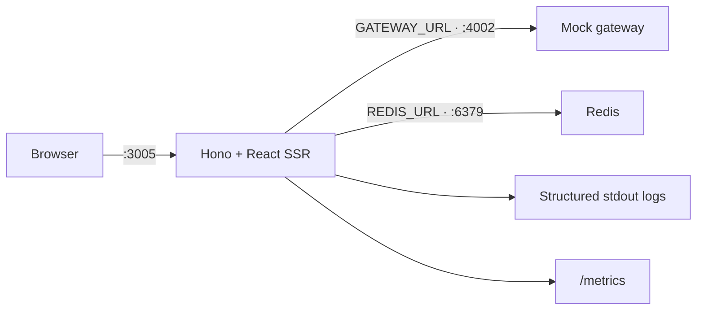
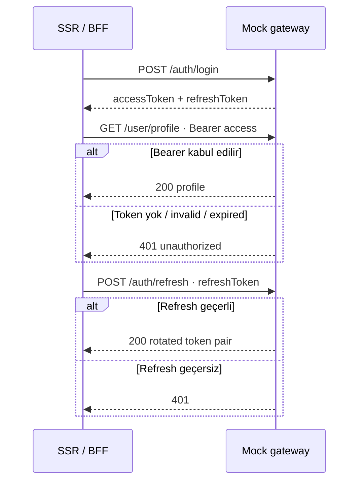
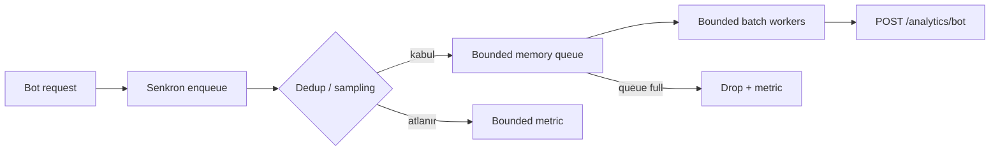
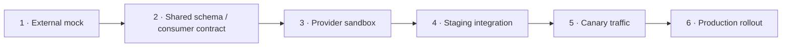

# Gerçek Gateway Olmadan Gerçekçi Bir SSR Sistemi Geliştirmek

> Dış servis hazır değilken fixture’a teslim olmadan; HTTP sınırı, auth semantiği, failure mode’ları ve
> production lifecycle’ı nasıl inşa ettik?

Bir frontend veya SSR projesinin backend’den önce başlaması olağandışı değildir. Gateway ekibi henüz
endpoint’leri tamamlamamıştır, IAM ortamı hazır değildir, test verisi üretilemiyordur veya ağ erişimi
kurumsal süreçleri bekliyordur. UI ekibinin önünde genellikle iki seçenek varmış gibi görünür:

1. Gateway hazır olana kadar beklemek.
2. Component’lerin içine geçici mock data koyup geliştirmeye devam etmek.

İlk seçenek teslimatı durdurur. İkincisi ise çok daha sinsi bir problem yaratır: sayfalar çalışır ama
sistem çalışmaz.

Component’in import ettiği JSON dosyası timeout yaşamaz. `401` ile `503` arasındaki farkı göstermez.
Cookie taşımaz, header kaybetmez, bozuk payload dönmez, DNS hatası üretmez ve process sınırında
kapanmaz. Gerçek gateway geldiğinde ilk kez yalnız veri değil, gerçek dağıtık sistem davranışıyla da
karşılaşılır.

Biz üçüncü bir yol seçtik: mock veriyi uygulamanın içinde tutmak yerine ayrı bir HTTP servisine
çıkardık. SSR uygulaması local development’ta da production’da kullanacağı adapter ve network yolunu
çalıştırıyor. Tek değişen upstream adresi.

Bu yazı “Node ile mock API nasıl yazılır?” rehberi değil. Gerçek provider henüz yokken tüketici
sisteminin hangi parçalarını gerçek tutabileceğimizi, mock’un hangi konularda kasıtlı olarak sahte
kalması gerektiğini ve bunun production hazırlığıyla nasıl birleştiğini anlatıyor.

## “Gerçekçi” ne demek?

Bir mock’un gerçekçi olması gerçek bankaları, teklifleri veya kullanıcıları taklit etmesi demek değil.
Bizim için gerçekçilik beş ayrı seviyede ele alındı:

| Boyut             | Gerçek tutulması gereken şey                                   |
| ----------------- | -------------------------------------------------------------- |
| Transport         | HTTP method, path, query, header, body ve status code          |
| Contract          | Response shape, required alanlar ve hata sınıfları             |
| Security boundary | Bearer gereksinimi, HttpOnly cookie/BFF akışı, `401` semantiği |
| Failure behavior  | Timeout, unavailable, invalid payload ve no-fallback davranışı |
| Lifecycle         | Ayrı process, health check, port, startup ve shutdown          |

İçerik gerçekçi olmak zorunda değil. Kredi faiz oranlarının finansal doğruluğu veya blog başlıklarının
kalitesi bu altyapı çalışmasının konusu değil. Fakat `/account/summary` çağrısının bearer olmadan
`401` dönmesi, `/auth/refresh` body’sini kontrol etmesi ve SSR uygulamasının upstream `503` sırasında
kullanıcıyı yanlışlıkla logout etmemesi önemlidir.

Kısacası:

> Mock data sahte olabilir; sistem davranışı sahte olmamalıdır.

## Uygulama içi fixture neden yeterli değildi?

İlk aşamada şu desen çekici gelebilir:

```ts
export async function getMenu() {
  try {
    return await fetchGatewayMenu();
  } catch {
    return localMenuFixture;
  }
}
```

Bu kod local geliştirmeyi rahatlatır. Fakat production’da gateway DNS’i yanlışsa, TLS sertifikası
bozuksa veya response shape değişmişse kullanıcı çalışan görünen ama güncelliği ve kaynağı belirsiz
bir menü alır. Alert üretmesi gereken dependency problemi fixture tarafından saklanır.

Daha kötüsü, fallback hangi ortamda devreye girdiğini zamanla kaybedebilir. `NODE_ENV` branch’i,
feature flag veya test helper production bundle’a taşınır. Bir incident sırasında şu sorunun cevabı
belirsizleşir:

> Kullanıcı gerçek gateway verisini mi, fallback’i mi gördü?

Biz bu ambiguity’yi tamamen kaldırdık. Uygulama runtime’ında içerik veya auth fixture’ı yok. Gateway
yoksa hata görünür. Development’ın çalışması için gateway rolünü ayrı bir process üstleniyor.

```text
Yanlış sınır:
SSR process ── gateway service
           └─ local fixture fallback

Bizim sınır:
SSR process ── HTTP ── mock gateway process
                     veya
                     gerçek gateway
```

Bu tasarım sayesinde mock’u kapattığımızda production’a daha yakın bir arıza görürüz; görünmez bir
fallback değil.

## Next.js’ten çıktıktan sonra mock’u API route’a koymak neden geri adım olurdu?

Next.js içindeyken mock endpoint’leri Route Handler veya API Route olarak aynı uygulamaya eklemek
kolaydır. UI `/api/...` çağırır, framework aynı process içinde fixture döndürür. Küçük prototip için bu
verimli olabilir.

Fakat bizim geçişimizin temel motivasyonu runtime kararlarını açık sınırlara taşımaktı. Mock gateway’i
Hono uygulamasının içine koymak şu sorunları geri getirirdi:

- Uygulama ile upstream aynı deployment lifecycle’ını paylaşırdı.
- Gateway yokluğunu test etmek için uygulama kodunu veya flag’i değiştirmek gerekirdi.
- Production bundle’a yanlışlıkla mock endpoint taşınabilirdi.
- Network timeout, DNS ve ayrı process kapanışı gerçekçi olmazdı.
- `GATEWAY_URL` adapter sınırı yalnız teoride kalırdı.

Bu nedenle `mock-gw/` kendi `server.js`, `Dockerfile`, `package.json` ve health endpoint’i olan bağımsız
bir servis. Uygulama onun dosyalarını import edip veri almıyor; yalnız test bootstrap’ı aynı server
factory’sini process içinde başlatmak için import ediyor ve iletişim yine gerçek HTTP üzerinden
gerçekleşiyor.

Framework’ten çıkmak burada yalnız Hono seçimi değildi. Development bağımlılığını da production
sınırına benzetme fırsatıydı.

## Sistemin local topolojisi



Bu topolojide browser mock gateway’i normal sayfa verisi için doğrudan kullanmıyor. SSR loader’ları ve
internal BFF’ler gateway adapter’ı üzerinden çağrı yapıyor. Böylece auth cookie’sinin access header’a
çevrilmesi, correlation bilgisi, timeout ve response validation uygulama server’ında kalıyor.

Mock gateway’in varsayılan portu `4002`; uygulamanın tek bilgisi `GATEWAY_URL`. Docker Compose içinde
adres `http://mock-gw:4002`, host development’ta `http://127.0.0.1:4002`, testte ise işletim sisteminin
seçtiği rastgele port.

## Neden dependency’siz düz Node server?

Mock gateway’in hedefi yeni bir backend framework’ü kurmak değil. Node `http.createServer()` yeterli:

```js
export function createMockGatewayServer() {
  return createServer((request, response) => {
    void route(request, response)
      .catch((error) => {
        json(response, 500, { error: String(error) });
      })
      .finally(() => logRequest(request, response));
  });
}
```

Bu tercih birkaç avantaj sağlıyor:

- Mock servisin production uygulama dependency graph’ıyla bağı yok.
- Ayrı bir `npm install` gerektirmeden Node image’ında çalışıyor.
- Server factory testte ephemeral port ile başlatılabiliyor.
- HTTP parsing ve response davranışı tek dosyadan okunabiliyor.
- Gerçek gateway’e geçişte uygulamadan kaldırılması kolay.

Bu minimalizm mock’un büyümesini de sınırlar. Mock gateway kendi database’ine, framework plugin’lerine
ve karmaşık state machine’ine sahip olmaya başlarsa ikinci bir ürün geliştiriyor oluruz. Hedef
provider’ın bütün davranışını kopyalamak değil, tüketicinin ihtiyaç duyduğu kontratı çalıştırmaktır.

## Mock endpoint envanteri aslında consumer contract envanteridir

Mock gateway’deki endpoint’ler UI’ın hangi upstream yeteneklerine gerçekten bağımlı olduğunu gösterir:

| Method | Endpoint                                | SSR sistemindeki rolü             |
| ------ | --------------------------------------- | --------------------------------- |
| `GET`  | `/pages/menuitem/list`                  | Header/footer shell verisi        |
| `GET`  | `/finance/housing-loans`                | Filtreli/paginated kredi kataloğu |
| `GET`  | `/finance/credit-cards/:slug`           | Kritik kart detay verisi          |
| `GET`  | `/finance/credit-cards/:slug/campaigns` | Suspense ile deferred kampanyalar |
| `GET`  | `/content/articles`                     | Bilgi Merkezi listesi             |
| `GET`  | `/content/articles/popular`             | Fragment-cache widget verisi      |
| `GET`  | `/cms/redirects`                        | `3xx` ve `410` kararı             |
| `POST` | `/analytics/bot`                        | Bounded bot event batch sink      |
| `POST` | `/auth/login`                           | Access/refresh üretimi            |
| `POST` | `/auth/refresh`                         | Token yenileme                    |
| `GET`  | `/user/profile`                         | Authoritative session/profile     |
| `GET`  | `/account/summary`                      | Korumalı kişisel data             |

Bu tablo provider’ın bütün API kataloğu değildir. Consumer-driven bir kesittir: SSR uygulamasının
bugün kullandığı operation ve alanlar.

[OpenAPI Specification](https://spec.openapis.org/oas/latest.html), HTTP API yeteneklerini source
code veya network inspection gerektirmeden insan ve makine tarafından anlaşılabilir biçimde
tanımlamak için dil-bağımsız bir sözleşme sunar. Mock şu an executable JavaScript contract’ı gibi
çalışıyor; gerçek gateway entegrasyonuna yaklaşırken bu beklentilerin OpenAPI veya provider tarafından
doğrulanan consumer contract artifact’ına taşınması gerekir.

Mock’un varlığı tek başına kontrat garantisi değildir. Provider aynı path’te farklı alan adları,
nullable değerler veya hata body’si döndürürse entegrasyon yine kırılır. Mock ancak ortak sözleşmeden
türetilirse drift riski azalır.

## İçeriği değil semantiği taklit etmek

Offers endpoint’i altı banka ve formül tabanlı aylık ödeme döndürüyor. Bunlar ürün datası olarak
anlamsız olabilir. Fakat consumer açısından kritik semantik gerçek:

- `amount`, `city` ve `device` query parametreleri normal HTTP URL’siyle taşınır.
- Response array’dir.
- Her item `id`, `bank`, numeric `rate` ve numeric `monthly` alanı taşır.
- Uygulama bilinmeyen veya eksik shape’i kabul etmez.

Blog endpoint’i pagination, `pageSize`, `orderBy`, toplam kayıt ve toplam sayfa alanlarını üretir.
Redirect endpoint’i kural yoksa `404`, taşınmış URL için `301`, kaldırılmış içerik için `gone`
semantiği verir.

Bu semantik artık boyut limitlerini de kapsıyor. Consumer `page` ve `totalPages` alanlarını yalnız
number olduğu için kabul etmiyor: integer/aralık kontrolü, maksimum 100 item, bounded text/tag
alanları ve `posts.length <= pageSize` ilişkisi doğrulanıyor. Böylece mock küçük ve düzgün veri
döndürürken gerçek provider'ın yanlışlıkla milyonluk `totalPages`, aşırı büyük array veya sınırsız
string göndermesi React render ve cache memory problemine dönüşmeden gateway sınırında reddediliyor.

Benzer biçimde route input'ları mock'un her değere cevap verebilmesine güvenmiyor. Mock gateway de
gerçek provider gibi `/routing/domains` snapshot'ı yayınlıyor; kredi şehirleri ve başvuru sayfalarının
source-of-truth'u bu kontrat. Uygulama snapshot'ı Redis'te kısa süreli cache'leyip page cache
lookup'tan önce doğruluyor. İş-domain değerlerini env'e taşımıyoruz: gerçek gateway geldiğinde aynı
endpoint CMS/provider verisinden üretilecek, deployment config'i içerik veritabanına dönüşmeyecek.

Gerçekçi olan blog yazısının başlığı değil, consumer kodunun gerçekten query oluşturması, JSON parse
etmesi, schema guard’dan geçmesi ve status code’a göre branch almasıdır.

## Runtime validation TypeScript’in yapamadığı işi yapar

Gateway cevabını doğrudan type cast etmek sahte güven üretir:

```ts
const data = (await response.json()) as Offer[];
```

TypeScript network’ten gelen JSON’u doğrulamaz. Bu nedenle service katmanı `unknown` ile başlıyor:

```ts
const data = await readGatewayJson(response, "offers", INVALID_OFFERS);
return requireGatewayPayload("offers", data, isOffersPayload, INVALID_OFFERS);
```

Bu ortak okuma sınırı endpoint'e özel byte bütçesini önce `Content-Length`, sonra gerçek UTF-8 body
boyutuyla uygular; malformed JSON, aşırı body ve schema ihlalini ayrı nedenler olarak ölçer. Offers,
blogs, menu, page/SEO, route-domain, account, profile, auth refresh ve CMS redirect consumer'larının
tamamı aynı kapıdan geçer. Guard'lar string uzunluğu, array item sayısı, nested depth, güvenli integer
ve finite numeric aralıkları kontrol eder; `1e400` ile oluşan `Infinity` de geçerli “number” sayılmaz.
Bu “just enough validation” yaklaşımı, provider yeni opsiyonel alan eklediğinde gereksiz kırılma
üretmeden consumer'ın gerçekten kullandığı shape'i koruyor.

Kritiklik ayrıca schema'dan bağımsız bir kontrattır. Offer veya sayfa içeriği bozuksa route'un başarılı
HTML üretmesi doğru değildir. Menü bozuksa ise bütün sayfayı 500 yapmak yerine shell boundary boş,
shape-valid bir menüyle render eder. Profile/account/auth geçersiz payload'ı authenticated state
olarak kabul etmez; CMS redirect lookup'u kural yokmuş gibi degrade olur. Böylece fallback görünmez
bir fixture değil, ölçülen ve önceden tanımlanmış bir failure davranışıdır.

Fakat elle yazılmış guard’ların sınırı var. Deep nested schema, union error body ve format kuralları
büyüdükçe OpenAPI-generated validator veya schema library daha güvenli hale gelir. Final entegrasyon
öncesi mock response’u ile gerçek provider response’unun aynı schema testinden geçmesi gerekir.

## Auth mock’unda neyi gerçek tuttuk?

Auth, “her zaman 200 dönen user fixture” ile geliştirilemeyecek kadar davranışsal bir alan. Mock şu
akışları destekliyor:



Token payload’ında `sub`, `name` ve yakın gelecekteki `exp` bulunuyor. Profile ve account endpoint’leri
Bearer header olmadan çalışmıyor. Expired, `invalid` veya `rejected` token `401` üretiyor. Refresh yeni
bir token pair döndürüyor.

Bu davranışlar uygulamanın şu kod yollarını gerçekten çalıştırıyor:

- HttpOnly access/refresh cookie yazımı.
- Expiry heuristic ve refresh kararı.
- `Authorization` header injection.
- Gateway `401` challenge.
- Client `401 → refresh → tek retry` akışı.
- Verified profile’dan UI hint cookie senkronizasyonu.

## Auth mock’unda ne bilerek sahte?

Mock token header’ı `alg: none`; cryptographic signature yok. Issuer, audience, key rotation,
revocation list, scope, consent, MFA, brute-force koruması veya gerçek refresh token rotation
garantisi sunulmuyor. CORS header’ı da development kolaylığı için permissive.

Bu servis bir IAM değildir ve production güvenlik testi sayılamaz. Token’ın “geçerli” kabul edilmesi
yalnız uygulamanın taşıma ve state transition kodunu çalıştırır.

Bu sınırı yazılı tutmak önemlidir. Mock auth gittikçe “gerçeğe benzer” hale getirildiğinde ekip yanlış
bir güven geliştirebilir. Gerçek gateway’e geçişte ayrıca şunlar doğrulanmalıdır:

- Signature/JWKS veya opaque-token doğrulama sahibi kim?
- Refresh token tek kullanımlı mı, rotation reuse nasıl ele alınıyor?
- `401` ve `403` ayrımı nedir?
- Clock skew toleransı ne?
- Cookie domain/path ve SameSite gereksinimleri ne?
- Login/refresh rate limit’i nasıl bildiriliyor?
- Logout ve token revocation kontratı nedir?

## Gateway adapter: bütün dış çağrıların dar boğazı

Uygulama service’leri URL string’lerini rastgele birleştirip doğrudan `fetch` kullanmıyor. Ortak
adapter base URL, timeout ve gateway metriğini merkezileştiriyor:

```ts
export async function gatewayFetch(path: string, init: RequestInit = {}): Promise<Response> {
  const timeout = AbortSignal.timeout(config.gatewayTimeoutMs);
  const signal = init.signal ? AbortSignal.any([init.signal, timeout]) : timeout;

  try {
    const response = await fetch(gatewayUrl(path), { ...init, signal });
    observeGatewayRequest(response.status, elapsed());
    return response;
  } catch (error) {
    observeGatewayRequest(0, elapsed());
    throw error;
  }
}
```

Node’un resmi API’si [`AbortSignal.timeout`](https://nodejs.org/api/globals.html) ile süre sonunda
abort edilen signal, `AbortSignal.any` ile caller cancellation ve timeout’un birleştirilmesini
destekliyor.

Timeout koymamak yalnız yavaş request üretmez. Bir gateway bağlantısı sonsuza yakın açık kaldığında
server concurrency’sini, shutdown’ı ve SWR revalidation lock süresini etkiler. Bu projede gateway
timeout’u aynı zamanda revalidation lock TTL hesabının girdisidir.

Adapter bilinçli olarak bütün request’leri otomatik retry etmiyor. `GET` teorik olarak idempotent olsa
da provider yükünü, toplam latency bütçesini ve stampede riskini bilmeden global retry eklemek tehlikeli.
Retry ihtiyaç duyulan iş akışında tanımlanıyor: SWR revalidation sınırlı exponential backoff kullanıyor;
client auth yalnız belirli `401` sonrasında tek refresh/retry yapıyor. `POST` işlemler için idempotency
kontratı olmadan retry yapılmıyor.

## Request-scoped bilgiyi gateway’e taşımak

Gateway adapter’ın request-aware varyantı `Authorization` ve correlation header’ını downstream’e
taşıyor:

```ts
const authorization = request.headers.get("authorization");
const requestId = request.headers.get("x-request-id");

if (authorization) headers.set("authorization", authorization);
if (requestId) headers.set("correlationid", requestId);
```

Bu iki alan farklı amaçlara sahip:

- Authorization, kullanıcı credential’ını gateway’e taşır.
- Correlation ID, browser → SSR → gateway yolundaki logları ilişkilendirir.

Girişte gelen `x-request-id` yalnız güvenli karakter ve maksimum 128 uzunluk kontrolünden geçerse
korunuyor; aksi halde UUID üretiliyor. Böylece log injection ve sınırsız label/string riski azalıyor.

Mevcut implementasyonda Hono’nun ürettiği request ID context ve response’a yazılıyor; her service’in
aldığı raw `Request` header’ına otomatik enjekte edilmiyor. Ingress’ten geçerli ID geldiyse downstream’e
taşınır, uygulamanın yeni ürettiği ID bazı gateway çağrılarında service’in ayrıca eklemesine bağlıdır.
Production distributed tracing için bu kısmi propagation yeterli değildir.

Doğru uzun vadeli kontrat, `requestId` veya trace context’i service adapter’a açık request context ile
vermek ve W3C Trace Context/OpenTelemetry propagation kullanmaktır. OpenTelemetry’nin
[context propagation rehberi](https://opentelemetry.io/docs/concepts/context-propagation), dağıtık
servislerde sinyallerin aynı causal request zincirine bağlanmasını bu şekilde tarif eder.

Bu, mock gateway’in ortaya çıkardığı değerli bir derstir: ayrı process olmadan correlation eksikliğini
fark etmek daha zordur.

## Gateway yoksa sistem nasıl davranmalı?

İlk kez mock servisi ayrı process’e taşıdığımızda uygulama container’ı `fetch failed` logları ve `500`
döndürmeye başladı. Bu bir regression gibi göründü. Aslında daha önce gizlenen dependency gerçeğiydi:
uygulama yanlış gateway adresine bağlanıyordu veya gateway hiç ayağa kalkmamıştı.

Doğru çözüm uygulamaya fixture fallback’i geri koymak değil; environment topolojisini düzeltmekti.

Her gateway kullanımı aynı kritiklikte olmadığı için failure davranışı service bazında tanımlandı:

| Gateway işi                        | Failure davranışı                           | Gerekçe                                            |
| ---------------------------------- | ------------------------------------------- | -------------------------------------------------- |
| CMS redirect lookup                | Warning + redirect yokmuş gibi devam        | Yardımcı karar; sayfayı tamamen düşürmemeli        |
| Bot analytics write                | Warning, response beklenmez                 | Kullanıcı yolunu bloklamayan telemetry             |
| Menu/shell fetch                   | Cache yoksa render hatası                   | Temel document bağımlılığı; sahte menü gösterilmez |
| Ürün/içerik katalogları            | Handler error veya ilgili API hatası        | İçerik üretilemiyorsa görünür olmalı               |
| User profile/account `401`         | Unauthorized state                          | Credential reddedildi                              |
| User profile/account `5xx`/network | `503`, session korunur                      | Provider unavailable, kullanıcı logout edilmez     |
| Redis cache                        | Fail-open cache miss veya readiness failure | `CACHE_REQUIRED` operasyon politikasına bağlı      |

Bu tablo gerçekçilik tanımımızın merkezidir. Mock happy-path verisi değil, dependency’nin ürün
yolundaki rolü önemlidir.

## Fail-open ve fail-closed terimlerini dikkatli kullanmak

“Gateway hata verirse fail-open mu fail-closed mu?” sorusunun tek cevabı yok.

Auth için fail-closed gerekir: provider’a ulaşılamadı diye kişisel data döndürülemez. Fakat
“unavailable” ile “credential invalid” ayrılır; erişim verilmezken session da gereksiz yere silinmez.

Redirect lookup için fail-open kabul edilebilir: CMS kontrol edilemiyorsa statik route resolution ve
normal page render devam eder. Bunun SEO/legacy URL riski log ve metrikle görünür olmalıdır.

Cache için fail-open, Redis olmadan loader/render çalıştırmak anlamına gelir. Yetkisiz data göstermek
anlamına gelmez. Gateway kapasitesi cache miss yükünü taşıyamıyorsa `CACHE_REQUIRED=true` readiness’i
kapatarak trafik alınmaması seçilebilir.

Aynı terim farklı dependency’de farklı iş sonucu ifade eder. Bu nedenle politika genel exception
handler’da değil, boundary’nin domain anlamında kurulmalıdır.

## Local development için üç çalışma modu

Tek bir geliştirme modu bütün ihtiyaçları karşılamıyor:

| Komut                       | App                   | Mock gateway | Cache / Redis | Amaç                          |
| --------------------------- | --------------------- | ------------ | ------------- | ----------------------------- |
| `npm run dev`               | Host/watch            | Host         | memory        | Günlük geliştirme — Redis yok |
| `npm run dev:redis`         | Host/watch            | Host         | Docker Redis  | SWR/purge/lock testi          |
| `docker compose up --build` | Container/prod bundle | Container    | Container     | Production-benzeri topoloji   |

Ortam dosyaları: `.env.development` (memory), `.env.development.redis` (overlay), `.env.staging`,
`.env.production`. `dev:local`, `dev:redis` için geriye dönük alias'tır.

`npm run dev` `.env.development` dosyasını yükler; `CACHE_BACKEND=memory` ile Redis gerekmez.

`npm run dev` gerçek Vite development server’ı, mock gateway’i ve `tsx watch` Hono server’ını
`scripts/dev.mjs` üzerinden birlikte başlatır. Vite build-watch ile `dist/client` yazmaz; source
modüllerini, HMR websocket’ini ve React Refresh runtime’ını doğrudan servis eder. Hono HTML’i
`/@vite/client`, React Refresh preamble ve `/src/entry.client.tsx` modülünü enjekte eder.

Island/client değişiklikleri state'i koruyan Fast Refresh ile uygulanır. SSR üreten server, route ve
paylaşılan component değişiklikleri `tsx watch` restartından sonra bilinçli full document reload
tetikler. Orchestrator süreçlerden biri kapanırsa diğerlerini de sonlandırır; yarım development
topolojisi bırakmaz. Production ise bu yoldan bağımsız olarak hashed client asset manifest’ini ve SSR
bundle’ını kullanmaya devam eder.

`dev:redis` önce Compose içindeki app ve mock-gw container’larını durdurur, yalnız Redis’i
`docker compose up -d --wait redis` ile hazırlar, `.env.development.redis` overlay’ini uygular ve
host üzerinde watch süreçlerini başlatır:

```text
REDIS_URL=redis://127.0.0.1:6379
GATEWAY_URL=http://127.0.0.1:4002
SITE_URL=http://localhost:3005
```

Bu modun değeri günlük geliştirmede her değişiklikten sonra image rebuild veya `compose down`
gerektirmemesidir. Redis state’i container’da kalır; TypeScript ve client bundle host’ta hızlı reload
olur.

Full Compose ise service name DNS’lerini ve image içindeki production bundle’ı sınar. Docker’ın
[Compose startup order rehberi](https://docs.docker.com/compose/how-tos/startup-order/),
`condition: service_healthy` kullanılan bağımlılıklarda healthcheck başarılı olana kadar dependent
service’in başlamadığını açıklar. Redis `PING`, mock gateway `/healthz` ile hazır olduktan sonra app
başlar.

## Testte sabit port kullanmamak

Test suite mock gateway’i `4002` portunda başlatmıyor. Port `0`, işletim sisteminden boş port istemek
anlamına geliyor:

```js
const server = createMockGatewayServer();
server.listen(0, "127.0.0.1");
await once(server, "listening");

const address = server.address();
process.env.GATEWAY_URL = `http://127.0.0.1:${address.port}`;
```

Bu yaklaşım:

- Geliştiricinin açık `4002` süreciyle çakışmayı önler.
- Paralel CI job’larını izole eder.
- Testin yanlışlıkla dışarıda unutulmuş gateway’e bağlanmasını engeller.
- Server teardown’ını test lifecycle’ına bağlar.

Testler server function’ını import etse de endpoint’leri function call ile çağırmıyor; `fetch` ile
gerçek socket üzerinden gidiyor. JSON serialization, URL parsing, header ve status davranışı böylece
testte kalıyor.

Protected endpoint testleri önce login’den token alıyor, sonra profile/account’a Bearer gönderiyor ve
refresh yapıyor. Ayrı bir test bearer olmadan `401` bekliyor. Public contract testi menu, offers,
blogs ve redirect endpoint’lerini birlikte doğruluyor.

## Unit stub ile external mock birbirinin alternatifi değil

Her senaryoyu network server üzerinden test etmek suite’i yavaşlatır ve hata üretimini zorlaştırır.
Her şeyi `global.fetch = vi.fn()` ile test etmek de gerçek HTTP sınırını kaybettirir. İki araç farklı
katmanları koruyor:

```text
Pure/unit test
  → parser, cache key, state transition

Stubbed fetch test
  → timeout branch, 401/503/invalid payload gibi kontrollü failure

External mock HTTP test
  → method/path/header/body/status ve serialization

Production-bundle smoke
  → build artifact + process startup + temel request pipeline
```

Contract suite ayrıca gerçekçi happy-path fixture'larını, endpoint byte limitini, malformed JSON'u ve
deterministik mutation-fuzz corpus'unu çalıştırır. Fuzz corpus; boş/uzun string, collection overflow,
negatif/aralık dışı numeric ve `NaN`/`Infinity` eşdeğerlerini consumer guard'ına taşır. Bir red
`ssr_gateway_invalid_payload_total{contract,reason}` metriğini artırır; kritik olmayan shell fallback'i
ayrıca `ssr_shell_degraded_total` üretir. Böylece gerçek provider rollout'undaki contract drift yalnız
bir 500 oranı içinde kaybolmaz.

Örneğin menu service testi stubbed `503` ile local fixture’a düşülmediğini doğruluyor. Mock gateway
testi gerçek menu endpoint’inin başarılı shape döndürdüğünü kanıtlıyor. İkisi birlikte happy path ve
failure policy’sini kapsıyor.

Gerçekçi kontrat yalnız endpoint'in `200` dönmesi değildir. Menü payload'ının array olması,
`url` alanının güvenli olduğu anlamına gelmez. Uygulama sınırındaki content URL policy internal
linkleri root-relative/same-origin ile sınırlar; dış hedef için gateway item'ında açık
`external: true` ve HTTPS ister. `javascript:`, `data:`, `file:`, protocol-relative URL, credential,
control karakteri ve aşırı uzun URL payload'ı geçersiz kılar. Menü parser'ı ayrıca maksimum üç
seviye, seviye başına 50 ve toplam 200 item kontratını uygular.

SEO payload'ı da aynı nedenle yalnız `typeof seoInfo === "object"` kontrolüyle bırakılamaz. Runtime
parser string limitlerini ve URL alanlarını doğrular; canonical ile `og:url` değerlerini `SITE_URL`
origin'ine sabitler. Dış HTTPS image CDN kabul edilebilir, fakat dış canonical kabul edilmez. Final
metadata merge'in policy'yi tekrar uygulaması eski cache girdilerine ve route-level override'lara
karşı ikinci sınırdır. Mock gateway basit kalabilir; tüketici kontratının saldırgan payload testleri
basit gateway'in production koduna sınırsız güvenilmesine engel olur.

Bu kontrat artık yalnız meta etiketlerinden ibaret değildir. Liste ve detay response'ları image
boyut/alt bilgisi, index/follow kararı ve makalelerde published/modified/yazar/tag alanlarını taşıyan
bounded `seoInfo` döndürür. SSR katmanı bunlardan Open Graph/Twitter etiketlerini ve görünür içerikle
eşleşen `BreadcrumbList`, `ItemList`, `Article`, `FAQPage`, `LoanOrCredit` ve `CreditCard` JSON-LD
düğümlerini üretir. Mock veri rating veya review sağlamıyorsa structured data da sağlamaz; rich result
elde etmek için gerçek olmayan alan üretmek contract testinin amacıyla çelişir.

Dinamik crawl envanteri de gateway sorumluluğudur. `/seo/sitemap`, yalnız gerçek kategori ve detay
path'lerini, makalelerde gerçek `lastModified` değerini döndürür. Filtre query'leri, auth route'ları ve
teknik demolar bu envantere girmez. Gateway kesintisinde BFF sınırlı statik kategori sitemap'ine
degrade olur; uydurma slug veya deployment env allowlist'i üretmez.

Mock server’ın şu an deterministik happy path ve auth rejection sunduğunu da dürüstçe belirtmeliyiz.
Configurable latency, connection reset, malformed JSON veya per-endpoint `5xx` fault injection yok.
Bu failure’lar şimdilik stubbed fetch testlerinde üretiliyor. Daha fazla integration gerçekliği
gerekirse mock’a test-only fault profile eklenebilir; development varsayılanı yine deterministik
kalmalıdır.

## CI pipeline hangi riski hangi sırada yakalıyor?

Projenin `ci` komutu şu zinciri çalıştırıyor:

```text
typecheck
  → lint
  → format check
  → test
  → client + server production build
  → production-bundle smoke
```

Sıra bilinçli:

- Typecheck ve lint hızlı structural hataları erken yakalar.
- Testler route/cache/auth/gateway davranışını doğrular.
- Build, Vite client manifest ve server bundle’ın üretilebildiğini kanıtlar.
- Smoke, üretilen `dist/server/index.js` dosyasının gerçek Node process’i olarak başlayabildiğini
  doğrular.

Smoke testi mock gateway’i rastgele portta, uygulamayı ayrı production portunda başlatıyor. Redis
adresi bilerek ulaşılamayan bir porta veriliyor ve `CACHE_REQUIRED=false` kullanılıyor. Böylece
production bundle’ın Redis yokken fail-open cache miss ile başlayabildiği de sınanıyor.

Ardından iki kontrol yapılıyor:

1. `/healthz` `ok` dönüyor mu?
2. Mock CMS kuralı üzerinden `/kaldirildi` gerçekten `410` terminal response üretiyor mu?

Bu smoke testi tam end-to-end ürün testi değildir. Browser hydration, gerçek Redis, TLS, ingress,
autoscaling veya gerçek gateway’i doğrulamaz. Fakat “bundle üretildi” ile “bundle process olarak
başlayıp pipeline’dan cevap verdi” arasındaki önemli boşluğu kapatır.

## Production config varsayılanlara bırakılamaz

Development’ta `localhost` varsayımları faydalıdır. Production’da tehlikelidir. Uygulama başlangıçta
config’i doğruluyor ve şu koşullarda fail-fast davranıyor:

- `CACHE_BACKEND` bilinmeyen bir değer.
- Redis seçilmiş ama `REDIS_URL` yok.
- Timeout, port veya kapasite değerleri geçersiz.
- SWR drain timeout global shutdown timeout’tan büyük.
- Release ID güvenli formatta değil.
- Production’da memory cache seçilmiş.
- Production `GATEWAY_URL` veya `SITE_URL` açıkça verilmemiş.
- Production gateway HTTP kullanıyor ve internal-network istisnası açıkça seçilmemiş.
- `GATEWAY_URL` origin değil ya da `ASSET_CDN_URL` credential/query/hash taşıyor.
- `GTM_CONTAINER_ID` kapalı container formatını ihlal ediyor.
- Production purge secret veya `RELEASE_ID` eksik.

```ts
if (config.isProduction && !process.env.GATEWAY_URL) {
  throw new Error("Production GATEWAY_URL must be explicitly configured");
}
```

Fail-fast startup, yanlış environment ile trafik aldıktan sonra rastgele request’lerde hata vermekten
daha güvenlidir. Pod ready olmadan configuration incident görünür hale gelir.

Secret değerler image içine gömülmemeli; deployment secret manager tarafından verilmelidir. Mock
gateway adresi production manifest’ine varsayılan olarak taşınmamalı. Image aynı kalmalı, environment
binding deploy aşamasında yapılmalıdır.

## Production image source tree değildir

Dockerfile iki stage kullanıyor:

```dockerfile
FROM node:22-alpine AS builder
RUN npm ci
COPY . .
RUN npm run typecheck && npm run build

FROM node:22-alpine AS runner
RUN addgroup ... && adduser ...
RUN npm ci --omit=dev
COPY --from=builder /app/dist ./dist
USER nodejs
CMD ["node", "dist/server/index.js"]
```

Builder TypeScript ve Vite araçlarını kullanıyor. Runner yalnız production dependency’lerini ve
`dist/` artifact’ını alıyor; server production’da `tsx` ile source çalıştırmıyor. Process root
olmayan `nodejs` kullanıcısıyla çalışıyor.

Docker’ın [multi-stage build dokümantasyonu](https://docs.docker.com/build/building/multi-stage/),
yalnız gerekli artifact’ların final image’a kopyalanmasının build araçlarını ve gereksiz dosyaları
runtime’dan uzak tuttuğunu anlatır. Bu image boyutunu ve attack surface’i azaltır; dependency
vulnerability taramasının kapsamını da daha anlamlı hale getirir.

Bu yine tek başına secure supply chain değildir. Production release’te base image digest pinning,
SBOM, image scanning, signature/provenance ve `npm audit --omit=dev` sonucu ayrıca yönetilmelidir.

## Health, readiness ve dependency semantiği

Uygulama iki public lifecycle endpoint'i ve ayrı cluster-only metrics listener sunuyor:

```text
/healthz  → process HTTP cevap verebiliyor mu?
/readyz   → yeni trafik almalı mı?
:9090/metrics → runtime davranışı ne? (public Service'e bağlı değil)
```

`/healthz` minimal ve dependency çağrısı yapmıyor. Redis veya gateway geçici olarak bozuldu diye
process’i restart etmek çoğu zaman sorunu çözmez; aksine bütün replica’ları restart loop’a sokabilir.

`/readyz`, shutdown sırasında `503` döner. Redis ping başarısızsa sonuç `CACHE_REQUIRED` politikasına
bağlıdır. Cache optional ise pod trafik almaya devam eder ve SSR miss çalışır; cache zorunluysa ready
olmaz.

Gateway her readiness probe’da çağrılmıyor. Bu da bilinçli tartışılması gereken bir karar:

- Gateway bütün sayfalar için mutlak zorunluysa readiness’e dahil etmek trafiği koruyabilir.
- Gateway arızasında cached/public bazı sayfalar çalışabiliyorsa bütün pod’ları endpoint’ten çıkarmak
  tam outage yaratabilir.
- Her pod’un sık probe’u zaten arızalı gateway’e ek yük bindirebilir.

Kubernetes’in resmi
[liveness/readiness/startup probe dokümantasyonu](https://kubernetes.io/docs/concepts/workloads/pods/pod-lifecycle/#container-probes),
liveness failure’ın container restart; readiness failure’ın ise pod’u service endpoint’lerinden
çıkarma amacı taşıdığını açıklar. Dependency’yi hangi probe’a bağladığınız teknik değil, availability
politikasıdır.

Docker image healthcheck’i `/healthz` kullanıyor. Kubernetes manifest’inde liveness için `/healthz`,
readiness için `/readyz` ayrı tanımlanmalıdır; yavaş startup varsa startup probe eklenmelidir.
Prometheus pod'u annotation üzerinden `9090` portunu scrape eder; application Service yalnız `3005`
yayınlar. Prometheus'un güvenlik modeli metrics endpoint'lerini de korunması gereken HTTP yüzeyi kabul
ettiği için public ingress'e path bazlı istisna bırakılmaz.

## Structured log olmadan ayrı gateway yalnız gürültü üretir

Uygulama ve mock gateway tek satırlık JSON log üretiyor:

```json
{
  "level": "info",
  "msg": "request",
  "path": "/konut-kredisi",
  "status": 200,
  "cache": "HIT",
  "durationMs": 8,
  "requestId": "..."
}
```

Gateway adapter response status class ve toplam süre metriğini kaydediyor. Network exception status
`0/error` sınıfına giriyor. Böylece `5xx` response ile bağlantı/timeout hatası ayrılabiliyor.

Mock gateway de method, path, status ve duration yazıyor. Local development’ta browser request’i ile
upstream çağrısının gerçekten oluştuğunu görmek kolaylaşıyor.

Bu ilk sürüm daha sonra gerçek instrumentation katmanına yükseltildi. `server/instrumentation.ts`
OpenTelemetry SDK lifecycle'ını yönetiyor; inbound request, loader, SSR render, gateway, Redis/cache
ve SWR revalidation ayrı span'ler üretiyor. W3C trace context gateway'e taşınırken structured loglar
aktif `traceId`, `spanId` ve release kimliğini içeriyor. Cluster listener'daki `/metrics` artık request, gateway, cache ve
revalidation latency histogramlarının yanında gateway timeout/error outcome'larını, payload
rejection/shell degradation sayaçlarını ve process/event-loop metriklerini de sunuyor.

Metrics hâlâ doğası gereği process-local'dir; Prometheus her replica'yı scrape edip aggregate
etmelidir. Collector deployment'ı, dashboard, alert, retention ve error log PII/token redaction
politikası uygulama dışındaki production platform kontratının parçası olmaya devam eder.

Shell menüsü kritik route data'sıyla aynı failure politikasına sahip değildir. Redis'te fresh veya
SWR penceresindeki doğrulanmış stale menu snapshot'ı varsa gateway kesintisinde o snapshot sunulur.
Kullanılabilir snapshot yoksa header/footer boş menu modeliyle render edilir; ana route içeriği sırf
navigation dependency'si düştü diye `500` olmaz. Degrade nedeni bounded metric ve structured warning
olarak kalır.

## Fire-and-forget değil, bounded event dispatch

Bot ziyareti analytics için değerlidir ama sayfanın cevabını belirlemez. Bu ayrım, her bot request'i
için aşağıdaki kodu güvenli yapmaz:

```ts
void gatewayFetch("/analytics/bot", { method: "POST", body: event });
```

Bu yaklaşım request'i bekletmez; fakat açık socket ve pending Promise sayısına da üst sınır koymaz.
Crawler burst'ü uygulamanın gateway connection pool'unu ve memory'sini analytics uğruna tüketebilir.
SSR cevabından bağımsızlık ile lifecycle'sızlık aynı şey değildir.

Projede bot event yolu bu nedenle şöyledir:



`storeBotVisit()` yalnız enqueue sonucunu üretir; request gateway response beklemez. Queue kapasitesi
`1000`, aynı anda açık batch çağrısı `2`, batch boyutu `25`, kısmi batch flush penceresi `250ms`
varsayılanına sahiptir. Böylece yük artsa bile sender concurrency sabit kalır. Queue dolarsa analytics
event'i kaybedilir; sayfa trafiği analytics'e backpressure uygulanarak yavaşlatılmaz.

Aynı normalize pathname ve user-agent kombinasyonu SHA-256 anahtarıyla varsayılan 60 saniye pod
içinde deduplicate edilir. Bu kasıtlı olarak global bir doğruluk garantisi değildir: amaç Redis'i yeni
bir event broker'a çevirmek değil, tek replica'ya çarpan crawler tekrarlarını ucuzca azaltmaktır.
Gerekirse `BOT_ANALYTICS_SAMPLE_RATE` ile `0..1` aralığında sampling de uygulanabilir. Gerçek gateway
tek event yerine üst sınırı doğrulanan bir batch alır:

```json
{
  "events": [
    {
      "pathname": "/bilgi-merkezi",
      "userAgent": "ExampleBot/1.0",
      "trackingId": "..."
    }
  ]
}
```

Bu davranışın operasyon tarafı da görünürdür. Queue depth ve in-flight batch gauge'ları; enqueue,
drop, batch sonucu/süresi/boyutu ve drain sayaçları `/metrics` üzerinde yayınlanır. Raw pathname veya
user-agent label yapılmaz. Queue-full drop, gönderim hatası ve shutdown drain timeout'u için
`k8s/prometheus-rules.yaml` alarm başlangıçları sağlar.

OpenTelemetry’nin [metrics rehberi](https://opentelemetry.io/docs/concepts/signals/metrics/), histogramın
latency dağılımı için uygun olduğunu ve user ID/raw path gibi high-cardinality attribute’ların sınırsız
memory maliyeti doğurabileceğini vurgular. Request ID log/trace correlation içindir; metric label’ı
olmamalıdır.

## Graceful shutdown production özelliğidir

Container orchestration eski pod’a `SIGTERM` gönderdiğinde process’in hemen ölmesi şu işleri yarıda
kesebilir:

- Devam eden HTTP response.
- Redis write.
- SWR revalidation.
- Kuyrukta bekleyen bot analytics event'leri.
- Downstream gateway call.

Server shutdown akışı:

1. Tekrarlanan signal’i ignore edecek `shuttingDown` flag’ini set eder.
2. Yeni SSR request’lerine `503` verir.
3. HTTP server’ı yeni connection’a kapatır ve mevcut connection’ları bekler.
4. Aktif revalidation Promise'leri ile bot analytics kuyruğunu kendi bounded bütçeleri içinde paralel
   drain eder. Analytics dispatcher kısmi batch'i hemen flush eder; timeout'ta kalan event'leri drop
   edip in-flight request'leri abort eder.
5. Redis bağlantısını kapatır.
6. Global timeout aşılırsa error exit yapar.

Mock gateway de `SIGINT` ve `SIGTERM` aldığında server’ı kapatıyor. Development script’i signal’i
child süreçlere forward ediyor. Böylece Ctrl+C sonrasında portta orphan process bırakma olasılığı
azalıyor.

Kubernetes pod termination grace period, uygulamanın shutdown timeout’undan uzun olmalıdır. Aksi halde
uygulama drain etmeye çalışırken kubelet `SIGKILL` gönderir. Health/readiness, load balancer endpoint
güncellemesi ve process shutdown süresi birlikte tasarlanmalıdır.

## “Production-ready” ne demek?

Mock gateway ile bütün testlerin geçmesi production-ready olduğumuz anlamına gelmez. Daha doğru ifade
şudur:

> Uygulama runtime’ı production sorumluluklarını taşıyacak şekilde inşa edilmiştir; gerçek provider ve
> deployment ortamıyla doğrulanması gereken entegrasyon koşulları ayrıca vardır.

Kod tarafında hazır olan yapı taşları:

- Açık Request → pipeline → Response akışı.
- Shared Redis cache ve horizontal-scale lock.
- Gateway adapter timeout ve status metriği.
- Auth/BFF boundary ve `401`/`5xx` ayrımı.
- Runtime payload guard’ları.
- Trace-correlated structured logs, request ID, OpenTelemetry span'leri ve metrics endpoint'i.
- Liveness/readiness ayrımı.
- Production config validation.
- Non-root multi-stage image.
- Graceful shutdown; SWR ve bounded bot analytics queue drain.
- Production bundle smoke testi.

Environment/release tarafında hâlâ dışarıdan sağlanması gerekenler:

- Gerçek gateway DNS, TLS/mTLS ve network policy.
- Secret manager ve credential rotation.
- Kubernetes resource request/limit, replica ve autoscaling politikası.
- Ingress timeout/body limit/header politikası.
- Redis HA, backup/eviction ve kapasite planı.
- CDN ve cache purge entegrasyonu.
- Dashboard, alert, trace export ve log retention.
- Image registry, vulnerability gate ve provenance.
- Load/performance testi.
- Runbook, on-call ownership, canary ve rollback.

Production-ready bir boolean değil; kod, environment ve operasyonun kesişimidir.

## Gerçek gateway’e geçiş “URL değiştir ve unut” değildir

Mimari açıdan uygulama kodunun mock’tan kopması için `GATEWAY_URL` değişmesi yeterlidir. Bu önemli bir
kazanım: component veya loader fixture import’larını temizlemek gerekmez.

Fakat başarılı rollout için şu checklist tamamlanmalıdır.

### 1. Contract uyumu

- Path ve HTTP method aynı mı?
- Query encoding ve default değerler aynı mı?
- Request/response content type doğru mu?
- Nullable ve opsiyonel alanlar net mi?
- Pagination ve sıralama semantiği aynı mı?
- Error body ve status code matrisi belgelendi mi?
- Provider response’ları consumer runtime guard’larından geçiyor mu?

### 2. Auth ve güvenlik

- Cookie’yi kim üretiyor ve hangi domain/path’te?
- Gateway Bearer mı, başka credential mı bekliyor?
- Token refresh rotation ve reuse policy nedir?
- `401`, `403`, `429` ve `5xx` davranışı net mi?
- TLS/mTLS certificate rotation nasıl yapılacak?
- PII hangi log alanlarında yasak?

### 3. Dayanıklılık

- Gateway p50/p95/p99 latency nedir?
- `GATEWAY_TIMEOUT_MS` gerçek bütçeyle uyumlu mu?
- Hangi operation retry edilebilir?
- Retry varsa idempotency key gerekiyor mu?
- Rate-limit header ve `Retry-After` işlenecek mi?
- Circuit breaker veya concurrency budget gerekli mi?

### 4. Operasyon

- Correlation/trace context iki sistemde aynı mı?
- Gateway dashboard ve alert’lerine consumer breakdown eklenmiş mi?
- Sandbox/staging verisi production shape’i temsil ediyor mu?
- Canary sırasında mock ve gerçek sonuç karşılaştırılabilir mi?
- Hızlı rollback yalnız environment değişikliğiyle yapılabiliyor mu?

“Yalnız URL değişir” kod bağımlılığı için doğrudur; entegrasyon riski için değildir.

## En güvenli geçiş merdiveni

Mock’tan production gateway’e tek sıçrama yerine aşamalı ilerlemek daha güvenlidir:



1. **External mock:** UI gerçek HTTP ve failure boundary ile geliştirilir.
2. **Shared contract:** OpenAPI/schema provider ve consumer CI’ında doğrulanır.
3. **Provider sandbox:** Gerçek auth, header ve response shape test edilir.
4. **Staging:** Redis, ingress, TLS, DNS ve observability dahil topoloji doğrulanır.
5. **Canary:** Küçük trafik gerçek gateway’e yönlenir; error/latency/cache etkisi karşılaştırılır.
6. **Rollout:** SLO ve rollback gate’leri sağlanırsa kapsam büyütülür.

Shadow request bazı public/idempotent GET endpoint’lerinde faydalı olabilir; kişisel veya mutation
request’lerinde veri minimizasyonu, çift yan etki ve consent riskleri nedeniyle otomatik
uygulanmamalıdır.

## Mock’un drift etmesini nasıl önleriz?

Mock bir kez yazılıp unutulursa zamanla hayali provider’a dönüşür. Drift’i azaltmak için:

- Endpoint ve schema tek bir contract artifact’ından türetilmeli.
- Consumer’ın kullandığı alanlar açıkça listelenmeli.
- Provider CI, consumer contract örneklerini doğrulamalı.
- Gerçek sandbox response fixture’ları PII temizlenerek schema regression testine girmeli.
- Mock’un beklenenden daha toleranslı olması engellenmeli.
- Breaking provider değişikliği versioning veya koordineli rollout gerektirmeli.

Consumer-driven contract yaklaşımı provider’ın bütün yeteneklerini kopyalamak yerine mevcut
consumer’ların gerçekten dayandığı beklentileri görünür kılar. Bu mock gateway zaten bu beklentilerin
ilk executable hali; fakat provider doğrulaması olmadan tek taraflıdır.

## Mock ne zaman kaldırılmalı?

Gerçek gateway hazır olduğunda mock’u tamamen silmek her zaman doğru değildir. Local development,
deterministik CI ve failure reproduction için değerini korur. Kaldırılması gereken şey mock değil,
mock’un tek doğruluk kaynağı olmasıdır.

Olgun durumda üç kaynak birlikte bulunabilir:

- Contract/schema: ortak doğruluk kaynağı.
- Mock gateway: hızlı ve deterministik consumer development.
- Provider sandbox/integration suite: gerçek implementasyon doğrulaması.

Mock production deployment’ına girmez; uygulama production config’i explicit gerçek URL ister.
Mock image yalnız local Compose veya test ortamında kullanılır.

## Beş yazının sonunda kurduğumuz sistem

Serinin başında sorun dynamic rendering’in kendisi değildi. Hangi request girdisinin route’u neden
dynamic yaptığı ve cache’i nasıl etkilediği görünmez hale gelmişti.

İkinci yazıda framework çıktıktan sonra eksilen runtime’ı Hono request pipeline, explicit routing,
loader ve full-document React SSR ile yeniden kurduk.

Üçüncü yazıda cache key’ini performans detayı olmaktan çıkarıp route’un veri paylaşım kontratı yaptık.
Redis, SWR, replica lock ve purge bu kontratın operasyonel devamı oldu.

Dördüncü yazıda kişisel alanları shared HTML’den ayırdık. Island, HttpOnly credential ve BFF modeli
sayesinde header’daki kullanıcı deneyimi bütün document’i kişisel cache’e dönüştürmedi.

Bu final yazıda dış provider hazır değilken de aynı sınırları çalıştırdık. Mock veriyi uygulamanın
içinde saklamak yerine HTTP’nin diğer tarafına koyduk; build, health, metrics, timeout ve shutdown’ı
production perspektifinden ele aldık.

Ortaya çıkan şey Next.js’in küçük bir kopyası değil. Belirli bir ürün sınıfı için bilinçli olarak dar
bir SSR runtime:

```text
Explicit route contract
  + shared full-document cache
  + selective client islands
  + server-owned auth/BFF
  + replaceable gateway boundary
  + observable process lifecycle
```

## Güncel production sınırı: gateway’den bağımsız media delivery

Media pipeline mock gateway’e bağlı değildir. Kaynaklar build sırasında işlenir, hash’li manifest SSR
server tarafından okunur ve browser CDN/origin üzerinden doğrudan asset’e gider. Bu ayrım gerçek
gateway rollout’unun image optimizasyon davranışını değiştirmemesini sağlar.

Production’da üç açık seçenek vardır: build-time responsive dosyaları origin’den sunmak,
`IMAGE_CDN_URL` ile aynı dosyalara path-preserving prefix vermek veya `IMAGE_TRANSFORM_URL` ile
responsive adayları harici transformer’a yönlendirmek. Unoptimized CDN yolu da birinci sınıf
kontrattır; tek `src` kullanır, runtime proxy oluşturmaz. Self-host fontlar `ASSET_CDN_URL` üzerinden
yayınlanabilir ve üçüncü taraf font origin’ine ihtiyaç duymaz. `/medya-pipeline` route’u deployment
sonrası bu bağlantıların hızlı smoke kontrolünü yapabileceğimiz bir gösterim sayfasıdır.

## Güncel production sınırı: crawler-visible embedded data

Production smoke yalnız status, cache header ve asset dosyalarını kontrol etmez. SSR document'taki
island payload'larının wire formatı da deployment invariant'ıdır. Gateway'den veya route context'ten
gelen `/...` değerleri HTML'e embedded JSON olarak yazılıyorsa `\/` görünmeli; aynı değer client'ta
parse edildiğinde tekrar `/...` olmalıdır.

Bu ayrım mock ile gerçek gateway arasında özellikle önemlidir. Mock içerik URL alanlarını yeterince
çeşitlendirmezse serializer regresyonu production CMS verisi gelene kadar görünmeyebilir. Testler bu
yüzden relative path, absolute URL, nested menu URL, `</script>` benzeri boundary değeri ve
round-trip davranışını doğrudan kontrat olarak kapsar. ESLint de yeni JSX payload'larının merkezi
serializer'ı atlamasını engeller.

Google'ın crawl budget rehberi gereksiz URL inventory'sini azaltmayı öneriyor. Embedded JSON escaping
tek başına crawl budget stratejisi değildir; canonical, sitemap, doğru 404/410 ve gerçek anchor
disipliniyle birlikte savunma katmanıdır.

## Güncel contract örneği: yönlendirme ve canlı piyasa

Mock artık yalnız menü, blog ve auth JSON'u döndürmüyor. Finans ürünlerinin gerçek taşıma semantiğini
de görünür kılıyor:

- Konut kredisi ve kredi kartı listeleri filtre, sıralama ve pagination kabul eder.
- Detay endpoint'leri kampanya ve ürün alanlarını gerçekçi collection sınırlarıyla döndürür.
- Referral endpoint'i browser'a banka URL'sini doğrudan emanet etmeden server-side click kaydı ve
  redirect kararı üretir; internal stats endpoint'i ayrı operations token'ıyla korunur.
- BIST snapshot endpoint'i ilk SSR tablosunu, `/internal/markets/stream` ise uzun yaşayan quote
  batch'lerini sağlar.
- Sürümlü kredi hesaplama endpoint'i tutar/vade/faiz sınırlarını ve tam ödeme planını server'da
  üretir; SSR ile hydrated BFF aynı kontratı tüketir.
- Kart karşılaştırma endpoint'i yalnız 2–3 benzersiz ürünü, banka profili endpoint'i ise bounded ürün
  koleksiyonlarını ve güvenli HTTPS alanlarını kabul eder.

Canlı market endpoint'i özellikle değerlidir; mock'un yalnız JSON fixture olmadığını kanıtlar. Token
olmadan `401`, geçersiz symbol ile `400`, doğru bearer ile `text/event-stream` döner; connection abort
olduğunda timer ve response temizlenir. Browser bu token'ı hiçbir zaman görmez. UI server'ı tek upstream
bağlantıyı process içindeki hub üzerinden abonelere dağıtır.

Bu yine production piyasa sağlayıcısının kapasitesini, SLA'ini veya fiyat doğruluğunu kanıtlamaz.
Kanıtladığı şey transport ve trust boundary'dir: handshake, content type, auth, parser limitleri,
cancellation, reconnect ve graceful shutdown gerçek HTTP üzerinde çalışır. Ayrıntılar
[SSR Snapshot ile Güvenli Canlı Piyasa Verisi](./13-ssr-snapshot-ile-guvenli-canli-piyasa-verisi.md)
yazısındadır.

## Sonuç: Gerçek sistem, gerçek veri gelmeden de inşa edilebilir

Gerçek gateway olmadan gerçek bankacılık verisi üretemeyiz. Gerçek IAM güvenliğini, production
latency’sini veya provider kapasitesini de kanıtlayamayız.

Fakat şu davranışları gerçek tutabiliriz:

- Uygulama dış veriyi yalnız HTTP kontratından alır.
- Gateway erişilemezse local fixture gerçeği saklamaz.
- Request method, path, query, header ve status gerçekten işlenir.
- Protected endpoint bearer olmadan data döndürmez.
- `401`, `5xx`, timeout ve invalid payload farklı sonuçlar üretir.
- Auth refresh ve BFF aynı network sınırında çalışır.
- Testler ephemeral portta gerçek socket kullanır.
- Production bundle ayrı process olarak smoke edilir.
- Config hatası trafik almadan görünür olur.
- Health, readiness, metrics ve shutdown deployment lifecycle’ına katılır.
- Gerçek gateway’e geçiş component rewrite değil, contract doğrulama ve environment rollout’u olur.

İyi bir mock gerçeği saklamaz; henüz var olmayan provider’ın etrafındaki sistem sınırlarını erkenden
görünür yapar.

Bizim için mock gateway’in en büyük değeri sahte içerik sağlaması değildi. Uygulamayı gerçek dependency
varmış gibi davranmaya zorlamasıydı.

---

## Kaynaklar

- [OpenAPI Specification](https://spec.openapis.org/oas/latest.html)
- [Node.js `AbortSignal.timeout` ve `AbortSignal.any`](https://nodejs.org/api/globals.html)
- [Docker multi-stage builds](https://docs.docker.com/build/building/multi-stage/)
- [Docker Compose startup order ve healthcheck](https://docs.docker.com/compose/how-tos/startup-order/)
- [Kubernetes liveness, readiness ve startup probes](https://kubernetes.io/docs/concepts/workloads/pods/probes/)
- [Kubernetes Pod lifecycle ve termination](https://kubernetes.io/docs/concepts/workloads/pods/pod-lifecycle/)
- [OpenTelemetry context propagation](https://opentelemetry.io/docs/concepts/context-propagation/)
- [OpenTelemetry metrics](https://opentelemetry.io/docs/concepts/signals/metrics/)
- [Prometheus client/exposition rehberi](https://prometheus.io/docs/instrumenting/writing_clientlibs/)
- [Prometheus security model](https://prometheus.io/docs/operating/security/)
- [Consumer-Driven Contracts — Martin Fowler](https://martinfowler.com/articles/consumerDrivenContracts.html)
- [Google crawl budget management](https://developers.google.com/crawling/docs/crawl-budget)
- [Google sitemap oluşturma rehberi](https://developers.google.com/search/docs/crawling-indexing/sitemaps/build-sitemap)
- [Google robots.txt rehberi](https://developers.google.com/crawling/docs/robots-txt/create-robots-txt)
- [RFC 8259 — JSON standardı](https://www.rfc-editor.org/rfc/rfc8259)
