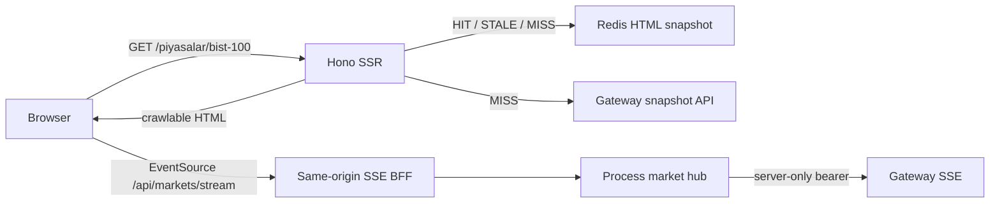

# SSR Snapshot’tan Canlı Fiyata: Cache-Safe ve Güvenli SSE Mimarisi

Bir finans sayfasında iki beklenti aynı anda vardır: ilk ekran hızlı ve crawlable açılmalı, fiyatlar da
sayfa açık kaldığı sürece güncellenmelidir. Bu iki beklentiyi tek mekanizmayla çözmeye çalışınca ya her
request pahalı dynamic SSR’a döner ya da yüksek frekanslı veri yanlış cache katmanına yazılır.

Bu yazıda BIST 100 ekranını iki freshness düzlemine ayırıyoruz:



Amaç “gerçek zamanlı” etiketi koymak değil; cache, transport, güvenlik ve arıza davranışını ayrı
kontratlar haline getirmektir.

## Neden her fiyat değişiminde SSR yapmıyoruz?

Piyasa sağlayıcısı saniyede bir batch gönderiyorsa HTML’i aynı hızda yeniden üretmek şu maliyetleri
doğurur:

- Her kullanıcı için tekrar gateway listesi ve React render.
- Redis’te sürekli body write ve invalidation.
- Fiyat veya timestamp cache key’e girerse sınırsız cardinality.
- TTFB’nin canlı provider latency’sine bağlanması.
- Crawler’ın aynı URL için sürekli değişen fakat indeks değeri düşük document görmesi.

Öte yandan ilk HTML’i boş tablo/skeleton yapmak da doğru değildir. JavaScript çalışmayan crawler,
erişilebilirlik aracı veya sorunlu ağdaki kullanıcı anlamlı içerik göremez.

Çözüm “snapshot + delta” modelidir. Snapshot ilk representation’dır; stream aynı document’in zaman
içinde değişen küçük alanlarını günceller.

## İlk düzlem: Redis’te kısa ömürlü SSR snapshot

`/piyasalar/bist-100` route’u public full-document cache kullanır:

```text
fresh TTL: 30 saniye
stale-while-revalidate: 300 saniye
content query: sortBy, page
```

İlk HTML tablo satırlarını, son fiyatı, değişim oranını, `asOf` zamanını ve veri gecikme uyarısını
taşır. `sortBy` ve `page` çıktıyı değiştirdiği için normalize key boyutudur. `utm_source` gibi içerik
değiştirmeyen query aynı HTML key’ini kullanır. Serbest arama/sector filtreleri şimdilik route cache’ini
bypass eder; kontrolsüz query cardinality’sini Redis’e taşımaz.

Snapshot’ın 30 saniyelik TTL’i “fiyat en fazla 30 saniye gecikir” garantisi değildir. STALE penceresi,
gateway kesintisi ve upstream’in `delayedByMinutes` alanı ayrıca hesaba katılır. UI bu nedenle veri
timestamp’ini ve gecikme açıklamasını gösterir.

## İkinci düzlem: hydrate island ve SSE

SSR tablo `market-live` island’ının fallback’i ve ilk state’idir. Hydration markup’ı yeniden üretmez;
aynı tabloyu sahiplenir. Sonra yalnız sayfadaki symbol’lerle EventSource açar:

```ts
const symbols = initialStocks.map((stock) => stock.symbol).join(",");
const source = new EventSource(`/api/markets/stream?symbols=${encodeURIComponent(symbols)}`);
```

Her `quotes` event’i runtime schema’dan geçer. Sequence geriye gidiyorsa event yok sayılır; geçerli
batch yalnız eşleşen hisseleri immutable state update ile değiştirir. Stream yoksa SSR snapshot ekranda
kalır.

Bu progressive enhancement sınırı önemlidir: canlılık ek özelliktir, içeriğin varlık koşulu değildir.

## Neden WebSocket değil SSE?

Bu use case browser’dan server’a sürekli komut göndermiyor; yalnız server quote yayınlıyor. SSE:

- Native `EventSource` API’siyle tek yönlü akış sunar.
- Normal HTTP response, proxy ve observability araçlarıyla çalışır.
- `event`, `id` ve `retry` alanlarını standartlaştırır.
- Browser bağlantı koptuğunda yeniden bağlanma davranışı sağlar.

WebSocket yanlış değildir. Order entry, çift yönlü subscription değişimi, yüksek frekanslı binary
frame veya çok düşük overhead gereksinimi çıkarsa daha doğru olabilir. Bugünkü public, düşük frekanslı
quote batch’i için SSE daha dar bir protokoldür.

HTTP/1.1’de browser+origin başına düşük connection limitleri olabilir; HTTP/2’de stream sayısı
negotiated olur. Bu nedenle her widget için ayrı EventSource açmıyoruz; sayfa tek bağlantıda symbol
batch’i ister.

## Browser neden gateway'e doğrudan bağlanmıyor?

Gateway stream’i `/internal/markets/stream` adresindedir ve bearer token ister. EventSource custom
`Authorization` header eklemeyi desteklemez. Token’ı query string’e koymak log, history ve analytics
sızıntısı yaratır. Browser’a secret vermek ise zaten güven sınırını kaldırır.

Bu nedenle browser yalnız same-origin BFF endpoint’ine bağlanır:

```text
Browser  ── no secret ──>  /api/markets/stream
Hono     ── Bearer token ─> /internal/markets/stream
```

Public fiyat akışı kullanıcı auth’u gerektirmez; burada korunan şey provider credential’ı ve origin
kapasitesidir. Kişisel portföy akışı eklenirse HttpOnly session doğrulaması ve kullanıcı bazlı
authorization aynı endpoint’in açık kontratı olmalıdır.

## Browser-facing admission ve request doğrulaması

SSE bağlantısı ucuz bir GET gibi görünür fakat dakikalarca socket ve memory tutabilir. Endpoint şu
kontrolleri handshake’ten önce uygular:

- `Accept: text/event-stream` zorunlu.
- `Sec-Fetch-Site: cross-site` reddedilir.
- `Origin` varsa `SITE_URL` origin’iyle eşleşir.
- Symbol yalnız `[A-Z0-9.]{1,12}` ve en fazla 25 adet olabilir.
- Aynı IP için 5, process için 1000 aktif bağlantı varsayılan limittir.
- Limit aşımı `429` ve bounded `Retry-After` döndürür.

Origin/Sec-Fetch kontrolleri tek başına authentication değildir; bazı non-browser client’lar bu
header’ları hiç göndermez veya taklit edebilir. Public endpoint için asıl kapasite savunması admission,
trusted proxy üzerinden doğru client IP, ingress/WAF rate limit ve connection timeout’tur.

Per-IP limit NAT arkasındaki kullanıcıları paylaşabilir. Production değeri gerçek trafik dağılımı ve
IPv6 politikasıyla ölçülmeli; keyfi yükseltilmemelidir.

## Upstream güven sınırı: gelen event de untrusted input'tur

Gateway internal olsa bile payload doğrudan React state’e alınmaz. Server parser şu sınırları uygular:

- Response status başarılı ve content type `text/event-stream` olmalı.
- Handshake normal gateway timeout bütçesine uymalı.
- Parser buffer’ı en fazla 128 KiB olabilir.
- Art arda beş invalid event upstream bağlantısını kapatır.
- Batch 1–100 quote taşır.
- Sequence pozitif safe integer, timestamp parse edilebilir ve en fazla 40 karakterdir.
- Symbol formatı kapalıdır; bütün sayılar finite ve domain aralığındadır.
- `dayLow <= dayHigh` invariant’ı korunur.

Client aynı schema’yı tekrar uygular. Bu defense in depth’tir: server validator regresyonu veya farklı
BFF implementasyonu olsa bile `NaN`, aşırı fiyat ya da bozuk symbol DOM state’ine sessizce girmez.

Sequence global piyasa doğruluğu değildir. Mevcut kontrat connection/process delivery sırasını korur;
upstream reconnect sonrasında hub yeni monoton delivery sequence üretir. Gerçek provider’da replay veya
tam kayıpsız resume gerekiyorsa kalıcı cursor ve `Last-Event-ID` politikası ayrıca tasarlanmalıdır.

## Fan-out: her browser için gateway socket açmamak

Hono process’i ilk subscriber geldiğinde tek upstream stream açar. Hub gelen batch’i subscriber’ların
symbol setlerine göre filtreler:

```text
1 upstream connection / process
          ↓
process hub
  ├─ browser A: THYAO, AKBNK
  ├─ browser B: THYAO, TUPRS
  └─ browser C: GARAN
```

Son subscriber ayrıldığında upstream abort edilir. Böylece 500 browser bağlantısı gateway’de 500
socket olmak zorunda değildir.

Bu tasarım process-local’dır. Dört replica dört upstream bağlantı açar; hub state’i Redis’e yazılmaz.
Bu, mevcut trafik için bilinçli ve basit bir sınırdır. Provider process başına bağlantıya izin
vermiyorsa veya replica sayısı çok büyürse ayrı market-ingestion service + pub/sub fan-out katmanı
gerekebilir. Redis Pub/Sub kullanılabilir ama HTML cache Redis’i ile aynı kapasite/SLO bütçesine körlemesine
eklenmemelidir.

## Slow consumer ve memory güvenliği

Her subscriber için sınırsız queue tutmak, yavaş mobil client’ta memory büyütür. Fiyat ekranında eski
ara tick’lerin tamamını teslim etmek yerine son durum önemlidir. `LatestBatchInbox` bekleyen tek batch
tutar; yenisi gelirse eskisini coalesce eder.

Bu lossless event log değildir. Finansal emir/işlem akışında event kaybetmek kabul edilemez; durable
queue ve acknowledgement gerekir. Public quote UI’da “en son bilinen state” semantiği doğru olduğu
için coalescing güvenlidir ve metriği ayrıca tutulur.

## Connection lifecycle ve reconnect fırtınası

Server bağlantıyı varsayılan beş dakikada `rotate` event’iyle kapatır. Bu yaklaşım sonsuza kadar asılı
socket, deploy drain ve ara proxy timeout riskini sınırlar. Client:

- Sekme gizlenince stream’i kapatır ve `paused` gösterir.
- Browser offline olunca bağlantıyı kapatır; snapshot’ı korur.
- Online/visible olduğunda yeniden bağlanır.
- Hatalarda 1–30 saniye exponential backoff + jitter uygular.
- Server `rotate` event’inde kısa kontrollü reconnect yapar.

Jitter bütün browser’ların deploy veya gateway dönüşünde aynı milisaniyede bağlanmasını önler. Buna
rağmen büyük incident sonrasında ingress rate limit ve server admission son savunma olarak kalır.

## Response header'ları transport kontratıdır

Browser SSE response’u şunları taşır:

```http
Content-Type: text/event-stream
Cache-Control: private, no-store, no-transform
X-Accel-Buffering: no
Vary: Accept
```

`no-store` event stream’in CDN/browser shared cache’e dönüşmesini, `no-transform` ve
`X-Accel-Buffering: no` ara katmanın event’leri toplamasını azaltmayı hedefler. Yine de production
ingress/CDN’de buffering ve idle timeout gerçek bağlantıyla test edilmelidir; response header tek
başına her vendor davranışının garantisi değildir.

## Observability: request latency değil stream lifecycle

Beş dakikalık bağlantıyı normal API duration histogramına koymak p99’u bozar. Ayrı bounded metrikler
kullanılır:

- `ssr_market_stream_active_connections`
- `ssr_market_stream_connections_total{outcome}`
- `ssr_market_stream_events_total{outcome}`

Alarm önerileri:

- Active / process limit oranı kalıcı yükseliyor mu?
- `ip_limited` veya `global_limited` oranı arttı mı?
- `invalid / received` upstream contract drift gösteriyor mu?
- `coalesced / received` slow-consumer baskısı gösteriyor mu?
- Son geçerli batch yaşı piyasa freshness SLO’sunu aşıyor mu?
- Upstream reconnect sıklığı release veya provider incident ile korele mi?

Symbol, IP ve request ID metric label’ı olmaz. Gerekirse örneklenmiş structured log veya trace event
olarak taşınır.

## Arıza matrisi

| Arıza                | Kullanıcı davranışı                                     | Server davranışı                    |
| -------------------- | ------------------------------------------------------- | ----------------------------------- |
| Redis yok            | readiness/cache politikasına göre snapshot MISS/degrade | local truth üretmez                 |
| Snapshot gateway yok | stale varsa stale; yoksa route error                    | timeout/error metric                |
| Upstream SSE yok     | son snapshot, `reconnecting`                            | jittered reconnect                  |
| Invalid event        | UI state değişmez                                       | schema reject; tekrarında reconnect |
| Browser offline      | son state, `offline`                                    | socket release                      |
| Sekme hidden         | son state, `paused`                                     | socket release                      |
| Process shutdown     | bağlantı kapanır, client reconnect eder                 | clients + hub abort/drain           |
| Connection limiti    | snapshot + reconnect                                    | `429`, admission metric             |

“Canlı veri çalışmıyor” hiçbir durumda ilk document’i boşaltmamalıdır. Bu sistemin temel degrade
kontratı budur.

## Test matrisi

En az şu seviyeler gerekir:

1. Schema unit testleri: malformed JSON, NaN/Infinity, range, sequence, array sınırı.
2. Admission unit testleri: IP/global limit, idempotent lease release.
3. API testleri: Accept, Origin, Sec-Fetch-Site, symbol ve `429`.
4. Hub testleri: tek upstream, filter, reconnect, last subscriber abort.
5. Client testleri: event apply, stale sequence, offline/visible ve cleanup.
6. Gerçek socket integration: mock gateway token, event frame, disconnect cleanup.
7. Proxy smoke: ilk heartbeat’in buffer edilmeden gelmesi ve idle timeout.
8. Load test: connection ramp, FD/memory/event-loop lag ve reconnect storm.

## Next.js ile yapılamaz mıydı?

Yapılabilirdi. Next.js Route Handlers standart `Request`/`Response` ile streaming response üretebilir;
self-hosting rehberi de streaming için proxy buffering’in kapatılmasını ister. Client Component içinde
EventSource açmak da mümkündür.

Buradaki fark capability değil ownership’tir. Bu mimaride snapshot cache identity’si, BFF admission,
server-only gateway credential, process hub ve shutdown sırası tek tek bizim kontratlarımızdır. Next.js
içinde kalsaydık aynı kararları Route Handler, cache backend ve deployment adapter sınırlarında yine
tasarlamamız gerekirdi.

Framework değiştirmek socket güvenliğini otomatik çözmez; yalnız sorumluluğun nerede göründüğünü
değiştirir.

## Production'a geçmeden önce açık kalanlar

Mock gateway transport davranışını çalıştırır, gerçek piyasa doğruluğunu kanıtlamaz. Provider seçilince:

- Lisans, delayed/real-time gösterim ve disclaimer kuralları.
- Exchange calendar, seans ve timezone semantiği.
- Provider sequence/cursor ve gap recovery.
- Symbol master/data quality ve corporate action davranışı.
- Gateway fan-out kotası ve multi-region topoloji.
- WAF/load balancer connection limitleri ve trusted proxy zinciri.
- Freshness SLO, incident fallback ve market-data kill switch.
- Capacity testinde file descriptor, heap, event-loop lag ve egress maliyeti.

Bu maddeler mock içine sahte biçimde gömülmemeli; gerçek provider contract rollout’unun acceptance
kriterleri olmalıdır.

## Sonuç

Canlı piyasa sayfasını hızlı yapan şey yalnız SSE değildir. Asıl tasarım kararı, ilk representation ile
sonraki değişimleri ayırmaktır:

> SSR snapshot erişilebilir, cacheable ve güvenli fallback’tir. SSE ise küçük, geçici ve bounded bir
> freshness kanalıdır.

Bu ayrımla her quote Redis write’ına, her kullanıcı gateway socket’ine ve her stream hatası boş sayfaya
dönüşmez. Güvenlik de token saklamaktan ibaret kalmaz; origin, admission, schema, backpressure,
reconnect, observability ve shutdown aynı lifecycle’ın parçaları olur.

---

## Kaynaklar

- [WHATWG HTML Standard — Server-sent events](https://html.spec.whatwg.org/dev/server-sent-events.html)
- [MDN — Using server-sent events](https://developer.mozilla.org/en-US/docs/Web/API/Server-sent_events/Using_server-sent_events)
- [Hono Streaming Helper — `streamSSE`](https://hono.dev/docs/helpers/streaming)
- [Next.js Route Handlers](https://nextjs.org/docs/app/getting-started/route-handlers)
- [Next.js Self-hosting — Streaming and Suspense](https://nextjs.org/docs/app/guides/self-hosting#streaming-and-suspense)
- [MDN Content Security Policy `connect-src`](https://developer.mozilla.org/en-US/docs/Web/HTTP/Reference/Headers/Content-Security-Policy/connect-src)
- [RFC 9110 — HTTP Semantics](https://www.rfc-editor.org/rfc/rfc9110)
- [Cache Bir Optimizasyon Değil, Route Kontratıdır](./03-cache-bir-optimizasyon-degil-route-kontratidir.md)
- [Island Architecture ile Cache-Safe Kişiselleştirme](./04-island-architecture-ile-cache-safe-kisisellestirme-ve-auth.md)
