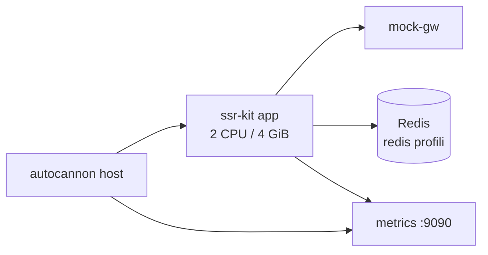

# Load testing metodolojisi

Bu belge, `load-test/` klasöründeki Docker tabanlı yük testi organizasyonunun **neden**, **nasıl** ve
**ne zaman** çalıştırılacağını tanımlar. Amaç prod SLA taahhüdü değil; release öncesi **regresyon
sinyali**, **cache profili karşılaştırması** ve **kapasite sınırları** (503/504) hakkında kanıt
toplamaktır.

## Amaç ve kapsam dışı

| Dahil | Kapsam dışı |
| --- | --- |
| Production build (`npm run build` image) | Gerçek gateway latency/contract |
| App container: **2 vCPU / 4 GiB** | Çok pod / horizontal scale |
| mock-gw ile uçtan uca SSR | CDN / edge cache |
| memory vs redis cache profili | Finans prod cutover onayı |

Mutlak RPS sayıları yalnızca staging (gerçek gateway + cluster Redis) tekrarında anlam kazanır.
Buradaki değerler **göreli karşılaştırma** içindir.

## Ortam topolojisi



- **Public**: `http://127.0.0.1:31005` (override: `LOADTEST_APP_PORT`)
- **Metrics**: `http://127.0.0.1:31090` (override: `LOADTEST_METRICS_PORT`)
- Compose dosyaları: `load-test/compose.yml` + profil override

## Profiller

### memory

- `CACHE_BACKEND=memory`, Redis yok
- Tek pod / restart sonrası soğuk davranışa yakın
- `APP_ENV=loadtest` ile production build + memory cache (yalnızca load test için izinli)

### redis

- `CACHE_BACKEND=redis`, `CACHE_REQUIRED=true`
- Paylaşımlı HTML cache + cold-fill coalescing
- Çok replika senaryosuna daha yakın

Her release adayında **her iki profil de** ardışık koşturulmalı; sonuçlar `load-test/results/`
altında saklanır (gitignore).

## Senaryo matrisi

Senaryolar `load-test/scenarios.mjs` içinde sıralıdır; cache HIT ölçümlerinden önce warmup yapılır.

| Grup | Senaryolar | İzlenecek sinyal |
| --- | --- | --- |
| Baseline | `warmup-health` | Liveness, düşük latency |
| Shared cache | `cache-miss-home`, `cache-hit-home`, `cache-hit-bank`, `cache-short-bist` | `x-cache`, p99, HIT oranı |
| Fragmentation | `cache-miss-housing-catalog`, `mixed-catalog` | Query key cardinality |
| BYPASS | `cache-bypass-calculator`, `cache-bypass-account` | SSR yükü, gateway çağrıları |
| Kapasite | `capacity-ramp` | `503`, `504`, `ssr_ssr_capacity_rejected_total` |
| BFF | `referral-post` | Same-origin guard; başarılı yanıt **303** (autocannon'da hata sayılmaz) |

## Referans kapasite (tek pod, 2 vCPU / 4 GiB, mock-gw)

Stress koşularından türetilmiş **üst limit tahminleri** — prod gateway ile %20–40 düşebilir.

| Profil / trafik | Rahat çalışma | Sert tavan |
| --- | ---: | ---: |
| Hard concurrent SSR | — | **96** (32+64 kuyruk) |
| Memory + cache HIT | ~1.200 req/s | ~1.600 req/s |
| Redis + cache HIT | ~800–1.000 req/s | ~1.480 req/s (yüksek conn'da 503) |
| BYPASS rotalar | ~80–100 req/s | ~150 req/s |
| Karışık (finans benzeri) | ~800–1.000 req/s | ~1.200 req/s |

Redis profili ~96 eşzamanlı SSR altında memory ile eşit; üstünde cache HIT path Redis
round-trip nedeniyle daha erken 503 üretir. Stress suite bunu bilinçli ortaya çıkarır; benchmark
suite steady-state regresyon içindir.

Karşılaştırma:

```bash
npm run loadtest:compare      # benchmark
npm run stress:compare        # stress
```

## Çalıştırma

```bash
# Tam suite (~15–25 dk / profil)
npm run loadtest:memory
npm run loadtest:redis

# Hızlı smoke (~5 dk)
npm run loadtest:memory -- --quick

# Image zaten var
npm run loadtest:redis -- --skip-build

# Stack debug
npm run loadtest:memory -- --keep-stack
```

## Raporlama

Her koşu `load-test/results/<timestamp>-<profile>/` oluşturur:

| Dosya | İçerik |
| --- | --- |
| `report.md` | Özet tablo, yorum rehberi |
| `results.json` | Ham autocannon + meta |
| `metrics-before.txt` / `metrics-after.txt` | Prometheus scrape |
| `preflight.json` | İlk istek header örneği |

### Kabul eşikleri (regresyon)

Staging gate öncesi iç kontrol önerisi:

1. Steady-state senaryolarda (`cache-hit-*`, `mixed-catalog`) hata oranı **< %1**
2. `capacity-ramp` dışında **504** yok; `503` yalnızca bilinçli stres senaryosunda
3. Aynı senaryoda redis profili p99, memory'ye göre anlamlı iyileşme göstermeli (soğuk start hariç)
4. p99 bir önceki release'e göre **>%20** kötüleşme → SSR capacity, gateway timeout veya cache key incelemesi
5. `ssr_gateway_invalid_payload_total` artışı yok

## Release döngüsü önerisi

1. CI yeşil (`npm run ci`)
2. `loadtest:memory` + `loadtest:redis` ardışık
3. Raporları release ticket'a ekle
4. Staging'de aynı URL seti + gerçek gateway ile tekrar (mutlak sayılar)
5. Pentest readiness (`npm run pentest:readiness`) staging URL ile

## Stres testi (stress suite)

Benchmark suite (`loadtest:*`) steady-state regresyon içindir. **Ciddi stres** için ayrı suite:

```bash
npm run stress:memory
npm run stress:redis
npm run stress:memory -- --quick
```

Stress suite bilinçli olarak `SSR_MAX_CONCURRENCY=32` + `SSR_MAX_QUEUE=64` sınırını aşar (384–512
eşzamanlı bağlantı). Beklenen sinyaller: `503` (capacity rejected), `504` (deadline). Soğuma
senaryosu (`stress-recovery`) sonrası hata oranı <%1 olmalıdır.

| Faz | Bağlantı | Süre | Amaç |
| --- | ---: | ---: | --- |
| SSR saturation | 384 | 120s | Tek route queue dolumu |
| BYPASS storm | 220 | 90s | Gateway + SSR bypass yükü |
| Cache stampede | 240 | 75s | Benzersiz query key cold-fill |
| Mixed hostile soak | 256 | 180s | Karışık trafik altında dayanıklılık |
| Capacity ramp | 96→512 | 4 faz | Kademeli kırılma noktası |
| Recovery | 24 | 45s | Steady-state'e dönüş doğrulama |

Sonuçlar: `load-test/results/<timestamp>-stress-<profile>/`

İlgili: [load-test/README.md](../load-test/README.md), [production-security.md](./production-security.md),
[pentest-prep.md](./pentest-prep.md)
